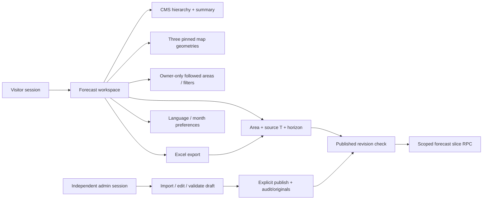

# Korat Tan Phai / โคราชทันภัย Project Map

Source cleanup checkpoint: 2026-10-03. This is a map of the current working source,
not confirmation that these changes are deployed. See [HANDOFF](docs/HANDOFF.md)
for release evidence and the current production revision.

## Purpose and Current Scope

Korat Tan Phai is an authenticated Nakhon Ratchasima drought dashboard. Active
surfaces are forecast overview, province/district/subdistrict six-horizon
forecasts, Excel reporting, personal saved workspaces and the no-code CMS at
`/admin`. The public workspace is forecast-only under
[FORECAST_ONLY_RESTORATION](docs/FORECAST_ONLY_RESTORATION.md).

Actual routing and its source integration remain parked by the owner's decision.
Metadata/validation/backend ingestion contracts are retained where real; they do
not imply configured live feeds. The satellite/DOAE/model publication architecture
in [MODEL_PIPELINE_DESIGN](docs/MODEL_PIPELINE_DESIGN.md) remains a future design.

The source cleanup removes synthetic nationwide/workflow data, the old source
registry and research/rainfall stubs, rev02 files/builders, the unused national demo
map and risk-fusion endpoint. It preserves original rev03 lineage, real hierarchy,
map geometry, source-backed CMS operations, stored history and saved selections.

## Project Coordinates

- Repository: `/Users/point/korattanphai`
- Remote: `https://github.com/purichw/korattanphai.git`
- Production: `https://korattanphai.vercel.app`
- Vercel project: `korattanphai`
- Stack: Vite, React, TypeScript and Supabase Auth/database; Vercel handlers.
- Current checkout/branch and release SHA must be checked before edits or deploy.
  A document timestamp does not authorize overwriting another checkout's changes.

## Route and Surface Map

| Path/surface | Responsibility |
| --- | --- |
| `/login` | Visitor email/password login and internal return path |
| `/` | Nakhon Ratchasima province forecast overview |
| `/drought` | Province six-horizon drought forecast |
| `/{district-slug}` | District workspace |
| `/{district-slug}/{subdistrict-slug}` | Subdistrict workspace |
| `/nakhon-ratchasima/...` | Compatible aliases for existing geographic links |
| `/admin/login` | Independent admin sign-in |
| `/admin` and its detail/import screens | Data management, drafts and publication |
| Excel export / saved workspaces | Dialogs within the visitor workspace |

Visitor and admin navigation have distinct purposes. Admin links stay in admin
workflows; legacy nationwide, farmer, alert/publication demo sections are removed.
Actual/operational components are not mounted by current public workspace routes.

## Main Ownership Map

| Files/directories | Owns |
| --- | --- |
| `src/main.tsx`, `src/App.tsx` | Root, lightweight login/startup, history, lazy loading |
| `src/AuthenticatedApp.tsx` | Visitor shell, account controls, export and saved actions |
| `src/store.tsx`, `src/persistedState.ts`, `src/browserStorage.ts` | Supported language/month preferences and storage recovery |
| `src/domain.ts`, `src/data/catalog.ts` | Real hierarchy-derived locations, code/slug lookup and routing |
| `src/components/NakhonRatchasimaWorkspace.tsx` | Route composition, scope and loading |
| `src/components/nakhon-ratchasima/` | Local map, camera/geography helpers, forecast controls/model and views |
| `src/forecastPeriod.ts`, `src/data/forecastScope.ts` | Origin/horizon calendar and administrative request scope |
| `src/useForecastArchive.ts`, `src/data/supabaseForecastArchive.ts` | Revision-aware scoped database loading |
| `src/data/cmsReferences.ts`, `shared/cmsResources.mjs` | Five-resource active catalog and pinned reference loading |
| `src/data/localMapGeometry.ts` | Shared bounded loading for three map geometries |
| `src/admin`, `server/admin-data` | No-code CMS forms/import, validation, drafts, publication/history and membership |
| `src/authScope.ts`, `src/useAuth.ts`, `src/supabase.ts` | Separate account session scopes and shared lazy client |
| `src/access` | Parked officer-role scaffold; visitor compatibility mode remains explicit |
| `src/styles.css`, `src/admin/admin.css` | Existing brand tokens, layout, responsive component styles |
| `src/types.ts`, `src/i18n.ts` | Current data types, Thai labels and formatting |
| `api/`, `server/model-inputs`, `server/operations` | CMS/input/operational handlers and isolated backend services |

Shared UI includes `AppSelect`, `PageSummary`/`MetricGrid`/`MetricCard`,
`MapPreviewFooter`, loading primitives, dialogs and `WorkspaceBookmarks`.
Preserve their keyboard, mobile, alignment and navigation contracts when reusing.

## Data and Source Map

Retained canonical source files:

- `src/data/canonical/nakhon_ratchasima/admin_hierarchy.json`: one province,
  32 districts and 289 subdistricts, or 322 real location nodes.
- `src/data/canonical/nakhon_ratchasima/drought_forecast_archive_rev03.json`:
  normalized original Excel archive for integrity checks/static regression mode.
- `data/normalized/drought-rev03/`: original normalization lineage and manifests.

Generated `forecast-archive-summary.json` and `forecast-overview-t1.json` derive
from rev03 before dev/build. Do not hand-edit them or treat them as new sources.
Database builds exclude raw archive assets and load current published revisions.

`shared/cmsResources.mjs` contains exactly five active read-only system resources:
real hierarchy, generated forecast summary, local subdistrict geometry, local
province boundary and Thailand ADM1 neighbor context. Startup requests only the
first two payloads; maps fetch the three geometry resources when needed. Retired
catalog rows may still exist in CMS history but are not active runtime inputs.

Source geometry is retained at:

- `public/geodata/nakhon-ratchasima-subdistricts.geojson`
- `public/geodata/nakhon-ratchasima-boundary.geojson`
- `public/geodata/thailand-adm1.geojson`

CMS builds fetch pinned published reference IDs with no static fallback. Static
regression builds use these files. Regenerate the local outline from all local
polygons using `npm run generate:nr-boundary`, never manual coordinate edits.
ADM1 provides neighboring province context, not a nationwide risk dataset.

## Runtime Data Flow



Database mode uses `VITE_DATA_BACKEND=supabase`; CMS references use
`VITE_REFERENCE_BACKEND=cms` and require database mode. Loaders preserve source
scope, verify revision before cache reuse and dispose protected caches on account
changes/logout. Initial failures show retry, not bundled predictions or zero risk.
Static mode is an isolated regression configuration, not a recovery fallback in
production. See [FORECAST_SCOPED_LOADING](docs/FORECAST_SCOPED_LOADING.md).

Preferences use `korat-tan-phai-preferences-v1` and contain language/month only.
The previous demo-state key is read only for compatible preferences; old workflow
fields are ignored and the snapshot is preserved. Auth and database saved rows
are separate. A failed database save cannot be reported as browser-only success.

Current Vercel APIs are `/api/admin-data`, `/api/model-inputs`,
`/api/operational-context`, `/api/health` and `/api/telemetry`. Accepted model inputs
are stored separately and cannot automatically publish forecasts. Clock/source-gap
metadata does not establish a live actual feed. Configuration/release evidence is
in [API](docs/API.md), [NFR operations](docs/NFR_OPERATIONS_RUNBOOK.md) and HANDOFF.

## Product and Data Contracts

- Visible UI remains Thai and usable without technical knowledge. Use actual
  buttons, clear field descriptions, sample values and honest validation states.
- Preserve `TH-P29`, administrative code `30` and all existing area links. Join
  values using administrative codes, never Thai names or route slugs.
- Source workbook Year/Month is origin T. T+1 through T+6 are forward calendar
  months; source T itself is not a T+0 risk. Legacy URL `target` and saved
  `target_period` still select source T and must not be reinterpreted.
- Original rev03 has 289 mapped source IDs, 127 origins (`2015-06`–`2025-12`) and
  220,218 vintages. These are baseline validation facts; visible current periods,
  counts and latest revision come from the published data, not UI constants.
- Risk `0` means no detected forecast risk, `1` moderate, `2` high. Blank is
  out-of-scope; missing rows are a separate problem. Neither becomes a green zero.
- Workbook irrigation is independent of forecast risk. No live water, weather,
  rainfall or agricultural area feed is implied by the two available map modes.
- Forecasts are not official damage observations. Parked actual/agriculture
  components require verified inputs before they can show real values.
- Forecast CMS import/edit/publish remains active; system references stay read-only.
  Unknown/retired reference keys cannot be cloned, edited or published, while
  stored original/version/history access remains intact.
- Visitor/admin sessions stay independent, including refresh and sign-out.
  No persona or client-editable label grants permission.

## Running and Verifying

```bash
npm install
npm run dev
npm run build:protected
```

Vite defaults to `http://127.0.0.1:5173`. Use the project launchers in `package.json`;
`scripts/local-runtime.mjs` checks the actual host's local-runtime restrictions.
Use attached or managed Playwright mode as supported by that environment.

Match verification to changed risk. Target geography/routing tests for joins,
CMS/backend tests for permission/publication behavior and map/loading tests for
shared loaders. Use build/bundle/exposure gates and affected browser journeys for
release; do not run broad suites merely because a document lists them.

For an authorized deployment, follow [RELEASE_RUNBOOK](docs/RELEASE_RUNBOOK.md)
and [PRODUCTION_SMOKE](docs/PRODUCTION_SMOKE.md). Check the intended revision,
required CI, build and promotion separately. Verify real authenticated reads,
no-code admin journeys, independent sessions, mobile map labels and affected
routes. `/api/health` is a liveness surface; it does not prove that input feeds,
schedulers or private readiness are configured. Do not test deleted demo endpoints.

Local tests may use explicit fixtures. Production/preview reads require an
approved real account; never commit credentials or silently replace runtime data
with test fixtures. Source cleanup alone does not authorize remote data deletion.

## Documentation Guide

- [ARCHITECTURE](docs/ARCHITECTURE.md), [DATA_CONTRACT](docs/DATA_CONTRACT.md):
  active ownership, source/time semantics, persistence and loading boundaries.
- [APP_MAP](docs/APP_MAP.md), [INTERACTION_MAP](docs/INTERACTION_MAP.md): current
  surfaces and user journeys.
- [DROUGHT_REV03_NORMALIZATION](docs/DROUGHT_REV03_NORMALIZATION.md),
  [DROUGHT_REV03_CUTOVER](docs/DROUGHT_REV03_CUTOVER.md): original source lineage
  and historical cutover evidence.
- [CMS_CUTOVER_20260928](docs/CMS_CUTOVER_20260928.md): historical CMS activation;
  the current resource allowlist is in code and DATA_CONTRACT.
- [ACTUAL_FORECAST_SEPARATION](docs/ACTUAL_FORECAST_SEPARATION.md): parked actual
  eligibility and future integration guards, superseded routing as noted above.
- [RAINFALL_SOURCE_AUDIT](docs/RAINFALL_SOURCE_AUDIT.md): historical source/proxy
  research, not a current feed inventory.
- [NOTIFICATION_CONTRACT](docs/NOTIFICATION_CONTRACT.md): historical demo/future
  provider cautions, not an active delivery service.
- [AUTH_SETUP](docs/AUTH_SETUP.md), [WORKSPACE_ACCESS](docs/WORKSPACE_ACCESS.md),
  [OPERATIONS](docs/OPERATIONS.md), [API](docs/API.md): access and backend scope.
- [DESIGN_SYSTEM](docs/DESIGN_SYSTEM.md), [SHARED_COMPONENTS](docs/SHARED_COMPONENTS.md):
  visual direction and component interaction contracts.
- [HANDOFF](docs/HANDOFF.md): release checkpoint, evidence and outstanding risks.

Historical specifications preserve provenance but do not override current code,
verified source data or explicit product decisions. A deleted runtime file should
not be restored merely to satisfy an old diagram or source inventory.
