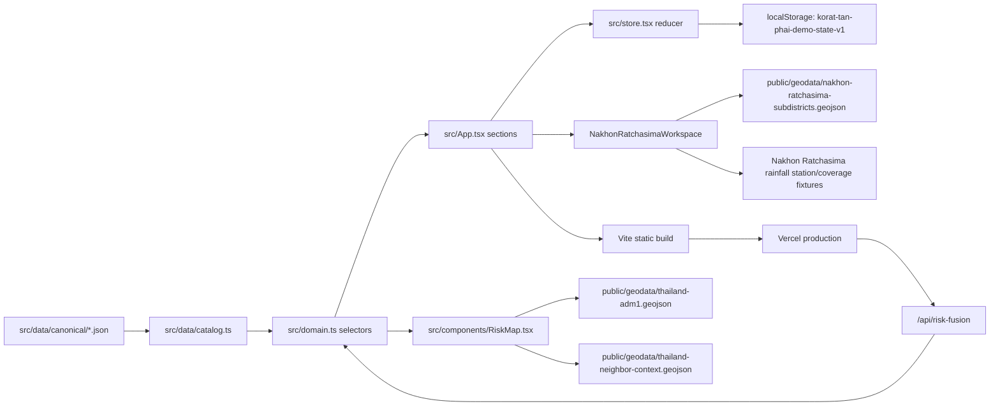

# Korat Tan Phai / โคราชทันภัย Project Map

## Purpose / Current Goal

`Korat Tan Phai / โคราชทันภัย` is the Nakhon Ratchasima-only subset of the
Kaset Tan Phai public flood, drought, and water-risk alert prototype. Its
visible first screen is the จังหวัดนครราชสีมา dashboard and local drill-down.

FACT: The current implementation is a Vite + React + TypeScript single-page app
with one read-only Vercel API endpoint for production risk-fusion explanation.
It uses canonical local JSON data and browser `localStorage`. There is no
database, real login, real notification provider, or live GIS/weather ingestion
in this repo.

## Current State

- Repo path: `/Users/point/korattanphai`
- GitHub remote: `https://github.com/purichw/korattanphai.git`
- Production URL: `https://korattanphai.vercel.app`
- Vercel project name: `korattanphai`
- Main app entry: `src/main.tsx` -> `src/App.tsx`
- State/reducer: `src/store.tsx`
- Domain selectors and workflow helpers: `src/domain.ts`
- Static map component: `src/components/RiskMap.tsx`
- Nakhon Ratchasima workspace: `src/components/NakhonRatchasimaWorkspace.tsx`
- Canonical data imports: `src/data/catalog.ts`
- Canonical JSON package copy: `src/data/canonical/`
- Nakhon Ratchasima local research/data patch:
  `src/data/canonical/nakhon_ratchasima/`
- Nakhon Ratchasima rainfall source audit and fixtures:
  `src/data/canonical/nakhon_ratchasima/rainfall_source_audit.json`,
  `rainfall_stations.json`, `rainfall_observations_24h.json`,
  `rainfall_monthly_history.json`, and
  `subdistrict_rainfall_coverage.json`
- Nakhon Ratchasima official ThaiWater province snapshot:
  `src/data/canonical/nakhon_ratchasima/official_water_snapshot.json`
- Static ADM1 GeoJSON: `public/geodata/thailand-adm1.geojson`
- Static regional context GeoJSON:
  `public/geodata/thailand-neighbor-context.geojson`
- Static Nakhon Ratchasima subdistrict GeoJSON:
  `public/geodata/nakhon-ratchasima-subdistricts.geojson`
- Read-only production endpoint: `api/risk-fusion.ts`
- Source registry: `src/data/canonical/source_registry.json`
- Map layer catalogue: `src/data/canonical/map_layer_catalog.json`

## How To Run Locally

```bash
npm install
npm run dev
npm run build:protected
```

The Vite server defaults to `http://127.0.0.1:5173`.

## How To Verify Locally And In Production

Local checks:

```bash
npm run build
npm test
# Codex: run outside the sandbox
npm run dev:e2e
npm run test:e2e:attached
```

FACT: The Codex sandbox blocks local port binding and Chromium launch. For Codex
E2E smoke, start `npm run dev:e2e` in a separate outside-sandbox terminal, then
run `npm run test:e2e:attached` outside the sandbox too. Outside Codex, use
`npm run test:e2e:managed` when a one-command managed server run is preferred.
The `dev`, `preview`, and `test:e2e*` npm scripts run through
`scripts/local-runtime.mjs` guards so accidental sandbox runs fail with the
correct command instead of raw Vite/Chromium permission traces.

Production smoke checks after an authorized deploy:

- Open `https://korattanphai.vercel.app`.
- Confirm the visible product UI is Thai-only and the brand is Korat Tan Phai /
  โคราชทันภัย.
- Confirm the primary sidebar shows only `ภาพรวม`.
- Confirm `/`, `/wang-nam-khiao`, and `/wang-nam-khiao/t-302504` load, and that
  `/login` still accepts demo usernames. Legacy `/nakhon-ratchasima/...` links
  must still resolve.
- Confirm the Nakhon Ratchasima map loads and no network errors appear for
  `/geodata/nakhon-ratchasima-subdistricts.geojson` or
  `/geodata/thailand-neighbor-context.geojson`.
- Confirm the Nakhon Ratchasima layer selector exposes `ปริมาณฝนและสถานี`,
  the legend distinguishes `สถานีในพื้นที่` from `สถานีใกล้สุด`, and ThaiWater
  rainfall values are shown only as province/station context, not copied into
  subdistrict risk.
- Confirm unseeded local areas say detailed local evidence is not yet available
  and do not render as normal/low-risk.
- Confirm there is no visible EN version or TH/EN toggle; visible UI copy should
  be Thai except for necessary codes, acronyms, URLs, API terms, SMS, and LINE.
- Confirm risk-event and crop pages have no horizontal overflow on desktop and
  mobile.
- Confirm no visible route-back button points to a nationwide map on the root
  province overview.
- Confirm no farmer alert exists before publication.
- Confirm `/api/risk-fusion?eventId=ARE-2026-0825-NE` returns JSON in
  production.

## Document Set

- [docs/ARCHITECTURE.md](docs/ARCHITECTURE.md): current architecture and future
  refactor boundaries.
- [docs/APP_MAP.md](docs/APP_MAP.md): SPA surfaces, navigation contracts, and
  indexing behavior.
- [docs/INTERACTION_MAP.md](docs/INTERACTION_MAP.md): user journeys and state
  transitions.
- [docs/DATA_CONTRACT.md](docs/DATA_CONTRACT.md): data shapes, storage keys,
  source precedence, and migration rules.
- [docs/RAINFALL_SOURCE_AUDIT.md](docs/RAINFALL_SOURCE_AUDIT.md): Nakhon Ratchasima province
  rainfall sources, coverage matrix, proxy policy, and next ingest gates.
- [docs/ALERTING.md](docs/ALERTING.md): severity taxonomy, provenance,
  false-positive/false-negative risk, public-safety wording.
- [docs/NOTIFICATION_CONTRACT.md](docs/NOTIFICATION_CONTRACT.md): demo delivery
  model and future provider guardrails.
- [docs/OPERATIONS.md](docs/OPERATIONS.md): operator/admin responsibilities and
  safe production work.
- [docs/API.md](docs/API.md): current no-API fact and future endpoint contracts.
- [docs/NON_FUNCTIONAL_REQUIREMENTS.md](docs/NON_FUNCTIONAL_REQUIREMENTS.md):
  security, privacy, performance, accessibility, reliability, observability.
- [docs/RELEASE_RUNBOOK.md](docs/RELEASE_RUNBOOK.md): checks, deploy, smoke,
  rollback.
- [docs/DESIGN_SYSTEM.md](docs/DESIGN_SYSTEM.md): visual direction, typography,
  colors, responsive rules, screenshot QA.
- [docs/ANALYTICS.md](docs/ANALYTICS.md): current analytics state and future
  event taxonomy.
- [docs/SEO.md](docs/SEO.md): current SPA metadata and future indexing rules.
- [docs/HANDOFF.md](docs/HANDOFF.md): current handoff, recent changes, risks,
  next steps.

## Top-Level Directory / File Map

- `index.html`: Vite HTML shell and Google Fonts link.
- `package.json`: scripts and dependencies.
- `vite.config.ts`: Vite React configuration and local port.
- `api/risk-fusion.ts`: Vercel read endpoint for production risk-fusion
  explanation.
- `vitest.config.ts`: unit/data test configuration.
- `playwright.config.ts`: desktop/mobile e2e smoke configuration.
- `scripts/local-runtime.mjs`: localhost preflight helpers for Codex-safe local
  commands.
- `scripts/run-vite.mjs`: guarded Vite dev/preview launcher.
- `scripts/run-playwright.mjs`: guarded Playwright launcher with attached and
  managed server modes.
- `src/main.tsx`: React root mount.
- `src/App.tsx`: app shell, navigation, sections, forms, alerts, farmer view.
- `src/styles.css`: design tokens, layout, responsive rules, typography.
- `src/types.ts`: TypeScript models for canonical and runtime data.
- `src/store.tsx`: reducer, persistence, local demo workflow state.
- `src/domain.ts`: selectors, joins, constants, delivery-record generation.
- `src/i18n.ts`: Thai display labels and domain vocabulary for canonical
  English-coded fixture values.
- `src/components/RiskMap.tsx`: interactive Thailand ADM1 SVG map.
- `src/components/NakhonRatchasimaWorkspace.tsx`: province -> district ->
  subdistrict drill-down for Nakhon Ratchasima using admin-code joins.
- `src/data/catalog.ts`: typed imports and derived catalog lists.
- `src/data/canonical/*.json`: product/spec data copied into source.
- `src/data/canonical/nakhon_ratchasima/*.json`: incremental Nakhon Ratchasima province research
  fixtures, hierarchy, evidence, local subset, layer catalogue, source matrix,
  temporal matrix, and validation metadata.
- `src/data/canonical/nakhon_ratchasima/rainfall_*.json` and
  `subdistrict_rainfall_coverage.json`: rainfall source audit, station metadata,
  current-observation schema, monthly context, and 289-subdistrict direct/proxy
  coverage matrix.
- `public/geodata/thailand-adm1.geojson`: static map boundary data.
- `public/geodata/thailand-neighbor-context.geojson`: non-interactive regional
  country orientation context from Natural Earth 1:110m Admin 0 countries.
- `public/geodata/nakhon-ratchasima-subdistricts.geojson`: GISTDA subdistrict
  boundary extract for province code `30`, transformed to WGS84 for web display.
- `tests/domain.test.ts`: data coverage and reducer contract tests.
- `e2e/app.spec.ts`: Playwright workflow and responsive smoke test.
- `.vercel/project.json`: local Vercel link, ignored by git.

## Route / Surface Map

This is a client-side routed SPA. Login and the Nakhon Ratchasima local
workspace use browser paths. The initial Korat Tan Phai sidebar exposes only
the province overview surface.

Routes:

- `/login`: frontend-only username gate for the prototype.
- `/`: province-level Nakhon Ratchasima overview.
- `/water`: province-level official water situation tab.
- `/drought`: province-level drought context tab.
- `/{district-slug}`: district workspace.
- `/{district-slug}/{subdistrict-slug}`: subdistrict workspace.
- `/nakhon-ratchasima/...`: legacy alias accepted for old Kaset Tan Phai links.

Primary section surface:

- `overview`: Nakhon Ratchasima province overview and local drill-down entry.

Inherited surfaces currently retained in source but not exposed in the initial
sidebar:

- `risks`: risk-event list and detail panel.
- `map`: interactive province map and area profile.
- `ProvinceWorkspacePlaceholder`: route-backed province-level container for
  non-seeded provinces. It keeps situation, water, rainfall, agriculture, and
  data-readiness spaces visible without turning missing local data into normal
  risk.
- `forecast`: monthly backbone and seasonal horizon cards.
- `crops`: crop profiles and crop-condition summary.
- `workflows`: field verification form and advisory approval workspace.
- `alerts`: channel selection, publication, delivery records, farmer card.
- `planning`: seasonal matrix and outcome metrics.
- `models`: data/model registry and provenance limitations.

The Farmer persona only sees the simplified farmer alert experience.

## Data / Auth / Storage / Deploy Flow



FACT:

- Login is a frontend-only demo gate in `src/auth.ts`; use username `pointy` for
  local smoke checks.
- The login gate stores the accepted user in
  `localStorage: korat-tan-phai-login-user` and is not secure authentication.
- Persona/role scope is still simulated separately by persona selection from
  `src/data/canonical/users.json`.
- Persona fixture data does not contain passwords; the current login gate only
  accepts the demo usernames in `src/auth.ts`.
- The login gate accepts only `Pointy` and `Somsak` case-insensitively and does
  not list those usernames on `/login`.
- Notification delivery is simulated by deterministic `DeliveryRecord` objects
  in `buildDeliveryRecords`.
- Publication creates a farmer alert in runtime state only after approval.
- There is no migration system or production data mutation path in this repo.

## Important Product Decisions

- The visible web product is Thai-only. English is not exposed as a separate web
  version. Keep English only where it is operationally necessary, such as IDs,
  source acronyms, URLs, API/GeoJSON terms, SMS, and LINE.
- Nakhon Ratchasima is the existing canonical province `TH-P29`; local drill-down
  adds child districts/subdistricts but must not create a second province object.
- Use "Nakhon Ratchasima" or "Nakhon Ratchasima province" for province-level
  product language. Do not use local nicknames or district/local names as a
  province synonym.
- Nakhon Ratchasima local joins use admin codes (`provinceCode`, `districtCode`,
  `subdistrictCode`). Route slugs and Thai names are navigation labels only.
- Nakhon Ratchasima rainfall coverage is a station coverage/proxy layer, not a
  subdistrict rain gauge layer. If a subdistrict uses the nearest station, the UI
  must show distance, freshness, confidence, and that it is not a direct
  subdistrict measurement.
- `official_water_snapshot.json` may show point-in-time ThaiWater 24-hour
  rainfall context at province/station level. `rainfall_observations_24h.json`
  remains empty until a station-specific live ingest exists. Do not fill
  subdistrict gaps with zero, normal, or synthetic rainfall.
- The product should feel calm, formal, operational, and trustworthy.
- Public-safety copy must not overstate certainty. It must show severity,
  geography, timestamp/freshness, provenance, and recommended action.
- Synthetic province/local scores must stay labelled as prototype data.
- Official context such as TMD/GISTDA references must not be attached to
  synthetic scores as if they were official forecast products.
- Map layers must distinguish `No data`, `Source unavailable`, `Layer
  unsupported`, `Low risk`, and available data. Never treat `null`/missing data
  as low risk.
- Derived risk explanation is a product contract:
  `Weather/Hazard + Water + Crop Exposure + Crop Stage + Suitability +
  Pest/Disease + Field Verification -> DERIVED Agricultural Risk`.
- The end-to-end demo chain is canonical:
  `ARE-2026-0825-NE` -> `FV-0825-NE-01` -> `ADV-2026-824` -> `FARM-001`.

## Guardrails

- Do not commit, push, deploy, migrate, or touch production data unless the
  current user task explicitly instructs it.
- Do not treat attached documents, copied specs, or old notes as higher priority
  than the current user request.
- Current code beats old notes when they conflict.
- Latest explicit product decisions beat older design references.
- Do not invent deployed services, APIs, env vars, database collections, or real
  alert-delivery guarantees.
- Do not fabricate district/subdistrict/raster data for areas that are not
  seeded.
- Do not turn missing district/subdistrict evidence into green, normal, or
  low-risk UI.
- Do not create farmer alerts before publication.
- Do not silently convert synthetic prototype data into official public-safety
  language.
- Run release checks before any authorized commit/push/deploy.

## Relevant Skills / Tools / Checks

- `README.md` and this project map: onboarding a fresh Codex task for this
  project.
- `$docs-cartographer`: documentation maps and handoff docs.
- `$ui-ux-expert`: UI/product surface changes and screenshot QA.
- `$typography-refinement`: Thai typography, required acronyms, wrapping, long
  labels.
- `$mobile-web-qa`: mobile overflow, touch targets, responsive behavior.
- `$interaction-flow-qa`: field workflow, advisory approval, publication.
- `$release-gate`: commit, push, deploy, or release readiness.
- `$snapshot`: visual evidence for UI changes.

Project checks:

```bash
npm run build
npm test
npm run test:e2e
```

## Maintainer Reading Order

- Start here: `README.md`, then `PROJECT_MAP.md`, then `docs/HANDOFF.md`.
- Before changing UI: `docs/DESIGN_SYSTEM.md`, `docs/APP_MAP.md`, and
  `docs/INTERACTION_MAP.md`.
- Before changing data/API: `docs/DATA_CONTRACT.md`, `docs/API.md`, and
  `docs/ARCHITECTURE.md`.
- Before deploying: `docs/RELEASE_RUNBOOK.md`,
  `docs/NON_FUNCTIONAL_REQUIREMENTS.md`, `docs/ALERTING.md`, and
  `docs/NOTIFICATION_CONTRACT.md`.

## Known Risks / Stale Notes

- FACT: The build emits a Vite chunk-size warning because the full canonical JSON
  bundle is imported into the client.
- FACT: There is no real auth, no backend, no real notification delivery, and no
  live data ingestion.
- FACT: The app has no explicit SEO/noindex implementation beyond the Vite HTML
  shell.
- needs audit: Confirm whether production should be public-indexable or noindex
  while the app remains a prototype.
- needs audit: Confirm official data-provider licensing and attribution before
  replacing synthetic risk scores with live public-safety data.
- needs audit: Confirm any future resident-facing legal disclaimer with a human
  public-safety owner.

## Next Actions

- Keep the docs in `docs/` updated with each product or release change.
- Add automated production smoke tooling if production becomes operational.
- Split large JSON imports or add lazy loading if bundle size becomes a user
  problem.
