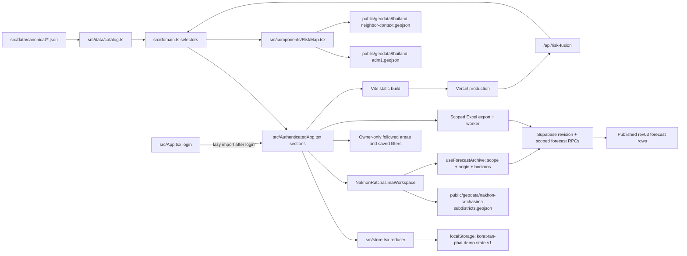

# Korat Tan Phai / โคราชทันภัย Project Map

## Purpose / Current Goal

`Korat Tan Phai / โคราชทันภัย` is an authenticated Nakhon Ratchasima drought
dashboard derived from the Kaset Tan Phai prototype. Its current surfaces are
forecast overview, province/district/subdistrict six-horizon forecasts, Excel
reporting, personal saved workspaces and the scoped no-code CMS at `/admin`.
Actual routing is parked by explicit
owner request on 2026-09-20; operational feeds remain unconfigured.

[Forecast-only restoration](docs/FORECAST_ONLY_RESTORATION.md) is the active
routing contract. `target` is origin T in both old plain and explicit archive
links. Retain all rev03 values and shared UI fixes. See the latest
[release checkpoint](docs/HANDOFF.md). The older
[Actual / Forecast Separation](docs/ACTUAL_FORECAST_SEPARATION.md) is retained as
parked implementation history, not current navigation.

FACT: The current implementation is a Vite + React + TypeScript single-page app
with a read-only risk-fusion endpoint and a new machine-authenticated model-input
API. Supabase Auth, scoped forecast reads and personal saved workspaces are
implemented; see the latest `docs/HANDOFF.md` for deployment evidence. The legacy
workflow still uses browser `localStorage`. The JSON/CSV collector and isolated
input store are locally testable; no actual local-system/ThaiWater feed or
ingest schedule is configured. See `docs/API.md` for the integration contract.

The proposed next architecture for Thai satellite/DOAE inputs, team-run models
and live T+ publication is [docs/MODEL_PIPELINE_DESIGN.md](docs/MODEL_PIPELINE_DESIGN.md).
It is a future-state v2 design, not the current runtime contract.

NFR handlers were deployed to [production](https://korattanphai.vercel.app) on
2026-09-09. Public health returns 200; model-input ingestion and private
readiness remain unconfigured (503); telemetry POST returns 204 while disabled.
Bounded/retryable map and forecast loads are deployed. Job/backup/restore tools
remain operator-run; no remote migration, live feed/scheduler, monitoring,
notification recipient or remote log store was activated. V2 remains proposed. See
[release evidence](docs/HANDOFF.md) and [NFR operations](docs/NFR_OPERATIONS_RUNBOOK.md).

## Current State

- CMS: `src/admin`, `server/admin-data`, `shared`, and additive migrations through
  `20260928010000`. `/admin/login` uses existing accounts with an independent
  Admin session. Shared login, selects, dialogs and empty states preserve the
  visitor design/interaction contracts; `authScope.ts` owns session boundaries.
- `VITE_REFERENCE_BACKEND=cms` uses published database resources with no bundled
  fallback; activation status and scope are in [the cutover record](docs/CMS_CUTOVER_20260928.md).

- Repo path: `/Users/point/korattanphai`
- GitHub remote: `https://github.com/purichw/korattanphai.git`
- Production URL: `https://korattanphai.vercel.app`
- Vercel project name: `korattanphai`
- Main app entry: `src/main.tsx` -> `src/App.tsx`
- State/reducer: `src/store.tsx`
- Domain selectors and workflow helpers: `src/domain.ts`
- Active local map: `src/components/nakhon-ratchasima/NakhonRatchasimaLocalMap.tsx`
- Retained nationwide map component: `src/components/RiskMap.tsx`
- Nakhon Ratchasima workspace: `src/components/NakhonRatchasimaWorkspace.tsx`
- Operational route/valid-month semantics: `src/operationalLocation.ts`
- Shared operational view: `src/components/nakhon-ratchasima/OperationalDroughtWorkspace.tsx`
- Operational request lifecycle: `src/useOperationalContext.ts`; server clock and
  source-gap metadata: `api/operational-context.js` and
  `server/operations/operational-context.mjs` (deployed metadata, not a live feed).
- Eligibility/integration contracts: `src/operationalData.ts`; Bangkok calendar
  policy: `src/data/operationalPolicy.mjs`. These do not provide a live actual feed.
- Shared select component: `src/components/AppSelect.tsx`
- Shared metric components: `src/components/PageSummary.tsx`
- Shared map preview footer: `src/components/MapPreviewFooter.tsx`
- Canonical data imports: `src/data/catalog.ts`
- On-demand forecast archive: `src/useForecastArchive.ts` and
  `src/data/supabaseForecastArchive.ts` in database mode; scoped overview reads
  one horizon and drought reads six. Static regression mode alone uses
  `src/data/forecastArchive.ts` and the generated T+1 projection.
- Canonical JSON package copy: `src/data/canonical/`
- Nakhon Ratchasima local research/data patch:
  `src/data/canonical/nakhon_ratchasima/`
- Nakhon Ratchasima rainfall source audit and fixtures:
  `src/data/canonical/nakhon_ratchasima/rainfall_source_audit.json`,
  `rainfall_stations.json`, `rainfall_observations_24h.json`,
  `rainfall_monthly_history.json`, and
  `subdistrict_rainfall_coverage.json`
- Nakhon Ratchasima drought forecast archive:
  `src/data/canonical/nakhon_ratchasima/drought_forecast_archive_rev03.json`
- Static ADM1 GeoJSON: `public/geodata/thailand-adm1.geojson`
- Static regional context GeoJSON:
  `public/geodata/thailand-neighbor-context.geojson`
- Static Nakhon Ratchasima subdistrict GeoJSON:
  `public/geodata/nakhon-ratchasima-subdistricts.geojson`
- Rev03 normalization/cutover: `docs/DROUGHT_REV03_NORMALIZATION.md` and
  `docs/DROUGHT_REV03_CUTOVER.md`. The rev02 builder is retired tooling.
- Read-only production endpoints: `api/risk-fusion.ts` and public liveness in
  `api/health.js`; private readiness remains unconfigured (503).
- Model-input API: `api/model-inputs.js`; legacy collector/schema/storage in
  `server/model-inputs/`; local commands and demo in `scripts/*model-inputs.mjs`.
  Inputs are separate from the published forecast archive and browser provider.
- Source registry: `src/data/canonical/source_registry.json`
- Map layer catalogue: `src/data/canonical/map_layer_catalog.json`

## How To Run Locally

```bash
npm install
npm run dev
npm run build:protected
```

The Vite server defaults to `http://127.0.0.1:5173`.

## How To Verify Locally And In Production

Local checks:

```bash
npm run build
npm test
# Codex: run outside the sandbox
npm run dev:e2e
npm run test:e2e:attached
```

FACT: The Codex sandbox blocks local port binding and Chromium launch. For Codex
E2E smoke, start `npm run dev:e2e` in a separate outside-sandbox terminal, then
run `npm run test:e2e:attached` outside the sandbox too. Outside Codex, use
`npm run test:e2e:managed` when a one-command managed server run is preferred.
The `dev`, `preview`, and `test:e2e*` npm scripts run through
`scripts/local-runtime.mjs` guards so accidental sandbox runs fail with the
correct command instead of raw Vite/Chromium permission traces.

Production smoke checks after an authorized deploy:

- Open `https://korattanphai.vercel.app`.
- Confirm the visible product UI is Thai-only and the brand is Korat Tan Phai /
  โคราชทันภัย.
- Confirm navigation shows `ภาพรวม`, its `ภัยแล้ง` subitem and `ส่งออก Excel`
  in database mode, plus `จัดการข้อมูล`, with saved workspaces in the account toolbar.
- Confirm `/admin` requires separate sign-in from the visitor, Admin sign-out
  leaves the visitor session working and vice versa, including real refresh.
- Confirm `/`, `/wang-nam-khiao`, and `/wang-nam-khiao/t-302504` load after
  login, while legacy `/nakhon-ratchasima/...` links still resolve.
- Confirm the Nakhon Ratchasima map loads from pinned CMS reference RPCs in
  CMS mode, with no fallback to `/geodata/`. Static regression builds still
  exercise the source GeoJSONs; they are not production migration evidence.
- Confirm the active map offers forecast-risk and workbook irrigation coloring,
  not water, flood, reservoir, weather or rainfall feeds. Raw catalog entries
  remain parked for future ingest/prediction work only.
- Confirm unseeded local areas say detailed local evidence is not yet available
  and do not render as normal/low-risk.
- Confirm there is no visible EN version or TH/EN toggle; visible UI copy should
  be Thai except for necessary codes, acronyms, URLs, API terms, SMS, and LINE.
- Confirm overview, drought, area pages and the Excel/saved-workspace dialogs
  have no horizontal overflow on desktop and mobile.
- Confirm no visible route-back button points to a nationwide map on the root
  province overview.
- Do not count retained farmer/publication demos as an active alert service.
- Confirm `/api/risk-fusion?eventId=ARE-2026-0825-NE` returns JSON in
  production.

## Document Set

- [docs/ARCHITECTURE.md](docs/ARCHITECTURE.md): current architecture and future
  refactor boundaries.
- [docs/APP_MAP.md](docs/APP_MAP.md): SPA surfaces, navigation contracts, and
  indexing behavior.
- [docs/INTERACTION_MAP.md](docs/INTERACTION_MAP.md): user journeys and state
  transitions.
- [docs/DATA_CONTRACT.md](docs/DATA_CONTRACT.md): data shapes, storage keys,
  source precedence, and migration rules.
- [docs/ACTUAL_FORECAST_SEPARATION.md](docs/ACTUAL_FORECAST_SEPARATION.md): local
  actual/archive split, valid-month semantics, source gaps and verification evidence.
- [docs/RAINFALL_SOURCE_AUDIT.md](docs/RAINFALL_SOURCE_AUDIT.md): Nakhon Ratchasima province
  rainfall sources, coverage matrix, proxy policy, and next ingest gates.
- [docs/ALERTING.md](docs/ALERTING.md): severity taxonomy, provenance,
  false-positive/false-negative risk, public-safety wording.
- [docs/NOTIFICATION_CONTRACT.md](docs/NOTIFICATION_CONTRACT.md): demo delivery
  model and future provider guardrails.
- [docs/OPERATIONS.md](docs/OPERATIONS.md): operator/admin responsibilities and
  safe production work.
- [docs/API.md](docs/API.md): current endpoint contracts and configuration limits.
- [docs/AGRI_MAP_CAPABILITY_COMPARISON.md](docs/AGRI_MAP_CAPABILITY_COMPARISON.md):
  source-based comparison with the supplied historical Agri-Map manual.
- [docs/NON_FUNCTIONAL_REQUIREMENTS.md](docs/NON_FUNCTIONAL_REQUIREMENTS.md):
  security, privacy, performance, accessibility, reliability, observability.
- [docs/RELEASE_RUNBOOK.md](docs/RELEASE_RUNBOOK.md): checks, deploy, smoke,
  rollback.
- [docs/DESIGN_SYSTEM.md](docs/DESIGN_SYSTEM.md): visual direction, typography,
  colors, responsive rules, screenshot QA.
- [docs/SHARED_COMPONENTS.md](docs/SHARED_COMPONENTS.md): exported and local
  shared component inventory, reuse rules, and component contracts.
- [docs/ANALYTICS.md](docs/ANALYTICS.md): current analytics state and future
  event taxonomy.
- [docs/SEO.md](docs/SEO.md): current SPA metadata and future indexing rules.
- [docs/HANDOFF.md](docs/HANDOFF.md): current handoff, recent changes, risks,
  next steps.

## Top-Level Directory / File Map

- `index.html`: Vite HTML shell and Google Fonts link.
- `package.json`: scripts and dependencies.
- `vite.config.ts`: Vite React configuration and local port.
- `api/risk-fusion.ts`: Vercel read endpoint for production risk-fusion
  explanation.
- `vitest.config.ts`: unit/data test configuration.
- `playwright.config.ts`: desktop/mobile e2e smoke configuration.
- `scripts/local-runtime.mjs`: localhost preflight helpers for Codex-safe local
  commands.
- `scripts/run-vite.mjs`: guarded Vite dev/preview launcher.
- `scripts/run-playwright.mjs`: guarded Playwright launcher with attached and
  managed server modes.
- `src/main.tsx`: React root mount.
- `src/App.tsx`: lightweight login, URL history, and lazy dashboard loading.
- `src/AuthenticatedApp.tsx`: app shell, navigation, sections, forms, alerts,
  farmer view, and content error boundary.
- `src/browserStorage.ts`, `src/persistedState.ts`: safe storage access and
  validation/recovery of persisted demo state.
- `src/styles.css`: design tokens, layout, responsive rules, typography.
- `src/types.ts`: TypeScript models for canonical and runtime data.
- `src/store.tsx`: reducer, persistence, local demo workflow state.
- `src/domain.ts`: selectors, joins, constants, delivery-record generation.
- `src/i18n.ts`: Thai display labels and domain vocabulary for canonical
  English-coded fixture values.
- `src/components/RiskMap.tsx`: interactive Thailand ADM1 SVG map.
- `src/components/NakhonRatchasimaWorkspace.tsx`: province -> district ->
  subdistrict route composition and loading state.
- `src/components/nakhon-ratchasima/`: extracted local map, forecast model,
  forecast controls/workspace, shared panels, and province/district/subdistrict
  views. Continue using admin-code joins and existing shared UI components.
- `.github/workflows/quality.yml`: unit, protected-build, bundle and built E2E gates.
- `.github/workflows/deployment-smoke.yml`, `scripts/smoke.mjs`: read-only deployed
  smoke checks. Runbook: `docs/PRODUCTION_SMOKE.md`.
- `src/components/AppSelect.tsx`: shared centered dropdown/listbox component.
- `src/components/PageSummary.tsx`: shared `PageSummary`, `MetricCard`, and
  `MetricGrid` components.
- `src/components/MapPreviewFooter.tsx`: shared map preview footer for actions
  and centered fallback notes.
- `scripts/build-nr-drought-forecast-archive.py`: retired rev02 builder; do not
  use it to replace or interpret the approved rev03 archive.
- `src/data/catalog.ts`: typed imports and derived catalog lists.
- `src/data/canonical/*.json`: product/spec data copied into source.
- `src/data/canonical/nakhon_ratchasima/*.json`: incremental Nakhon Ratchasima province research
  fixtures, hierarchy, evidence, local subset, layer catalogue, source matrix,
  temporal matrix, and validation metadata.
- `src/data/canonical/nakhon_ratchasima/rainfall_*.json` and
  `subdistrict_rainfall_coverage.json`: rainfall source audit, station metadata,
  current-observation schema, monthly context, and 289-subdistrict direct/proxy
  coverage matrix.
- `src/data/canonical/nakhon_ratchasima/drought_forecast_archive_rev03.json`:
  canonical verification/static-mode archive. Database pages read the published
  equivalent from authenticated Supabase RPCs; no static fallback is allowed.
- `public/geodata/thailand-adm1.geojson`: static map boundary data.
- `public/geodata/thailand-neighbor-context.geojson`: non-interactive regional
  country orientation context from Natural Earth 1:110m Admin 0 countries.
- `public/geodata/nakhon-ratchasima-subdistricts.geojson`: GISTDA subdistrict
  boundary extract for province code `30`, transformed to WGS84 for web display.
- `tests/domain.test.ts`: data coverage and reducer contract tests.
- `e2e/app.spec.ts`: Playwright workflow and responsive smoke test.
- `.vercel/project.json`: local Vercel link, ignored by git.

## Route / Surface Map

This is a client-side routed SPA. Login and the Nakhon Ratchasima local
workspace use browser paths. The sidebar exposes overview, drought and a
database-only Excel export action.

Routes:

- `/login`: Supabase email/password login with an internal-only return path.
- `/`: province-level Nakhon Ratchasima overview.
- `/drought`: province-level drought context page.
- `/{district-slug}`: district workspace.
- `/{district-slug}/{subdistrict-slug}`: subdistrict workspace.
- `/nakhon-ratchasima/...`: legacy alias accepted for old Kaset Tan Phai links.
- Excel export and saved workspaces are dialogs, not routes.

Primary section surface:

- `overview`: Nakhon Ratchasima province overview and local drill-down entry.

Inherited surfaces currently retained in source but not exposed in the initial
sidebar:

- `risks`: risk-event list and detail panel.
- `map`: interactive province map and area profile.
- `ProvinceWorkspacePlaceholder`: route-backed province-level container for
  non-seeded provinces. It keeps situation, agriculture, and data-readiness
  spaces visible without turning missing local data into normal risk.
- `forecast`: monthly backbone and seasonal horizon cards.
- `crops`: crop profiles and crop-condition summary.
- `workflows`: field verification form and advisory approval workspace.
- `alerts`: channel selection, publication, delivery records, farmer card.
- `planning`: seasonal matrix and outcome metrics.
- `models`: data/model registry and provenance limitations.

The retained Farmer experience belongs to the legacy non-workspace branch;
changing persona does not turn current workspace routes into a farmer service.

## Data / Auth / Storage / Deploy Flow



FACT:

- Login uses the shared Supabase client and `src/useAuth.ts`. SDK-managed
  session restoration, refresh and logout replace the retired demo gate.
- `korat-tan-phai-login-user` is removed, not trusted. Preferences remain intact.
- Persona selection is display context only. Neither persona nor user-editable
  metadata grants permissions. Identity comes from the authenticated account.
- Local E2E uses test-only network fixtures; Preview/Production smoke requires
  a real admin-provisioned account. No credentials are committed.
- Static JSON/GeoJSON is publicly downloadable regardless of the UI login guard.
- Notification delivery is simulated by deterministic `DeliveryRecord` objects
  in `buildDeliveryRecords`.
- Publication creates a farmer alert in runtime state only after approval.
- The scoped Supabase migration covers only the verified Excel/normalized
  forecast archive and owner-only followed areas/saved filters. Runtime uses
  `VITE_DATA_BACKEND=supabase`; no privileged write key is shipped. See
  `docs/SUPABASE_DATA_MIGRATION.md` for integrity and release evidence.

## Important Product Decisions

- The visible web product is Thai-only. English is not exposed as a separate web
  version. Keep English only where it is operationally necessary, such as IDs,
  source acronyms, URLs, API/GeoJSON terms, SMS, and LINE.
- Nakhon Ratchasima is the existing canonical province `TH-P29`; local drill-down
  adds child districts/subdistricts but must not create a second province object.
- Use "Nakhon Ratchasima" or "Nakhon Ratchasima province" for province-level
  product language. Do not use local nicknames or district/local names as a
  province synonym.
- Nakhon Ratchasima local joins use admin codes (`provinceCode`, `districtCode`,
  `subdistrictCode`). Route slugs and Thai names are navigation labels only.
- Nakhon Ratchasima rainfall coverage is a station coverage/proxy layer, not a
  subdistrict rain gauge layer. If a subdistrict uses the nearest station, the UI
  must show distance, freshness, confidence, and that it is not a direct
  subdistrict measurement.
- `rainfall_observations_24h.json` remains empty until a station-specific live
  ingest exists. Do not fill subdistrict gaps with zero, normal, or synthetic
  rainfall.
- The rev03 archive is historical forecast-vintage data, not observed damage
  or a live/current external forecast. Rev02 is obsolete and must not supply
  values or temporal assumptions.
- `Source_YearMonth` is origin T; `issueMonth = T` and actual
  `targetMonth = T + horizon`. Record identity is
  `subdistrictCode + originMonth + horizon`. Legacy field names `targetMonths`,
  `packedRiskByTargetMonth`, URL `target` and saved `target_period` still mean T.
- Forecast scope is 289 tambons, 127 origins (2015-06 through 2025-12), six
  horizons and 220,218 slots, including out-of-scope. All predictions trace to
  the approved rev03 workbook; source ID 222 uses the confirmed Phimai mapping.
- Archive risk values are `0` no forecast risk, `1` moderate forecast risk,
  `2` high forecast risk, and blank workbook cells as out of scope. Blank cells
  are not low-risk and not join failures.
- Historical local map periods from `normalized_research_monthly_panel.json` and
  `normalized_research_panel_summary.json` are intentionally cleared while a new
  dataset is being prepared. Do not restore the old `2025-12` historical map
  period unless the user asks for a source-backed refresh.
- The product should feel calm, formal, operational, and trustworthy.
- Public-safety copy must not overstate certainty. It must show severity,
  geography, timestamp/freshness, provenance, and recommended action.
- Synthetic province/local scores must stay labelled as prototype data.
- Official context such as TMD/GISTDA references must not be attached to
  synthetic scores as if they were official forecast products.
- Map layers must distinguish `No data`, `Source unavailable`, `Layer
  unsupported`, `Low risk`, and available data. Never treat `null`/missing data
  as low risk.
- Derived risk explanation is a product contract:
  `Weather/Hazard + Water + Crop Exposure + Crop Stage + Suitability +
  Pest/Disease + Field Verification -> DERIVED Agricultural Risk`.
- The end-to-end demo chain is canonical:
  `ARE-2026-0825-NE` -> `FV-0825-NE-01` -> `ADV-2026-824` -> `FARM-001`.

## Guardrails

- Do not commit, push, deploy, migrate, or touch production data unless the
  current user task explicitly instructs it.
- Do not treat attached documents, copied specs, or old notes as higher priority
  than the current user request.
- Current code beats old notes when they conflict.
- Latest explicit product decisions beat older design references.
- Reuse the shared components in `docs/SHARED_COMPONENTS.md` instead of
  duplicating stat cards, dropdowns, map preview footers, provenance markers,
  or dashboard section shells.
- Do not invent deployed services, APIs, env vars, database collections, or real
  alert-delivery guarantees.
- Do not fabricate district/subdistrict/raster data for areas that are not
  seeded.
- Do not turn missing district/subdistrict evidence into green, normal, or
  low-risk UI.
- Do not collapse rev03 origin month, target month and horizon into one
  latest-risk value, or restore the retired fixed-target interpretation.
- Do not create farmer alerts before publication.
- Do not silently convert synthetic prototype data into official public-safety
  language.
- Run release checks before any authorized commit/push/deploy.

## Relevant Skills / Tools / Checks

- `README.md` and this project map: onboarding a fresh Codex task for this
  project.
- `$docs-cartographer`: documentation maps and handoff docs.
- `$korat-tan-phai-new-chat`: fresh-chat onboarding for this repo.
- `$korat-tan-phai-shared-components`: shared component reuse and consistency.
- `$ui-ux-expert`: UI/product surface changes and screenshot QA.
- `$typography-refinement`: Thai typography, required acronyms, wrapping, long
  labels.
- `$mobile-web-qa`: mobile overflow, touch targets, responsive behavior.
- `$interaction-flow-qa`: field workflow, advisory approval, publication.
- `$release-gate`: commit, push, deploy, or release readiness.
- `$snapshot`: visual evidence for UI changes.

Project checks:

```bash
npm run build
npm run build:protected
npm test
npm run test:e2e:managed
```

## Maintainer Reading Order

- Start here: `README.md`, then `PROJECT_MAP.md`, then `docs/HANDOFF.md`.
- Before changing UI: `docs/DESIGN_SYSTEM.md`, `docs/APP_MAP.md`,
  `docs/INTERACTION_MAP.md`, and `docs/SHARED_COMPONENTS.md`.
- Before changing data/API: `docs/DATA_CONTRACT.md`, `docs/API.md`, and
  `docs/ARCHITECTURE.md`.
- Before deploying: `docs/RELEASE_RUNBOOK.md`,
  `docs/NON_FUNCTIONAL_REQUIREMENTS.md`, `docs/ALERTING.md`, and
  `docs/NOTIFICATION_CONTRACT.md`.

## Known Risks / Stale Notes

- Database builds exclude raw static forecast assets. Login, application and
  export-worker bundles have separate budgets; current build results require
  running the documented checks, not assuming an old chunk warning still applies.
- FACT: Supabase auth passed real-account production smoke and self-signup is
  disabled. Archive and personal-workspace RLS are audited separately in the
  migration notes. There is no live external data ingestion or
  real notification delivery.
- FACT: The app has no explicit SEO/noindex implementation beyond the Vite HTML
  shell.
- needs audit: Confirm whether production should be public-indexable or noindex
  while the app remains a prototype.
- needs audit: Confirm official data-provider licensing and attribution before
  replacing synthetic risk scores with live public-safety data.
- needs audit: Confirm any future resident-facing legal disclaimer with a human
  public-safety owner.

## Next Actions

- Keep the docs in `docs/` updated with each product or release change.
- Confirm existing production smoke workflow secrets, deployment-event triggers
  and notification recipients before relying on automated release follow-up.
- Split large JSON imports or add lazy loading if bundle size becomes a user
  problem.
