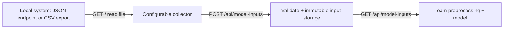

# โคราชทันภัย API Contract

## Current API State

CMS: `/api/admin-data?action=...` verifies the Supabase bearer session and
database operator membership. The browser obtains that session through the
separate `/admin/login`; this does not create a second user directory or change
the API field schemas. Import/edit/validate/accept/export
share the V1 domain fields; draft bookkeeping is a separate envelope.
`CMS_SUPABASE_URL` and `CMS_SUPABASE_SECRET_KEY` are server-only. Published
references are authenticated read-only RPCs, not direct table access. See
[CMS contracts](ADMIN_CMS.md) and [activation evidence](CMS_CUTOVER_20260928.md).

Local-only addition: `GET /api/operational-context[?period=YYYY-MM]` returns trusted
server time, Bangkok current/next-month boundary, the selected data family, policy
version and empty source catalogs. It is public metadata, not a record endpoint;
responses are `private, no-store`. Invalid/duplicate/unknown query parameters return
400; non-GET returns 405. Dev Vite and the Vercel handler use the same implementation.
No actual source, forecast publication policy or new permission was activated.
See [actual/forecast separation](ACTUAL_FORECAST_SEPARATION.md).

The repo contains the read-only risk-fusion route, a machine-authenticated
model-input ingestion route, health probes and opt-in operational telemetry.
The integration/operational handlers were deployed to
[production](https://korattanphai.vercel.app) on 2026-09-09. Public health returns
200; model-input ingestion returns 503 `service_not_configured`; private
readiness returns 503 `not_configured`; telemetry POST returns 204 while disabled.
No remote migration, live feed/scheduler, monitoring, notification recipient or remote log
store was activated. See [release evidence](HANDOFF.md).
Supabase Auth, scoped forecast reads and personal saved workspaces already have
separate contracts in [AUTH_SETUP.md](AUTH_SETUP.md) and
[FORECAST_SCOPED_LOADING.md](FORECAST_SCOPED_LOADING.md).

The proposed end-to-end v2 design is in
[MODEL_PIPELINE_DESIGN.md](MODEL_PIPELINE_DESIGN.md): source artifacts, frozen
features, team-operated model jobs, and live forecast publication. Those v2
routes are not implemented. Its issuance-month convention is intentionally
separate from the completed-feature-month assumption of the v1 demo below.

Field types, mandatory/conditional/optional rules, nullability, sample values,
and source-to-target examples for the implemented collector are documented in
[MODEL_INPUT_DATA_MAPPING.md](MODEL_INPUT_DATA_MAPPING.md). Proposed v2 parameter
tables are kept separately in [the v2 SPEC](MODEL_PIPELINE_DESIGN.md#parameter-reference).

Network activity:

- The browser fetches `/geodata/thailand-adm1.geojson`.
- The browser fetches `/geodata/thailand-neighbor-context.geojson`.
- The browser fetches `/geodata/nakhon-ratchasima-subdistricts.geojson` for the
  Nakhon Ratchasima local workspace.
- The browser fetches `/geodata/nakhon-ratchasima-boundary.geojson` for the
  visible Nakhon Ratchasima province outline in the local workspace.
- In production, the browser fetches `/api/risk-fusion?eventId=...` for the
  risk-fusion explanation shown in the risk detail panel.
- Google Fonts may be requested by the browser from the stylesheet in
  `index.html`.
- Nakhon Ratchasima water/rainfall data is bundled as static JSON imports from
  `src/data/canonical/nakhon_ratchasima/`; no live rainfall API is called by the
  browser. Current bundled rainfall fixtures are station/source coverage and
  empty observation schemas, not live province water-provider snapshots.

Server integration credentials never use `VITE_` variables and are not browser
login credentials. The new input API does not publish or modify forecast data.

## Model Inputs: Local-System Bridge

Current source direction: satellite data and DOAE crop/production records.
See [Thai source research](THAI_AGRICULTURAL_DATA_RESEARCH.md) for verified
GISTDA/ThaiWater client calls and actual DOAE CSV fields. The station adapter
below remains useful for auxiliary rainfall. Sample source mappings are
demonstrations, not approved wire contracts for these agencies.

Purpose: let an old local system provide observations to the team running the
model without a person repeatedly dumping Excel. Source technology does not
need to match the dashboard technology.



Implemented: HTTP GET and local-file JSON/CSV adapters, column mapping, explicit
timestamps/units/missing values, immutable batch ingestion, authenticated reads,
retry of the same submission, and local persistent storage. Vercel has a
Supabase store adapter and an additive migration prepared separately.

Not connected yet: an actual provider URL/access agreement/column sample,
an activated polling schedule, HTML scraping, Excel binary import, a model runner or forecast
publication. A site resembling ThaiWater does not establish that it has an
authorized JSON feed. If it only exposes a page, ask its owner for the data API,
a read-only database view with an export bridge, or an automated CSV export.
Do not use page text as measurements or invent station-to-subdistrict joins.

An additional resumable **ingest job wrapper** exists in
`scripts/run-model-input-job.mjs`; it freezes input and retries submission.
It does not run the scientific model or implement the proposed V2 job API.
See [NFR controls and operations](#nfr-integration-controls).

### Run the complete local demonstration

Requires Node 24+ and installed project dependencies. No source/API credentials
are needed for the demonstration:

```bash
npm run model-inputs:demo
npm run test:model-inputs
```

The demo creates a local HTTP CSV source, runs the actual collector CLI twice,
checks HTTP 201 then 200, restarts the API, and reads the stored batch again.
It keeps a `model-readable-batch.json` under `artifacts/model-input-demo/run-*`
and closes both servers. All demonstration stations/readings are synthetic.
It never contacts ThaiWater, Supabase or the production app.
The same demo also submits synthetic satellite/crop batches, retrieves them
through GET, writes a draft `satellite-crop-model-request.json`, and validates
six `insufficient_data` cells in `forecast-result-contract-example.json`.
Only one month has complete sample features; no model is run and no risk is
invented for the missing history.

### Prepared satellite and crop payloads

Use the same `POST /api/model-inputs` envelope with `kind: "satellite"` or
`kind: "crop"`; the array is still named `observations`. Source, batch identity,
authentication, limits, immutable storage and GET are unchanged. These are
processed model-input contracts, not raw GeoTIFF/STAC or original DOAE CSV.

| Kind | Row fields |
| --- | --- |
| `satellite` | `subdistrictCode`, `period` YYYY-MM, `availableAt`, `metric`, `value`, `unit`, `quality`, `validPixelFraction`, `product`, `productVersion`, `processingVersion`, `resolutionMeters`, `spatialAggregation`, `temporalAggregation` |
| `crop` | `subdistrictCode`, `cropCode`, `seasonId`, `periodType`, `periodStart`, `periodEnd`, `availableAt`, `agency: "DOAE"`, `datasetVersion`, `plantedAreaRai`, `harvestedAreaRai`, `productionTonnes`, `yieldKgPerRai`, `yieldAreaBasis`, `quality` |

Both allow `sourceRecordId`. Satellite additionally allows `geometryVersion`,
`maskVersion`, `nativeSupportMeters`, `sourceArtifactHash`. Codes must match the
actual 289 Korat subdistricts. Satellite metrics: precipitation/mm/sum,
NDVI or NDMI/unit `1`/mean, land_surface_temperature/degC/mean,
soil_moisture/m3/m3/mean. Indices allow -1…1; volumetric moisture 0…1.
Values are already physically scaled. A grid's resolution does not establish
its native measurement support; preserve both when available.

Satellite periods are completed UTC calendar months; `availableAt` must be
after that month. Crop `periodType` is `calendar_year` or `crop_season`, with
explicit inclusive dates and availability after the period ends. Annual
examples span January–December. Yield area basis is `harvested`, `planted`, or
`unspecified`; the API does not derive a ratio or silently change its denominator.
All-null crop measurements require missing quality; partial nulls remain null.

The actual inspected DOAE annual **file** contains year/month/variety/planting
round columns. Their row-period meaning must be resolved before conversion to
this processed contract. Do not infer annual totals from the catalogue cadence,
invent harvest dates, drop crop variety, or classify all damaged area as drought.

```bash
npm run model-inputs:collect -- --config examples/model-inputs/satellite-features.config.json --output artifacts/satellite-batch.json
npm run model-inputs:collect -- --config examples/model-inputs/doae-crop-yield.config.json --output artifacts/crop-batch.json
npm run model-inputs:prepare -- --batch artifacts/satellite-batch.json --batch artifacts/crop-batch.json --origin 2026-08 --cutoff 2026-09-08T00:00:00Z --areas 300806 --output artifacts/model-request.json
```

Create the `artifacts` directory first if it does not exist. Output files are
exclusive creates; choose new filenames on repeat. Typed collector configs
use `fields` (canonical field → source column) and disjoint `constants` instead
of station `measurements`/`timestamp`. Quality and date interpretation are explicit.

`prepareModelRequest` verifies hashes, excludes unavailable/future/out-of-scope
records, builds a monthly feature grid and preserves crop periods separately.
Overlapping versions require explicit reconciliation. Defaults are provisional:
36 history months, 50% valid coverage and precipitation/NDVI/LST required;
the function accepts different `requiredMetrics`, history and coverage settings.
Absent data stays null; invalid/suspect readings retain their provenance and
appear in `missingOrUnusableMetrics`. The model must honor these flags.

### Model-team result → T+ review contract

`validateForecastResult` accepts `schemaVersion`, `runId`, `modelVersion`,
`originMonth`, `informationCutoff`, `createdAt`, `scope.subdistrictCodes`,
`inputBatches` (sourceId/batchId/contentHash), and `predictions`. Every scoped
area needs all six rows with `subdistrictCode`, `horizonMonths`, `targetMonth`,
`status`, `riskCode`. `targetMonth = originMonth + horizonMonths` across year
boundaries. For T=2026-08 the targets run from 2026-09 to 2027-02.

`predicted` requires risk 0/1/2. `out_of_scope` and `insufficient_data` require
null and remain distinct. `forecastCellsForReview` retains both status and risk;
it does not write the existing archive. The existing web's archive null means
out of scope, so insufficient-data rows cannot be silently relabelled to fit it.
Publication needs a separate reviewed adapter and the agreed scientific target,
threshold, validation and uncertainty contract described in the research note.

This is structural validation only. It does not execute the model, verify
claimed provenance against a training run, validate skill, or approve a release.
Calendar T+h must be distinguished from actual lead measured from issuance;
late publication/cutoff data cannot be labelled as an earlier as-issued forecast.

### Run your local API and collector

Create a gitignored `.env.model-inputs.local` with `MODEL_INPUT_SOURCE_ID` and
`MODEL_INPUT_API_TOKEN`; use `.env.example` for the variable names. Generate a
strong token with `node -e "console.log(require('node:crypto').randomBytes(32).toString('hex'))"`.
Optionally generate a different `MODEL_INPUT_READ_TOKEN` for the model team;
that token supports GET only. The writer token supports GET and POST.
The local server also supports named clients and quota environment settings
described under [NFR controls](#nfr-integration-controls); its limiter remains
local to that process. The collector/job reads its selected token from an
environment-variable name, not from the client-registry JSON.
The npm serve/collect commands load this env file automatically.

```bash
# Terminal 1: binds only to 127.0.0.1:8787; requires valid token configuration.
npm run model-inputs:serve

# Terminal 2: inspect a normalized batch from the synthetic CSV, without sending.
npm run model-inputs:collect -- --config examples/model-inputs/local-csv.config.json

# Send the same fixture to the local API (sourceId must be local-demo).
npm run model-inputs:collect -- --config examples/model-inputs/local-csv.config.json --submit http://127.0.0.1:8787/api/model-inputs
```

Local persistence defaults to `.local/model-inputs` (gitignored). Restarting the
local server preserves accepted batches. `MODEL_INPUT_PORT` and
`MODEL_INPUT_DATA_DIR` can override its port and directory. This file store is
for a single local machine; large feeds should use database storage.

### Configure an old source

Start with `examples/model-inputs/local-csv.config.json`, `local-json.config.json`
or `http-json.config.example.json`. The HTTP example intentionally uses an
unresolvable placeholder, not an undocumented ThaiWater endpoint.

| Config | Meaning |
| --- | --- |
| `sourceId` | Your agreed source identifier, matching the API configuration |
| `source.type` | `http` for GET, or `file` for an exported file |
| `source.url` / `source.path` | Operator-configured endpoint / file path relative to the config |
| `source.headers` | Header names mapped to `{ "env": "LOCAL_SOURCE_API_KEY" }`; values come from the collector environment |
| `format.type` | `json` or `csv` |
| `format.dataPath` | JSON array location, e.g. `data.observations`; omit for a root array |
| `format.encoding` | `utf-8` (default) or Thai `windows-874` |
| `format.delimiter` | CSV separator, default comma; quoted fields and BOM are supported |
| `fields` | Source column names for `stationId`, `observedAt`, optional `sourceRecordId` |
| `timestamp` | `{"format":"iso"}` for explicit offset, or `{"format":"local","timezoneOffset":"+07:00"}` for Gregorian `YYYY-MM-DD HH:mm:ss` |
| `missingValues` | Explicit source sentinels, e.g. `["", "-9999", "NULL"]`; JSON null is always missing |
| `measurements` | Value column, metric, unit, aggregation, period; optional `qualityColumn` and `qualityMap` |

An unmapped quality flag, missing column, malformed CSV, invalid number or date
rejects the whole batch. The collector does not guess Buddhist years, units,
thousands separators or station location. Numeric station IDs cannot recover
leading zeroes already lost by the source; require text IDs when significant.
For a source quality column, map every accepted code explicitly to `reported`,
`missing` or `suspect`; `reported` is not independent scientific verification.

Use `--file PATH` to read a specific CSV/JSON export using the same mapping, or
`--output PATH` to create a normalized JSON file without overwriting an existing
file. Without `--submit`, the command never sends a batch. One invocation reads
one source response/window; there is no automatic source pagination or chunking.
Split larger feeds into bounded windows upstream.

HTTPS is the default. A trusted legacy LAN endpoint may opt into plain HTTP with
`source.allowHttp: true`; put the collector within that network. Source header
values stay in environment variables. Requests never follow redirects or turn
off TLS verification. Submission requires HTTPS except on local loopback.
HTML responses fail parsing; they are never treated as a valid dataset.

### POST /api/model-inputs

Required headers: `Authorization: Bearer <writer-token>` and
`Content-Type: application/json`. One configured source is allowed per API
instance. The request limit is 1 MiB and 2,000 observations; no partial acceptance.

```json
{
  "schemaVersion": 1,
  "sourceId": "local-demo",
  "batchId": "rain-20260908-0700-v1",
  "observations": [
    {
      "stationId": "DEMO-001",
      "observedAt": "2026-09-08T07:00:00+07:00",
      "metric": "rainfall",
      "value": 0,
      "unit": "mm",
      "aggregation": "sum",
      "periodMinutes": 60,
      "quality": "reported"
    }
  ]
}
```

`observedAt` is the observation time, or the **end** of an aggregation window;
the preceding `periodMinutes` describes that window. It requires seconds and
an explicit UTC offset, validates the Gregorian date (1900–2100), and normalizes
to UTC. `receivedAt` is generated by storage and is not a freshness substitute.
Unknown fields and duplicate station/time/metric/aggregation/period identities
within one batch are rejected. Optional `sourceRecordId` preserves the source
record identifier. Station readings are not automatically subdistrict values.

| Metric | Unit | Aggregation |
| --- | --- | --- |
| `rainfall` | `mm` | `sum`, positive period |
| `air_temperature` | `degC` | `instant`, `mean`, `min`, `max` |
| `relative_humidity` | `%` | `instant`, `mean`, `min`, `max` |
| `water_level` | `m` | `instant`, `mean`, `min`, `max` |
| `streamflow` | `m3/s` | `instant`, `mean`, `min`, `max` |
| `soil_moisture` | `%` | `instant`, `mean`, `min`, `max` |

`instant` uses period 0; aggregates use a positive integer up to 527,040 minutes.
Percentages are 0–100; only temperature/water level may be negative. The source
owner must confirm water-level datum and soil-moisture definition before these
values are combined for a model. Unit conversion is a separate explicit step.
`value: null` requires `quality: "missing"`; numeric zero remains zero.
Other numeric values use `reported` or `suspect`. The model team must decide
quality filtering and preprocessing; storage does not impute or predict risk.

Response 201 for a new batch, 200 for the same batch/hash again:

```json
{
  "created": true,
  "batch": {
    "sourceId": "local-demo",
    "batchId": "rain-20260908-0700-v1",
    "contentHash": "<SHA-256 of the canonical envelope>",
    "receivedAt": "2026-09-08T00:00:01.000Z",
    "observationCount": 1
  }
}
```

The collector derives a deterministic `batchId` from the normalized source and
observations. Repeating the same data in the same row order is idempotent. It
retries network failures, HTTP 429 and 5xx with the **same body**, up to two
retries by default. It validates the API receipt before reporting success.
Reusing an existing ID with changed content gives 409; send a new ID for a
correction. Overlapping or reordered snapshots can create separate batches;
the model team must deduplicate observations and select correction versions.
An uncertain timeout is safe to retry with the same batch; it is not evidence
that the previous attempt failed to persist.

### GET /api/model-inputs

Requires the writer token or the optional GET-only token. Returns only the
configured source, with `Cache-Control: private, no-store`.

| Request | Response |
| --- | --- |
| `?batchId=<id>` | Full normalized envelope plus `contentHash` and `receivedAt`; 404 if absent |
| `?limit=25` | `{items: [...metadata], nextCursor: string or null}`; newest received batches first |
| `?limit=25&cursor=<nextCursor>` | Next older metadata page; limit 1–100 |

For a model run, list metadata, download the needed batch IDs, record processed
IDs/hashes, and reconcile overlapping observations before computing features.
The cursor is pagination, not a durable stream checkpoint: start each poll at
the newest page and overlap/reconcile processed IDs to cover delayed writes.
No live event subscription or model-ready feature matrix is implied.

Example for an environment that already exports the token:

```bash
curl --fail-with-body -H "Authorization: Bearer $MODEL_INPUT_API_TOKEN" 'http://127.0.0.1:8787/api/model-inputs?limit=25'
curl --fail-with-body -H "Authorization: Bearer $MODEL_INPUT_API_TOKEN" -H 'Content-Type: application/json' --data-binary @normalized-batch.json http://127.0.0.1:8787/api/model-inputs
```

Error shape: `{"error":{"code":"...","message":"..."}}`. Codes/status:
400 invalid JSON/schema/query, 401 invalid token, 403 wrong source/read-only token,
404 missing batch, 405 unsupported method, 409 immutable ID conflict,
413 excessive size/count, 415 unsupported media type, 429 exhausted client quota,
503 missing server configuration or unavailable storage/quota. Source/server credentials and remote
response bodies are not echoed in API errors.

### Production preparation and ownership

`api/model-inputs.js` uses Supabase persistence only. It fails closed with 503
if configuration is missing; it never falls back to ephemeral local storage.
Before enabling ingestion on the deployed handler, apply the separately
authorized migrations and configure the server-only
`MODEL_INPUT_SUPABASE_URL`, `MODEL_INPUT_SUPABASE_SECRET_KEY`, source ID and
integration tokens. The new migration
`supabase/migrations/20260909010000_model_input_batches.sql` creates an isolated
`model_input_batches` table with RLS, revokes public/anon/authenticated access,
and grants service-role SELECT/INSERT. The separate prepared
`20260909020000_model_input_api_quota.sql` migration is also required for the
durable quota RPC; the endpoint fails closed if it is unavailable. These leave forecast publications and
personal workspaces untouched. Never expose this Supabase secret to the source
owner, collector, model consumer or browser; they need only integration tokens.
The storage and quota adapters support both Supabase server-key formats:
opaque `sb_secret_...` keys are sent in `apikey` only; legacy service-role JWTs
are sent in `apikey` and `Authorization: Bearer`. Opaque secret keys are not
JWT bearer tokens. See [Supabase API keys](https://supabase.com/docs/guides/getting-started/api-keys).

Before scheduling a real source, agree endpoint access, station IDs, units,
quality flags, timestamp/window meaning, update frequency and retention with
its owner. Then run this one-shot collector through the team's existing job
scheduler at that frequency, with a single active worker, retries, failure
notifications and storage/backups. A 15-minute source cannot provide true
second-by-second observations. A durable rate-limit implementation is now
prepared, but this work activates no input schedule, retention enforcement,
distributed job queue or remote quota service. Use the resumable wrapper and
[NFR runbook](NFR_OPERATIONS_RUNBOOK.md) for operator setup and failure handling.

Implementation owners: `server/model-inputs/contract.mjs` (schema),
`collector.mjs` (legacy adapter), `handler.mjs` (auth/API), `storage.mjs`
(immutable persistence), and `scripts/*model-inputs.mjs` (CLI/demo/local server).
Node integration tests live in `tests/model-inputs/` and run through
`npm run test:model-inputs`, including isolated PGlite permissions checks.

## Static Asset Contract

Rainfall fixtures:

- `rainfall_source_audit.json`: source audit for DWR EWS and TMD context.
- `rainfall_stations.json`: 49 DWR EWS station points for Nakhon Ratchasima.
- `subdistrict_rainfall_coverage.json`: 289 subdistrict coverage records.
- `rainfall_observations_24h.json`: current-observation schema with zero
  imported observations.
- `rainfall_monthly_history.json`: national/regional context only.

These are not network endpoints. They are bundled at build time through
`src/data/catalog.ts`.

`GET /api/risk-fusion?eventId=:id`

Purpose:

- Returns the derived risk-fusion explanation for the selected event.
- Keeps the production browser bundle from calling this derivation directly.

Expected shape:

- `RiskFusionBreakdown` from `src/types.ts`.
- Unknown or omitted `eventId` falls back to the main demo event.

Constraints:

- Read-only.
- No credentials or secrets.
- `Cache-Control: private, no-store`.
- This is not real authorization and does not protect public data from being
  requested; it only moves this derivation out of direct client execution.

`GET /geodata/thailand-adm1.geojson`

Purpose:

- Provides Thailand ADM1 province boundaries for `RiskMap`.

Expected shape:

- GeoJSON `FeatureCollection`.
- 77 features.
- Each feature has `properties.shapeName` and `properties.shapeISO`.

Tests:

- `tests/domain.test.ts` checks 77 features and province-name joins.

`GET /geodata/thailand-neighbor-context.geojson`

Purpose:

- Provides low-emphasis regional country context for `RiskMap`.
- This is an orientation underlay only, not a risk layer.

Expected shape:

- GeoJSON `FeatureCollection`.
- Current fixture includes 11 Natural Earth Admin 0 country geometries around
  Thailand.
- Each feature has `properties.shapeName` and `properties.shapeISO`.

`GET /geodata/nakhon-ratchasima-subdistricts.geojson`

Purpose:

- Provides subdistrict boundaries for the Nakhon Ratchasima drill-down
  workspace.
- This is geometry/context only; it is not a risk score source.

Expected shape:

- GeoJSON `FeatureCollection`.
- 289 features for province code `30`.
- Each feature has `properties.Admin_code`, `P_code`, `A_code`, `T_code`,
  `P_Name_T`, `A_Name_T`, `T_Name_T`, and source metadata.

Tests:

- `tests/domain.test.ts` checks all 289 subdistrict codes match
  `src/data/canonical/nakhon_ratchasima/district_subdistrict_matrix.json`.

`GET /geodata/nakhon-ratchasima-boundary.geojson`

Purpose:

- Provides the visible province outline for the Nakhon Ratchasima local SVG map.
- The boundary is dissolved from the same 289 subdistrict geometries used for
  the colored local map polygons.
- `thailand-adm1.geojson` remains available for neighboring-province context
  and the national map, but it must not be used as the visible local province
  outline.

Expected shape:

- GeoJSON `FeatureCollection`.
- One `Polygon` or `MultiPolygon` feature for province code `30`.
- `properties.derivedFrom` points to
  `public/geodata/nakhon-ratchasima-subdistricts.geojson`.
- `properties.sourceFeatureCount` is `289`.
- `properties.sourceAdminCodes` includes all 289 source subdistrict codes.

Regeneration:

- Run `npm run generate:nr-boundary`.
- Do not hand-edit coordinates in the generated artifact.

Tests:

- `tests/domain.test.ts` checks source feature count, source code coverage,
  ring closure, geometry type, and bbox parity with the subdistrict dataset.

## Future API Principles

PROPOSAL:

- Use typed request/response schemas before adding endpoints.
- Include source timestamp and timezone in all risk/evidence responses.
- Include data provenance and confidence in alert responses.
- Keep public read endpoints separate from operator mutation endpoints.
- Make publish operations idempotent.
- Require server authorization for approval and publication.
- Add append-only audit entries for every mutation.

## Candidate Future Endpoints

These do not exist yet, except for the already-implemented
`GET /api/risk-fusion` read endpoint described above:

- `GET /api/risk-events`
- `GET /api/risk-events/:id`
- `GET /api/geographies/:id`
- `GET /api/advisories/:id`
- `POST /api/field-verifications`
- `POST /api/advisories/:id/submit-review`
- `POST /api/advisories/:id/approve`
- `POST /api/advisories/:id/request-changes`
- `POST /api/advisories/:id/publish`
- `GET /api/farmer-alerts`
- `POST /api/farmer-alerts/:id/acknowledge`

Do not cite these as current implementation.

## API Data Requirements For Public Safety

Future responses should include:

- Stable ID.
- Human-readable Thai title.
- Severity.
- Confidence.
- Geography.
- Valid period.
- Issued timestamp.
- Source data timestamp.
- Timezone.
- Source/provenance.
- Recommended action.
- Version or revision.
- Audit/publication status.

## Compatibility Rules

- Do not change IDs without migration.
- Keep alert/advisory revisions addressable.
- Treat publication as immutable after send; corrections should create a new
  version or correction record.

<a id="nfr-integration-controls"></a>
## NFR Integration Controls — 2026-09-09

The observation envelope, POST receipt and GET bodies above remain V1.
New controls add headers, named credentials and quotas. **Handlers were deployed
on 2026-09-09; ingestion remains unconfigured and the prepared migrations were
not applied.** See [release evidence](HANDOFF.md). [Typed environment and identity
tables](MODEL_INPUT_DATA_MAPPING.md#nfr-controls) include samples and M/C/O rules.

`MODEL_INPUT_CLIENTS_JSON` optionally defines up to 32 identities, each with
one role (`reader` or `writer`), the configured source ID and one or two current/
previous keys. A writer may GET/POST; a reader may GET only. Every identity's
source must equal `MODEL_INPUT_SOURCE_ID` in this V1 deployment. Duplicate
identities/keys and unknown fields fail configuration. Tokens are compared using
SHA-256 digests and timing-safe comparisons; the raw key never enters a log.

Existing `MODEL_INPUT_API_TOKEN` and `MODEL_INPUT_READ_TOKEN` remain supported
as `legacy-writer` and `legacy-reader`, respectively. Explicit identities may
coexist with them, or replace them by omitting the legacy variables. Rotate an
explicit client's keys within the same identity; both slots share one quota.
Remove the previous slot and deploy the configuration to revoke it. Warm
instances cache model-input configuration, so an edited local environment alone
does not prove production revocation.

Production `api/model-inputs.js` always consumes a durable Supabase quota via
`consume_model_input_quota`; it does not fall back to memory. Apply both prepared
migrations after an isolated verification:
`20260909010000_model_input_batches.sql` and
`20260909020000_model_input_api_quota.sql`. The standalone development handler
uses a process-local limiter that resets on restart; this is not distributed
production protection.

Defaults are **60 requests/minute and 10,000/day per source + client identity**,
with fixed UTC windows. Successful authentication consumes quota before body/
query/role validation, so retries and rejected authenticated requests count.
Unauthenticated requests do not create quota rows; WAF/platform rate limits
remain necessary. These limits bound requests, not bytes stored over all time,
independent concurrency, costs or approved scientific source cadence.

| Header / Outcome | Type on wire | M/C/O | Nullable | Sample | Business meaning / เงื่อนไข TH / EN |
| --- | --- | --- | --- | --- | --- |
| Response `X-Request-ID` | string | M | N | `"e9a2cc02-6f2f-4c57-a97a-9d7a33c5b421"` | รหัสจาก server ใช้ตาม log; ไม่เชื่อค่าที่ caller ตั้ง / Server-generated correlation ID; caller value is ignored. |
| `X-RateLimit-Limit` | string(integer) | C | N | `"60"` | จำนวนสูงสุดในนาที เมื่ออ่าน quota สำเร็จ / Minute allowance after a successful quota lookup. |
| `X-RateLimit-Remaining` | string(integer) | C | N | `"59"` | คงเหลือในนาทีหลังคำขอนี้ / Remaining minute allowance after this attempt. |
| `X-DailyQuota-Limit` | string(integer) | C | N | `"10000"` | จำนวนสูงสุดต่อวัน UTC / Daily UTC allowance after quota lookup. |
| `X-DailyQuota-Remaining` | string(integer) | C | N | `"9999"` | คงเหลือในวันหลังคำขอนี้ / Remaining daily allowance after this attempt. |
| `Retry-After` on 429 | string(integer seconds) | C | N | `"24"` | รอตามจำนวนวินาทีก่อนส่งซ้ำชุดเดิม / Delay before retrying the same batch. |
| `Retry-After` on 503 | string(integer seconds) | C | N | `"30"` | เว้นระยะเมื่อ storage/quota/config ใช้ไม่ได้ / Backoff for unavailable storage, quota or configuration. |
| `error.code` on 429 | string | C | N | `"rate_limit_exceeded"` | ใช้ quota หมด ไม่ใช่หลักฐานว่าข้อมูลผิด / Quota exhausted; not a data-validity verdict. |
| `error.code` on quota 503 | string | C | N | `"rate_limit_unavailable"` | ยังไม่อ่านหรือเขียน batch เพราะตรวจ quota ไม่ได้ / Fail closed before batch access when quota cannot be checked. |

Headers are strings even when they encode integer values. `M` above applies to
the handled model-input response. Correlation logs record a static route, HTTP
method, status, safe code, duration and configured client ID; never body, query,
URL, IP, credentials or exception messages. They are not business audit records.

<a id="operational-endpoints"></a>
## Operational Endpoints — Types, Conditions and Samples

All examples are illustrative. JSON `M` means key present, `O` means it may be
omitted, and `C` means the stated condition requires it. Nullable is independent
of omission. Unknown keys/query parameters are rejected. These routes do not
implement model readiness, source freshness or alert publication.

### GET /api/health

| Parameter | Location / Type | M/C/O | Nullable | Sample / Default | Business meaning — TH / EN |
| --- | --- | --- | --- | --- | --- |
| `mode` | query string | O | N | `"liveness"` (default); `"readiness"` | เลือกตรวจ process หรือ metadata archive / Select process liveness or archive metadata readiness. |
| `Authorization` | header string | C | N | `"Bearer example-health-token-0000000000000000"` | บังคับ readiness ใช้ token เฉพาะงาน health ไม่ใช่รหัส login / Required for readiness; separate health token, not a user password. |
| Response `status` | JSON string | M | N | `"ok"`, `"ready"`, `"unavailable"` | ผลตรวจตามขอบเขต ไม่ได้แปลว่าทุกข้อมูลสด / Result for the stated scope, not all-source freshness. |
| Response `scope` | JSON string | C | N | `"process"` or `"published_archive"` | มีเมื่อสำเร็จ; ระบุว่าตรวจส่วนใด / Present on success; explains coverage. |
| Response `checks` | JSON object | C | N | `{"publishedArchive":"available"}` | มีเมื่อ readiness ผ่าน / Present for successful readiness. |
| `checks.publishedArchive` | JSON string | C | N | `"available"` | อ่าน metadata ของ archive ที่เผยแพร่หนึ่งรายการได้ / One published archive metadata row was readable. |
| Response `code` | JSON string | C | N | `"archive_unavailable"` | รหัส error เมื่อไม่สำเร็จ / Safe failure code; omitted on success. |

Public liveness: `200 {"status":"ok","scope":"process"}`. It does **not**
call Supabase. Private readiness uses server-only configuration to read the
latest matching published dataset metadata with a five-second dependency deadline.
The query requires `source_time_role=CONFIRMED_SOURCE_IS_ORIGIN` and manifest
`sourceOfTruth=normalized_rev03_original_workbook`, matching the current archive
selection boundary. It
returns `200 {"status":"ready","scope":"published_archive","checks":{"publishedArchive":"available"}}`
only when that bounded probe succeeds. It does not read all forecast rows,
authenticate an end user, verify RLS for every role, or check source/model age.

Readiness returns 401 for a wrong token, 503 for missing config/dependency
failure; malformed mode/query gives 400 and a non-GET method gives 405.
Failure body: `{"status":"unavailable","code":"not_configured"}` (example).
No database URL, secret, dataset ID or upstream error is returned.

### POST /api/telemetry

Default disabled: a POST returns **204 with no body** and does not emit an
operational event. When enabled, valid same-origin reports return the same 204
and are written to structured logs. This is a best-effort technical counter,
not delivery proof. Server setup and privacy limits are in [ANALYTICS.md](ANALYTICS.md).
When enabled, reading a raw body has a five-second deadline; an incomplete slow
upload is closed instead of keeping the request indefinitely.

| Parameter | Location / Type | M/C/O | Nullable | Sample | Business meaning — TH / EN |
| --- | --- | --- | --- | --- | --- |
| `Content-Type` | header string | M when enabled | N | `"application/json"` | ส่ง JSON UTF-8 ไม่เกิน 1 KiB / UTF-8 JSON, at most 1 KiB. |
| `Origin` | header string | M when enabled | N | `"https://korattanphai.vercel.app"` | ต้องตรง origin ที่ผู้ดูแลอนุญาต / Must match the operator's exact allowlist. |
| `Sec-Fetch-Site` | header string | O | N | `"same-origin"` | ถ้ามีต้องเป็น same-origin / If present, it must be same-origin. |
| `schemaVersion` | JSON integer | M | N | `1` | รุ่นรูปแบบ event / Event schema version; exactly 1. |
| `event` | JSON string | M | N | `"forecast_load"` | ประเภทเหตุการณ์ทางเทคนิค / One of runtime_error, resource_error, forecast_load, map_load, web_vital. |
| `code` | JSON string | M | N | `"LOAD_TIMEOUT"` | รหัสคงที่ตาม event ไม่ใช่ข้อความ error / Fixed event-specific code; no exception text. |
| `route` | JSON string | M | N | `"district"` | ประเภทหน้า ไม่ใช่ URL หรือรหัสอำเภอ / login, overview, province, district, subdistrict, other; never a raw path. |
| `viewport` | JSON string | M | N | `"mobile"` | mobile เมื่อ CSS width <768; อื่น ๆ desktop / CSS-width category, not physical-device identification. |
| `durationMs` | JSON integer | O | N | `30000` | เวลาโหลด/ทำงาน 0–600000; ห้ามใส่กับ web_vital / Operation duration; forbidden on web_vital. |
| `metric` | JSON string | C | N | `"LCP"` | บังคับ web_vital และต้องตรง code; event อื่นห้ามใส่ / Required only for web_vital; equals code. |
| `value` | JSON number | C | N | `1820.5` | บังคับ web_vital; LCP/INP เป็น ms, CLS ไม่มีหน่วย / Web-vital measurement; finite ≥0, CLS ≤100, other metrics ≤600000. |
| `requestId` | JSON string | O | N | `"e9a2cc02-6f2f-4c57-a97a-9d7a33c5b421"` | UUID ของเหตุการณ์ที่ต้องการเชื่อมโยง ไม่ใช่ user ID / Optional correlation UUID, not a user identity. |
| Error `error` | JSON object | C | N | `{"code":"invalid_event"}` | มีเฉพาะคำขอที่ไม่สำเร็จ / Returned only on failure. |
| Error `error.code` | JSON string | C | N | `"rate_limited"` | รหัสเพื่อวิเคราะห์ปัญหา ไม่มีรายละเอียดส่วนตัว / Safe failure code without private details. |

Examples:

```json
{"schemaVersion":1,"event":"map_load","code":"LOAD_TIMEOUT","route":"overview","viewport":"mobile","durationMs":30000}
```

```json
{"schemaVersion":1,"event":"web_vital","code":"CLS","route":"district","viewport":"desktop","metric":"CLS","value":0.04}
```

Code pairs: `runtime_error` → RENDER_FAILED/UNHANDLED_ERROR/UNHANDLED_REJECTION;
`resource_error` → RESOURCE_FAILED; `forecast_load` and `map_load` →
LOAD_OK/LOAD_FAILED/LOAD_TIMEOUT; `web_vital` → LCP/INP/CLS.
Errors use `{ "error": { "code": "..." } }`, unlike model-input errors which
also include a message. Invalid event/query is 400, wrong origin 403, method
405, oversized body 413, wrong media type 415, exhausted global quota 429
with `Retry-After`, and missing quota/configuration 503. Browser reporting
never retries, even on 429; the UI continues independently.

Shared quota: **1,000/minute and 50,000/day** for the single opaque
`operational-telemetry` / `browser` scope. Origin checks are browser boundaries,
not authentication for arbitrary HTTP callers. Configure WAF/platform limits
and log retention before enabling collection.
