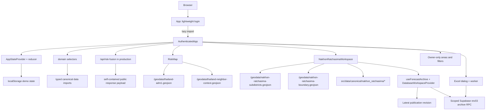

# Korat Tan Phai / โคราชทันภัย Architecture

## Current Architecture

FACT: The app is a Vite SPA with Supabase Auth, scoped published forecast reads
and personal saved workspaces. Vercel also hosts risk-fusion, model-input,
health, telemetry and operational-context handlers. Implemented handlers do not
imply configured live ingestion; see `API.md` and `NFR_OPERATIONS_RUNBOOK.md`.

Forecast-only restoration (2026-09-20): all public workspace routes mount the
forecast loader; no Actual intent branch is active. See
[FORECAST_ONLY_RESTORATION.md](FORECAST_ONLY_RESTORATION.md) and
[HANDOFF.md](HANDOFF.md). The Actual source/model/metadata implementation remains
parked and unconfigured; it is not a dependency of forecast navigation.

- Framework: Vite + React + TypeScript.
- Rendering: client-side React mounted from `src/main.tsx`.
- State: reducer/context in `src/store.tsx`.
- Persistence: Supabase for archive/followed areas/saved filters when enabled;
  browser `localStorage` for remaining preferences/demo workflows only.
- Data: static JSON imported through `src/data/catalog.ts`, including the
  canonical source registry and map layer catalogue.
- API: `api/risk-fusion.ts` returns a sanitized risk-fusion explanation in
  production without importing browser-side JSON catalog modules into the
  serverless runtime.
- Legacy nationwide map: static Thailand ADM1 GeoJSON fetched from `/geodata/thailand-adm1.geojson`,
  with non-interactive regional-country context from
  `/geodata/thailand-neighbor-context.geojson`.
- Local geography: Nakhon Ratchasima routes use static GISTDA subdistrict
  geometry from `/geodata/nakhon-ratchasima-subdistricts.geojson` and canonical
  research fixtures under `src/data/canonical/nakhon_ratchasima/`. The visible
  local province outline is the generated
  `/geodata/nakhon-ratchasima-boundary.geojson` artifact derived from the same
  subdistrict geometry, while ADM1 remains only national/context geometry.
- Rainfall: Nakhon Ratchasima has static rainfall source-audit, DWR EWS station,
  current-observation schema, monthly-context, and 289-subdistrict coverage
  fixtures. No live rainfall readings or province water-provider snapshots are
  ingested into the app yet.
- Drought forecast archive: published rev03 rows from `Drought_T1-6_rev03.xlsx`
  are read through `src/data/supabaseForecastArchive.ts` in database mode.
  `drought_forecast_archive_rev03.json` is the canonical verification/static-mode
  artifact. Rev02 is retired and is not a runtime fallback.
- Deployment: Vercel static build.
- Backend/database: Supabase Auth, immutable published forecast tables and
  owner-only saved workspaces. See `SUPABASE_DATA_MIGRATION.md`; unrelated
  operational domains have not been migrated.

## Runtime Boundaries

The diagram includes retained legacy RiskMap/risk-fusion branches; they are not
primary product navigation. See `APP_MAP.md` for the active surfaces.

Boundary rules:

- Parked, not mounted: `operationalPolicy.mjs` owns Bangkok calendar/family resolution;
  `useOperationalContext.ts` aborts departed requests, ignores late results and
  revalidates server time without a persistent operational cache. Unknown feed
  contracts fail closed; metadata is never promoted into observations.
- `operationalData.ts` defines/test-drives actual and eligible forecast resolution
  for future adapters. These integration contracts are not a connected data service.
  Actual-source absence does not mount `useForecastArchive` as a fallback.
- The active product reuses the forecast local map, selects, metrics, disclosures
  and bookmarks at every level. The parked `operationalUnavailable` variant has
  no live route; it is not an actual-value renderer.
- `src/data/canonical/*.json` is read-only source fixture data.
- `src/data/catalog.ts` casts JSON into typed application records and derives
  catalog lists.
- `src/data/forecastArchive.ts` loads content-hashed rev03 JSON in static mode
  only. Database builds alias it to `disabledStaticForecastArchive.ts` and do
  not emit raw archive assets or use them after a database failure.
- `src/useForecastArchive.ts` owns the loading lifecycle. The workspace passes
  the loaded archive into shared components. Database requests are scoped by
  origin and area; overview requests one horizon and drought requests six.
  Each load rechecks the server revision before cache reuse. Visible pages also
  revalidate on focus/visibility and every 60 seconds. Static mode alone uses a
  generated T+1 projection. See `FORECAST_SCOPED_LOADING.md`.
- `src/data/localMapGeometry.ts` shares pending/parsed local geometry requests.
  Forecast routes prefetch geometry alongside the archive to avoid serial
  loading. Optional context failures do not block the subdistrict geometry.
- `DatabaseWorkspaceProvider` owns per-Auth-user archive caches and saved-row
  clients in database mode. Its security-invoker RPC reconstructs the canonical
  full/T+1 projections. Static archive loaders/assets are replaced at build time;
  network errors do not fall back to JSON. Logout/account changes clear caches.
- `WorkspaceBookmarks` is shared by desktop/mobile account toolbars. Geographic
  following does not depend on a forecast selection. Structured archive selections
  preserve area, source month T, T+, dataset and map risk. Legacy
  `target`/`target_period` fields continue to key that source month. Only restoring a
  saved item remounts the route workspace; normal filter dialogs remain open.
- `src/domain.ts` owns deterministic joins and derived summaries.
- `src/store.tsx` owns UI state, workflow transitions, and local persistence.
- `src/App.tsx` owns lightweight login and browser history. It lazily imports
  `src/AuthenticatedApp.tsx` after login so canonical data is not in login startup.
  Its eager `AppStartup` renders public branding and neutral placeholders while
  a protected route checks its session or downloads the authenticated chunk.
  `ForecastLoadingPrimitives` stays independent of workspace/catalog loaders;
  the explicit login route keeps its login frame. No account data, protected
  component, or forecast fetch is introduced before session resolution.
  Deep-link query parameters and hashes survive login redirects.
- `src/AuthenticatedApp.tsx` owns the authenticated shell and remaining app
  surfaces. Ordinary internal content links use client navigation; modified
  clicks, downloads and external links retain browser behavior.
- `src/browserStorage.ts` wraps storage errors with a document-lifetime fallback;
  `src/persistedState.ts` validates persisted fields and nested runtime records.
  `src/store.tsx` does not rewrite the snapshot merely on mount. A visible notice
  reports invalid or unavailable preference storage. Auth token persistence is
  separately managed by the Supabase SDK, not this wrapper.
- `AppErrorBoundary` guards root/loading and routed content. Render retry
  remounts content without clearing storage; failed module loading retries by
  reloading the current URL because browsers cache failed dynamic imports.
- `src/components/RiskMap.tsx` owns map rendering, province selection, bounded
  zoom/pan, regional-country underlay rendering, and GeoJSON joins.
- `src/components/ProvinceWorkspacePlaceholder.tsx` owns route-backed
  placeholder dashboards for canonical provinces that do not yet have local
  drill-down data. It provides containers only and must not fabricate local
  evidence.
- `src/components/NakhonRatchasimaWorkspace.tsx` owns the Nakhon Ratchasima
  route composition, filters and loading state. View implementations now live
  under `src/components/nakhon-ratchasima/`, separately from the local map and
  forecast model. The extraction preserves existing calculations and markup.
  Never join evidence by route slug or display no-data as normal risk.
- Rainfall helper ownership lives in `src/domain.ts`. Components consume
  `getNakhonRatchasimaRainfall*` selectors and must keep direct-station coverage
  separate from nearest-station representative context.
- Drought forecast archive calculations live in
  `src/components/nakhon-ratchasima/forecastModel.ts`, using shared calendar-month
  arithmetic in `src/forecastPeriod.ts` for forecast views and saved selections.
  They preserve the source month T and T+ horizon, deriving origin = T and actual
  target = T+horizon for product display instead of using the legacy manifest's
  backwards issue date.

## Frontend / Backend / API Ownership

FACT:

- Frontend ownership is all user-facing behavior in this repo.
- Vercel handlers are `api/risk-fusion.ts`, `api/model-inputs.js`,
  `api/health.js` and `api/telemetry.js`. Model-input persistence is isolated
  from published forecast data and cannot automatically replace it. Configuration
  and deployment evidence are tracked separately from code in `API.md`/`HANDOFF.md`.
- Supabase Email + Password authentication is managed by `src/useAuth.ts` and
  the shared lazy client in `src/supabase.ts`. See `docs/AUTH_SETUP.md` for
  implementation status and real-account verification prerequisites.
- Personas from `src/data/canonical/users.json` are display context only,
  never authorization or evidence of an admin role.
- Delivery and alerting are retained local demos, not active notification services.

PROPOSAL:

- If this becomes operational, split domains into `alerts`, `geography`,
  `sources`, `field-verification`, `advisories`, `notifications`, and
  `audit-log`.
- Add verified backend authorization before using live data, real notifications
  or admin approvals.

## External Services

Current external services:

- Vercel hosts the static production app.
- Vercel hosts the read-only risk-fusion serverless endpoint. The function is
  intentionally self-contained because Vercel type-checks API code under a
  Node runtime that should not pull in Vite/browser JSON imports.
- Google Fonts loads `Google Sans` from `index.html`.
- Supabase provides email/password sessions and the opt-in archive/saved
  workspace provider. Browser access obeys RLS; no privileged key ships.
- Browser fetches local static map assets from the deployed app.

Current external-data facts:

- The Thai ADM1 map file is static in `public/geodata/thailand-adm1.geojson`.
- The regional-country context file is static in
  `public/geodata/thailand-neighbor-context.geojson`; it is Natural Earth 1:110m
  Admin 0 context used only as a low-emphasis orientation underlay.
- The Nakhon Ratchasima subdistrict context file is static in
  `public/geodata/nakhon-ratchasima-subdistricts.geojson`; it is a province-code
  `30` extract of GISTDA subdistrict boundaries transformed for web display.
- The Nakhon Ratchasima local province boundary file is static in
  `public/geodata/nakhon-ratchasima-boundary.geojson`; it is generated by
  dissolving all 289 local subdistrict geometries and must be regenerated with
  `npm run generate:nr-boundary` instead of edited by hand.
- The Nakhon Ratchasima DWR EWS rainfall station fixture is static in
  `src/data/canonical/nakhon_ratchasima/rainfall_stations.json`; it is used for
  station metadata and nearest-station coverage, not current rainfall values.
- `src/data/canonical/nakhon_ratchasima/rainfall_observations_24h.json`
  currently has zero current observations by design because live station-specific
  access still needs audit.
- `src/data/canonical/nakhon_ratchasima/drought_forecast_archive_rev03.json`
  is the approved source-backed T+1 through T+6 verification/static artifact.
  See `DROUGHT_REV03_NORMALIZATION.md` and `DROUGHT_REV03_CUTOVER.md` for lineage;
  older rev02 files/builders are not the current data contract.
- Canonical risk data is local JSON in `src/data/canonical/`.
- Documentation names the original local spec/data package path:
  `/Users/point/Downloads/agri_risk_codex_single_source`.

needs audit:

- Verify production licensing and attribution for any official data source
  before replacing prototype scores.
- Verify whether Google Fonts is acceptable for emergency/low-bandwidth use or
  whether self-hosted font files are required.

## Data Flow

1. Vite bundles imported canonical JSON from `src/data/catalog.ts`.
   The drought forecast archive is excluded from this catalog: Vite emits its
   canonical JSON as a separate asset via `?url` in static mode only. Database
   mode reads authenticated RPCs and excludes both raw archive assets. The overview summary is
   regenerated from that same source before dev/build by
   `scripts/generate-forecast-summary.mjs`.
2. Domain helpers in `src/domain.ts` compute records, summaries, workflow state,
   joins, delivery records, and map-related values.
3. The retained `RisksSection` can fetch `/api/risk-fusion`; it is not part of
   primary workspace navigation. Current workspace data comes from scoped
   Supabase reads, not this legacy explanation endpoint.
4. `src/store.tsx` initializes Thai default UI state and runtime workflow state.
5. User interactions dispatch reducer actions.
6. Reducer writes app state to `localStorage` under
   `korat-tan-phai-demo-state-v1`.
7. Components re-render from context state.

## Source-Of-Truth Rules

- Current code beats old notes when docs conflict.
- Latest explicit product decision beats older design references.
- Canonical JSON beats copied prose for fixture contents.
- Runtime state is demo-only and can be reset.
- Official context and synthetic scores must remain separated.
- `source_registry.json` is the source of truth for data-family provenance.
- `map_layer_catalog.json` is the source of truth for layer availability,
  no-data semantics, data class, and source linkage.
- Nakhon Ratchasima local hierarchy/evidence fixtures are source of truth for
  that workspace. They are additive children of existing province `TH-P29`.
- Generic province workspace slugs are derived from canonical province records
  in `src/data/catalog.ts`; they are navigation only and must not become data
  readiness flags.
- For Nakhon Ratchasima, `districtCode` and `subdistrictCode` are data keys;
  route slugs are navigation keys only.
- For Nakhon Ratchasima rainfall, `subdistrict_rainfall_coverage.json` is the
  source of truth for whether a subdistrict has a direct station, nearest
  station, or no available source. Nearest-station context must never be rendered
  as a direct subdistrict reading.
- For the drought forecast archive, the user confirmed on 2026-09-06 that
  `Source_YearMonth` is the origin/base month T for all 127 source months.
  Runtime projection uses `issueMonth = sourcePeriod` and actual
  `targetMonth = sourcePeriod + horizon`. The record identity remains
  `subdistrictCode + sourcePeriod + horizon`; equal numeric values across T+
  horizons are still different forecast vintages. Canonical bytes, published
  rows/RPC manifests and legacy source-month keys (`targetMonths`,
  `packedRiskByTargetMonth`, URL `target`, saved `target_period`) remain unchanged.
  The old fixed-target convention and workbook's original `UNCONFIRMED` marker
  remain historical provenance only; see `DATA_CONTRACT.md`.
- Archive risk values are `0` no forecast risk, `1` moderate forecast risk,
  `2` high forecast risk, and blank workbook cells are out of scope. Missing
  joined records are a different data-quality issue.
- Missing layer data must never be interpreted as low risk without an explicit
  available low-risk record.
- Public-safety copy must expose uncertainty and provenance.

## Current Facts vs Future Refactor Notes

FACT:

- Browser auth uses `VITE_SUPABASE_URL` and `VITE_SUPABASE_PUBLISHABLE_KEY`.
- Current API routes and configuration boundaries are maintained in `API.md`.
- There is no service worker, offline cache, or push notification registration.
- SQL migrations, a pinned-source importer, isolated PostgreSQL tests and
  recorded API verification cover the archive and personal workspaces.
  Production release evidence lives separately in `HANDOFF.md`.

PROPOSAL:

- Extend the existing typed/scoped data-access layer for any new approved
  data families, without treating prototype catalogs as live sources.
- Add append-only server audit logs before real admin/operator approvals.
- Add provider-specific notification receipts before claiming delivery
  guarantees.

## Do Not Break

- 77 province map join coverage.
- Nakhon Ratchasima local coverage: `TH-P29`, 32 districts, 289 subdistricts,
  and GeoJSON coverage for all 289 subdistrict codes.
- Nakhon Ratchasima rainfall coverage: 49 stations, 29 direct-station
  subdistricts, and 260 nearest-station records with explicit distance and
  confidence.
- Nakhon Ratchasima drought archive coverage: 289 mapped Source_IDs, 127 source
  months T from `2015-06` through `2025-12`, 6 forward horizons, and 220,218
  canonical forecast vintages. Actual target dates span `2015-07` through
  `2026-06`.
- 22-month province coverage and 1,694 province-month records.
- Thai-only visible production UI; no TH/EN switch.
- Farmer alert gating after advisory publication.
- No fabricated drill-down data for unseeded locations.
- Visible provenance and prototype data labels.
