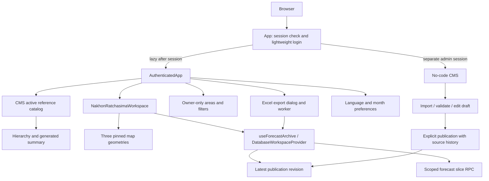

# Korat Tan Phai / โคราชทันภัย Architecture

Source cleanup checkpoint: 2026-10-03. This describes the current working source;
release and production evidence are tracked separately in [HANDOFF.md](HANDOFF.md).

## Current Architecture

The product is a Vite + React + TypeScript SPA with Supabase Auth, scoped
published drought forecasts, owner-only saved workspaces and an independently
authenticated no-code CMS. Vercel hosts the frontend and admin-data, model-input,
health, telemetry and operational-context handlers. Implemented handlers do not
imply configured live feeds or automated ingestion.

Public workspace routes remain forecast-only under
[FORECAST_ONLY_RESTORATION.md](FORECAST_ONLY_RESTORATION.md). Actual source/model/
metadata contracts are parked and unconfigured; they are not a dependency of
forecast navigation or a fallback for missing forecast data.

The active data graph has three parts:

1. Published rev03-compatible forecast rows, read by area, origin month and
   horizon through Supabase revision and slice RPCs.
2. Five published CMS system references: real administrative hierarchy,
   generated archive summary and three map geometries. Only the first two are
   startup payloads; map geometries load on demand.
3. Owner-only followed areas/saved filters, independent of local preferences.

The canonical rev03 JSON and normalized source package remain verification
artifacts and inputs for isolated static regression builds. Synthetic nationwide
risk/workflow data, old source lists, research/rainfall stubs, rev02 artifacts,
the national demo map and risk-fusion endpoint have been removed from runtime.

## Runtime Boundaries

- `src/App.tsx` owns browser history, lightweight login and lazy authenticated
  loading. `AppStartup` shows branding/neutral placeholders while protected
  routes resolve a session or load a chunk. No protected forecast request or
  account content appears before session resolution. Return paths preserve
  query parameters and hashes.
- `src/AuthenticatedApp.tsx` owns the visitor shell, workspace composition,
  saved-workspace/export actions and account controls. Internal links use client
  navigation; downloads, external links and modified clicks retain browser behavior.
- `src/data/catalog.ts` derives real locations from `admin_hierarchy.json` only.
  `src/domain.ts` owns geographic lookup, routing and formatting helpers. It no
  longer computes synthetic events, delivery records or research readiness.
- `src/store.tsx` owns supported language/month preferences and transient toasts.
  `src/persistedState.ts` validates these fields; `src/browserStorage.ts` handles
  unavailable storage with an explicit document-lifetime fallback. No demo
  workflow is restored or persisted.
- `src/components/NakhonRatchasimaWorkspace.tsx` coordinates route scope, filters
  and loading. Views, the local map and forecast calculations live under
  `src/components/nakhon-ratchasima/`. `workspaceModel.ts` retains geometry,
  camera, real geography and forecast criteria helpers only.
- `src/components/nakhon-ratchasima/forecastModel.ts` and `src/forecastPeriod.ts`
  preserve origin T and derive the actual target as T plus horizon. Maps,
  summaries, detail views and export use the same risk/coverage semantics.

Future officer roles remain scaffolded in `src/access`. The visitor shell uses
explicit compatibility mode; this cleanup does not activate new restrictions or
modify backend ACLs. CMS sessions/membership remain separate. See
[WORKSPACE_ACCESS.md](WORKSPACE_ACCESS.md) and `src/authScope.ts`.

## Forecast and Reference Loading

`DatabaseWorkspaceProvider` owns per-user loaders and saved-row clients.
`src/data/supabaseForecastArchive.ts` checks `ktp_latest_forecast_revision`
before cache reuse, then reads `ktp_load_forecast_slice` for area/origin scope.
Overview requests one horizon; drought requests six. Published metadata controls
available source months and latest selection; the UI does not freeze them to a
baseline month. Logout/account changes dispose caches. Stale, wrong-scope and
wrong-revision responses cannot overwrite active data.

`useForecastArchive` coordinates deadlines/retry and revalidation on focus,
visibility and a periodic timer. Previously loaded same-scope data may remain
visible with revalidation feedback; failed Excel revalidation blocks download.
Initial failed/pending loads do not become green values. See
[FORECAST_SCOPED_LOADING.md](FORECAST_SCOPED_LOADING.md).

Database builds replace static archive loaders at build time and exclude raw
archive/T+1 assets. Isolated static builds use a content-hashed rev03 archive and
a generated T+1 projection. `generate:forecast-summary` regenerates the summary
and projection before dev/build; neither is a separate prediction source.

`shared/cmsResources.mjs` is the five-resource allowlist used by bootstrap,
`cms-reference-plugin.mjs`, seed preparation and admin resource validation.
CMS mode pins only active heads, requires hierarchy/summary payloads and ignores
retired extra rows. `src/data/localMapGeometry.ts` loads these three resources:

- Nakhon Ratchasima subdistrict geometry (all 289 canonical codes).
- Local province boundary generated from the same subdistrict geometry.
- Thailand ADM1 for neighboring province context.

Geometry requests share pending/parsed results and retain deadline/retry behavior.
Core geometry failure is actionable; optional context failure need not block the
core map. CMS builds fetch pinned published references, with no `/geodata/`
fallback. Static regression builds use the retained source files in that folder.
Regenerate the local outline with `npm run generate:nr-boundary`; do not hand-edit
coordinates. The unused country underlay is no longer loaded or bundled.

## Admin, Persistence and API Ownership

`src/admin` provides no-code CSV/XLS/XLSX import, validation, draft review/editing,
explicit publication and history. `server/admin-data` implements membership and
resource rules; migrations retain source uploads, publication/audit history and
immutable versions. User-facing fields and examples describe the source contract
in Thai rather than requiring code or raw database knowledge.

All five active reference resources are read-only system data. Unknown/inactive
keys cannot be cloned, edited or published through the HTTP resource handler.
Stored retired versions remain accessible through existing get/history operations;
source cleanup does not delete originals, CMS rows, revisions or database pointers.
The separate forecast import/edit/publish workflow remains supported.

Current Vercel entry points are:

- `api/admin-data.js`: admin CMS operations.
- `api/model-inputs.js`: validated, machine-authenticated input storage.
- `api/operational-context.js`: server clock/policy and source-gap metadata.
- `api/health.js`: liveness/private readiness contracts.
- `api/telemetry.js`: bounded technical event handling.

Model-input ingestion uses the real hierarchy for administrative-code validation.
Its collector, validation, isolated storage and backup/restore tools remain useful
backend capabilities; they do not automatically publish forecasts or prove a live
ThaiWater/local-system feed is configured. Review `API.md` and
`NFR_OPERATIONS_RUNBOOK.md` for deployment/configuration evidence.

Supabase Auth manages email/password sessions. Published forecast tables are not
browser-writable; saved-workspace rows are owner-scoped by RLS. No privileged
server key ships in the browser. Admin and visitor sign-out must not clear each
other's sessions. `WorkspaceBookmarks` preserves geography plus structured
origin/horizon/risk/irrigation selections; only explicit restoration remounts a
workspace, while ordinary filters remain usable in place.

Preferences use `korat-tan-phai-preferences-v1`. The previous demo key is read only
for supported preference fields when the new key is absent, and is not overwritten
or deleted. Initial mount/toasts do not write a new snapshot. Saved database rows
never fall back to browser persistence after a failed save.

## Parked Actual Contracts

`operationalPolicy.mjs` owns Bangkok calendar/family resolution;
`operationalData.ts` defines future actual and eligible-forecast resolution.
`useOperationalContext.ts` bounds/aborts metadata requests and ignores late results.
None supplies an active observation transport. Metadata cannot become an observed
value, forecast data cannot fill an actual gap, and source absence remains explicit.

Generic agricultural presentation components may remain for future source-backed
inputs. Their existence is not evidence of current crop-area values, readiness
percentages or a live feed. Historical rainfall/source audit documents retain
provenance and integration cautions without reactivating deleted research data.

## Contracts to Preserve

- One canonical province `TH-P29`, 32 districts and 289 subdistricts; join by
  administrative codes, never labels or route slugs. Preserve existing deep links.
- Original rev03 integrity: 289 mapped source IDs, 127 origin months and six
  horizons, totaling 220,218 vintages. Original source T spans June 2015 through
  December 2025; actual forecast targets are T+1 through T+6.
- Legacy fields `targetMonths`, `packedRiskByTargetMonth`, URL `target` and saved
  `target_period` continue to identify source T. Do not rewrite saved selections.
- Risk `0` is no detected forecast risk, `1` moderate and `2` high. Workbook blank
  is out-of-scope; missing joined records are a separate data-quality problem.
- Irrigation metadata does not imply a risk score. Missing data never becomes a
  green zero, fabricated source timestamp or official warning.
- Original workbook lineage and approved CMS publication history remain auditable.
  Current published revision supplies visible data, not deleted source-list prose.
- Thai visible UI, independent admin/visitor sessions, honest loading/retry and
  mobile map labels/selection behavior remain required.
