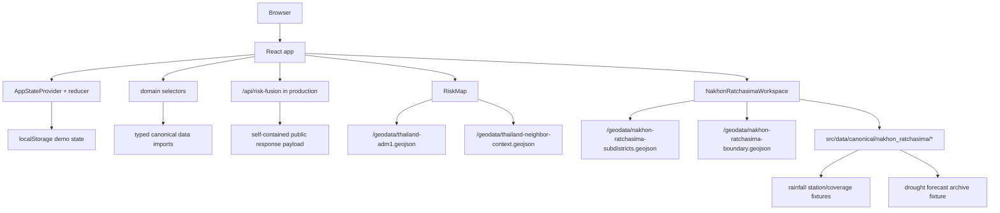

# เกษตรทันภัย Architecture

## Current Architecture

FACT: The app is primarily a static frontend prototype with one read-only
serverless endpoint.

- Framework: Vite + React + TypeScript.
- Rendering: client-side React mounted from `src/main.tsx`.
- State: reducer/context in `src/store.tsx`.
- Persistence: browser `localStorage`.
- Data: static JSON imported through `src/data/catalog.ts`, including the
  canonical source registry and map layer catalogue.
- API: `api/risk-fusion.ts` returns a sanitized risk-fusion explanation in
  production without importing browser-side JSON catalog modules into the
  serverless runtime.
- Map: static Thailand ADM1 GeoJSON fetched from `/geodata/thailand-adm1.geojson`,
  with non-interactive regional-country context from
  `/geodata/thailand-neighbor-context.geojson`.
- Local geography: Nakhon Ratchasima routes use static GISTDA subdistrict
  geometry from `/geodata/nakhon-ratchasima-subdistricts.geojson` and canonical
  research fixtures under `src/data/canonical/nakhon_ratchasima/`. The visible
  local province outline is the generated
  `/geodata/nakhon-ratchasima-boundary.geojson` artifact derived from the same
  subdistrict geometry, while ADM1 remains only national/context geometry.
- Rainfall: Nakhon Ratchasima has static rainfall source-audit, DWR EWS station,
  current-observation schema, monthly-context, and 289-subdistrict coverage
  fixtures. No live rainfall readings or province water-provider snapshots are
  ingested into the app yet.
- Drought forecast archive: `drought_forecast_archive_rev02.json` is a packed
  source-backed T+1 through T+6 archive fixture generated from the normalized
  rev02 workbook. It is consumed by the same Nakhon workspace at province,
  district, and subdistrict levels as the public drought prediction source.
- Deployment: Vercel static build.
- Backend/database: no database and no mutation service in the current repo.

## Runtime Boundaries

Boundary rules:

- `src/data/canonical/*.json` is read-only source fixture data.
- `src/data/catalog.ts` casts JSON into typed application records and derives
  catalog lists.
- `src/domain.ts` owns deterministic joins and derived summaries.
- `src/store.tsx` owns UI state, workflow transitions, and local persistence.
- `src/App.tsx` owns visible surfaces and form controls.
- `src/components/RiskMap.tsx` owns map rendering, province selection, bounded
  zoom/pan, regional-country underlay rendering, and GeoJSON joins.
- `src/components/ProvinceWorkspacePlaceholder.tsx` owns route-backed
  placeholder dashboards for canonical provinces that do not yet have local
  drill-down data. It provides containers only and must not fabricate local
  evidence.
- `src/components/NakhonRatchasimaWorkspace.tsx` owns the Nakhon Ratchasima
  province/district/subdistrict drill-down UI. It consumes domain helpers and
  must not join evidence by route slug or display no-data as normal risk.
- Rainfall helper ownership lives in `src/domain.ts`. Components consume
  `getNakhonRatchasimaRainfall*` selectors and must keep direct-station coverage
  separate from nearest-station representative context.
- Drought forecast archive helpers live in `src/domain.ts` and
  `src/components/NakhonRatchasimaWorkspace.tsx`. They must preserve target
  month, issue month, and T+ horizon instead of reducing the archive to a single
  latest-risk value.

## Frontend / Backend / API Ownership

FACT:

- Frontend ownership is all user-facing behavior in this repo.
- Backend ownership is limited to a read-only Vercel function for a public,
  sanitized risk-fusion explanation.
- API ownership currently exists only for `GET /api/risk-fusion`.
- Authentication is simulated by selecting personas from
  `src/data/canonical/users.json`.
- Delivery and alerting are simulated in local runtime state.

PROPOSAL:

- If this becomes operational, split domains into `alerts`, `geography`,
  `sources`, `field-verification`, `advisories`, `notifications`, and
  `audit-log`.
- Add a backend before using live data, real notifications, user accounts, or
  admin approvals.

## External Services

Current external services:

- Vercel hosts the static production app.
- Vercel hosts the read-only risk-fusion serverless endpoint. The function is
  intentionally self-contained because Vercel type-checks API code under a
  Node runtime that should not pull in Vite/browser JSON imports.
- Google Fonts loads `Google Sans` from `index.html`.
- Browser fetches local static map assets from the deployed app.

Current external-data facts:

- The Thai ADM1 map file is static in `public/geodata/thailand-adm1.geojson`.
- The regional-country context file is static in
  `public/geodata/thailand-neighbor-context.geojson`; it is Natural Earth 1:110m
  Admin 0 context used only as a low-emphasis orientation underlay.
- The Nakhon Ratchasima subdistrict context file is static in
  `public/geodata/nakhon-ratchasima-subdistricts.geojson`; it is a province-code
  `30` extract of GISTDA subdistrict boundaries transformed for web display.
- The Nakhon Ratchasima local province boundary file is static in
  `public/geodata/nakhon-ratchasima-boundary.geojson`; it is generated by
  dissolving all 289 local subdistrict geometries and must be regenerated with
  `npm run generate:nr-boundary` instead of edited by hand.
- The Nakhon Ratchasima DWR EWS rainfall station fixture is static in
  `src/data/canonical/nakhon_ratchasima/rainfall_stations.json`; it is used for
  station metadata and nearest-station coverage, not current rainfall values.
- `src/data/canonical/nakhon_ratchasima/rainfall_observations_24h.json`
  currently has zero current observations by design because live station-specific
  access still needs audit.
- `src/data/canonical/nakhon_ratchasima/drought_forecast_archive_rev02.json`
  contains the source-backed rev02 T+1 through T+6 forecast archive. It was
  generated from `Drought_T1-6_rev02_Normalized_ArchiveReady(1).xlsx` using
  `scripts/build-nr-drought-forecast-archive.py`.
- Canonical risk data is local JSON in `src/data/canonical/`.
- Documentation names the original local spec/data package path:
  `/Users/point/Downloads/agri_risk_codex_single_source`.

needs audit:

- Verify production licensing and attribution for any official data source
  before replacing prototype scores.
- Verify whether Google Fonts is acceptable for emergency/low-bandwidth use or
  whether self-hosted font files are required.

## Data Flow

1. Vite bundles imported canonical JSON from `src/data/catalog.ts`.
2. Domain helpers in `src/domain.ts` compute records, summaries, workflow state,
   joins, delivery records, and map-related values.
3. In production, `RisksSection` fetches the risk-fusion explanation from
   `/api/risk-fusion`; the endpoint returns only the public explanation payload
   and does not import the frontend catalog.
4. `src/store.tsx` initializes Thai default UI state and runtime workflow state.
5. User interactions dispatch reducer actions.
6. Reducer writes app state to `localStorage` under
   `korat-tan-phai-demo-state-v1`.
7. Components re-render from context state.

## Source-Of-Truth Rules

- Current code beats old notes when docs conflict.
- Latest explicit product decision beats older design references.
- Canonical JSON beats copied prose for fixture contents.
- Runtime state is demo-only and can be reset.
- Official context and synthetic scores must remain separated.
- `source_registry.json` is the source of truth for data-family provenance.
- `map_layer_catalog.json` is the source of truth for layer availability,
  no-data semantics, data class, and source linkage.
- Nakhon Ratchasima local hierarchy/evidence fixtures are source of truth for
  that workspace. They are additive children of existing province `TH-P29`.
- Generic province workspace slugs are derived from canonical province records
  in `src/data/catalog.ts`; they are navigation only and must not become data
  readiness flags.
- For Nakhon Ratchasima, `districtCode` and `subdistrictCode` are data keys;
  route slugs are navigation keys only.
- For Nakhon Ratchasima rainfall, `subdistrict_rainfall_coverage.json` is the
  source of truth for whether a subdistrict has a direct station, nearest
  station, or no available source. Nearest-station context must never be rendered
  as a direct subdistrict reading.
- For the drought forecast archive, `Source_YearMonth` is the target month and
  `issueMonth = targetMonth - horizon`. The record identity is
  `subdistrictCode + targetMonth + horizon`; equal numeric values across T+
  horizons are still different forecast vintages.
- Archive risk values are `0` no forecast risk, `1` moderate forecast risk,
  `2` high forecast risk, and blank workbook cells are out of scope. Missing
  joined records are a different data-quality issue.
- Missing layer data must never be interpreted as low risk without an explicit
  available low-risk record.
- Public-safety copy must expose uncertainty and provenance.

## Current Facts vs Future Refactor Notes

FACT:

- There are no environment variables used by the app.
- There is one read-only API route: `GET /api/risk-fusion`.
- There is no service worker, offline cache, or push notification registration.
- There is no database schema.

PROPOSAL:

- Introduce a typed data-access layer before adding real APIs.
- Move large province-month data behind lazy loading or an API if bundle size
  becomes a performance problem.
- Add append-only server audit logs before real admin/operator approvals.
- Add provider-specific notification receipts before claiming delivery
  guarantees.

## Do Not Break

- 77 province map join coverage.
- Nakhon Ratchasima local coverage: `TH-P29`, 32 districts, 289 subdistricts,
  and GeoJSON coverage for all 289 subdistrict codes.
- Nakhon Ratchasima rainfall coverage: 49 stations, 29 direct-station
  subdistricts, and 260 nearest-station records with explicit distance and
  confidence.
- Nakhon Ratchasima drought archive coverage: 289 mapped Source_IDs, 127 target
  months from `2015-06` through `2025-12`, 6 horizons, and 220,218 canonical
  forecast vintages.
- 22-month province coverage and 1,694 province-month records.
- Thai-only visible production UI; no TH/EN switch.
- Farmer alert gating after advisory publication.
- No fabricated drill-down data for unseeded locations.
- Visible provenance and prototype data labels.
