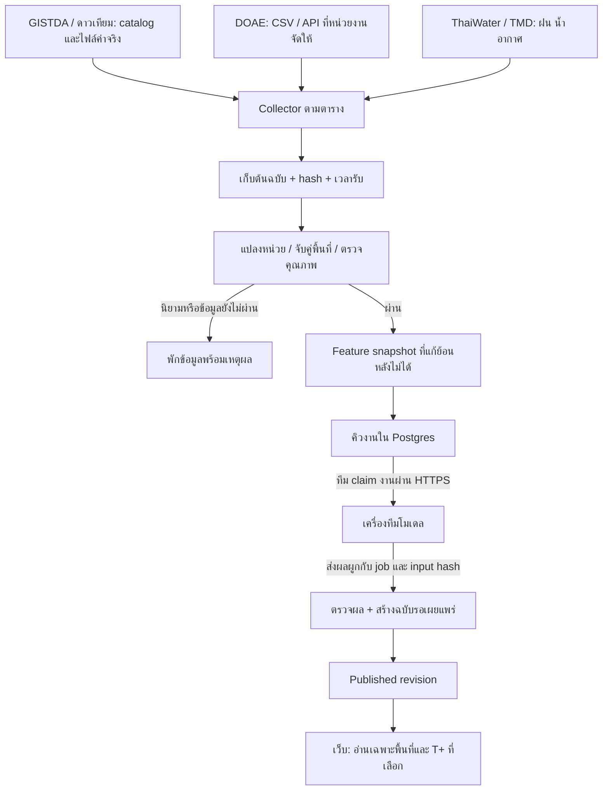
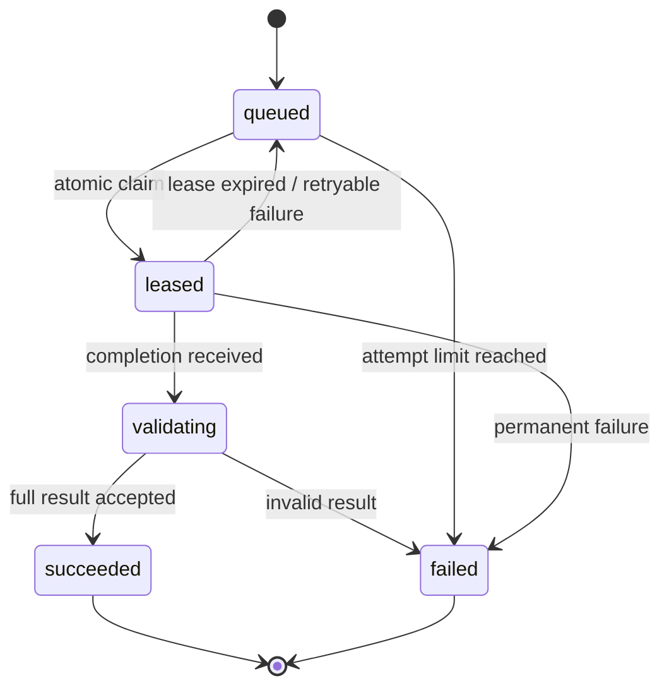

# แบบระบบข้อมูล → ทีมโมเดล → พยากรณ์ T+1–T+6

สถานะ: **ข้อเสนอ v2 สำหรับพัฒนา** · 8 กันยายน 2026 · โคราชทันภัย

ผู้อ่าน: Business Users, PO/BA, ทีมข้อมูล ทีมโมเดล ทีมเว็บ และผู้รับผิดชอบเผยแพร่ผล

ปรับปรุงคำอธิบายเชิงธุรกิจไทย–อังกฤษ: 9 กันยายน 2026

เพิ่ม Data Type, Mandatory, Nullable และ Sample Value: 9 กันยายน 2026

- [ตารางชนิดข้อมูลและตัวอย่าง v2 / V2 parameter tables](#parameter-reference)
- [Data mapping พร้อมค่าก่อน–หลังแปลง / Source-to-target mappings](MODEL_INPUT_DATA_MAPPING.md)

**สำหรับผู้อ่านที่ไม่ใช่สายเทคนิค:** เริ่มที่
[คำอธิบายแต่ละฟิลด์ภาษาไทยและอังกฤษ](#business-field-guide)
เพื่อดูว่าข้อมูลแต่ละช่องหมายถึงอะไร ใช้ทำอะไร และตัวเลขหรือค่าว่างควรอ่านอย่างไร

**For business readers:** Start with the [bilingual field guide](#business-field-guide)
for the meaning and business purpose of each field, including examples and the
difference between a missing value and zero. The original technical field names
are retained so business and development teams can refer to the same item.

ข้อเสนอนี้ใช้ผลการตรวจ [แหล่งข้อมูลไทย](THAI_AGRICULTURAL_DATA_RESEARCH.md)
และข้อจำกัดของโค้ดปัจจุบัน ไม่มีการสร้างฐานข้อมูลใหม่ ต่อ scheduler รันโมเดล
หรือเปลี่ยนข้อมูล production จากเอกสารนี้

## 1. แบบที่เสนอให้ทำ

ให้ระบบของเราดึงข้อมูลต้นทางอัตโนมัติ เก็บต้นฉบับและประวัติรุ่นข้อมูล
เตรียมชุด input ที่ตรวจสอบย้อนกลับได้ แล้วให้ **ทีมโมเดลดึงงานไปประมวลผล
บนเครื่องหรือ server ของทีมเอง** ทีมส่งผลกลับผ่าน API; ระบบตรวจผลและ
เผยแพร่เป็น revision ที่เว็บอ่านได้โดยไม่ต้อง build หรืออัปโหลด Excel ใหม่



เริ่มด้วยระบบขนาดเล็ก: **เว็บ/API เดิม + Supabase Postgres/Auth/พื้นที่เก็บไฟล์
ส่วนตัว + worker สำหรับดึงและประมวลผลข้อมูลหนึ่งชุด + เครื่องทีมโมเดล**
ใช้ตาราง jobs เป็นคิวก่อน งานอ่าน GeoTIFF และคำนวณเชิงพื้นที่อยู่ใน worker
เช่น Python container; API รับคำขอ ตรวจสิทธิ์ และจัดการสถานะ ไม่รับงานหนัก
ไว้ใน HTTP request ของ Vercel และ browser ไม่ถือกุญแจเข้าถึงข้อมูลต้นทาง

### สิ่งที่มีแล้ว กับสิ่งที่ต้องพัฒนา

| ส่วน | มีแล้วใน checkout | ข้อเสนอรอบถัดไป |
| --- | --- | --- |
| Collector | HTTP GET / local CSV-JSON, mapping, retry | adapter ตาม provider, catalog pagination, scheduler, ตรวจ revision |
| Input API | `GET/POST /api/model-inputs`, batch immutable, auth | raw artifacts, source หลายราย, สิทธิ์แยกตามงาน |
| Storage | local file store; Supabase adapter และ migration ที่เตรียมไว้ | private object storage, staging, metadata, feature manifests |
| Model handoff | draft v1 และตัวอย่าง synthetic | v2 ที่กำหนดเวลา/นิยามข้อมูลชัดเจน, durable jobs, model results |
| Forecast web | Supabase Auth และ scoped reads ของ archive เดิม | live model source family, status ใหม่, publication transaction |
| Model / schedule | ยังไม่มีการรันจริงหรือ schedule | ทีมโมเดลจัด runner; ทีมระบบจัด worker/scheduler |

โค้ดปัจจุบันอยู่ใน [API contract](API.md),
[input modules](../server/model-inputs/),
[draft model contract](../server/model-inputs/model-contract.mjs)
และ [scoped forecast reads](FORECAST_SCOPED_LOADING.md)
ตัวอย่าง v2 ด้านล่าง **ยังส่งเข้า validator v1 ไม่ได้**

## 2. รับข้อมูลอะไร และให้ต้นทางส่งแบบไหน

ต้นทางไม่จำเป็นต้องเปลี่ยน tech stack ถ้ามี API เราใช้ GET; ถ้ามีไฟล์ดาวเทียม
เราอ่าน catalog แล้วดาวน์โหลด asset; ถ้ามีเพียงระบบเก่า ให้ตั้ง export CSV
ลงโฟลเดอร์หรือ SFTP ตามเวลา แล้ววาง collector ใกล้ระบบนั้นเพื่อส่ง HTTPS
ออกมายังเรา การอ่านฐานข้อมูลเก่าทำผ่าน read-only view/bridge ที่หน่วยงานจัดให้
ส่วน push API เป็นทางเลือกเมื่อหน่วยงานพัฒนาต่อได้

| แหล่ง | ข้อมูลที่ต้องการ | วิธีเชื่อมที่เสนอ | หลักฐาน/ข้อจำกัดที่ตรวจพบ |
| --- | --- | --- | --- |
| GISTDA | ค่าความชื้นดิน, LST, ดัชนีน้ำ/พืช พร้อม QA, เวลาและพื้นที่ | STAC catalog → asset ที่มีค่าจริง → worker | พบ `smap`, `lst`, `ndwi`, `dri_plus`; ยังไม่ได้ยืนยัน raw asset และสิทธิ์จริงครบ [catalog](https://opendata.gistda.or.th/dataset/disaster-platform-drought) |
| ดาวเทียมเสริม | NDVI/EVI และฝนย้อนหลัง เมื่อ product ไทยไม่ครอบคลุม | adapter รายผลิตภัณฑ์ ใช้ native window ก่อนสรุปรายเดือน | เช่น [MODIS NDVI](https://developers.google.com/earth-engine/datasets/catalog/MODIS_061_MOD13Q1), [CHIRPS](https://chc.ucsb.edu/data/chirps3); การสลับ product ต้องเปลี่ยน feature/model version |
| DOAE | พืช/พันธุ์/รอบปลูก พื้นที่ปลูก–เก็บเกี่ยว–เสียหาย ผลผลิตและผลผลิตต่อไร่ | ดาวน์โหลดไฟล์จาก catalog อัตโนมัติ; ภายหลังรับ API ได้ | CSV จริงมีปีและเดือนในแถว แม้เผยแพร่เป็นไฟล์รายปี [catalog](https://data.go.th/th/dataset/production_doae) |
| ThaiWater | ฝนและน้ำจากสถานีสำหรับเสริม/ตรวจสอบข้อมูลดาวเทียม | adapter GET JSON; ผูกสถานีกับพื้นที่ด้วยวิธีที่ระบุรุ่น | เรียก [ฝน 24 ชม. จังหวัด 30](https://api-v3.thaiwater.net/api/v1/thaiwater30/public/rain_24h?province_code=30) ได้จริง; ต้องยืนยัน timezone/window ก่อนใช้ |
| TMD / forecast provider | ฝน/อุณหภูมิอนาคต พร้อม issue time และ ensemble | เก็บ forecast vintage แยกจาก observation | [seasonal WRF](https://weather.tmd.go.th/seasonal/index.html) ระบุ experimental; ต้องประเมิน skill ในไทยก่อนเลือกใช้ |

ข้อมูลขั้นต่ำที่ขอจากหน่วยงาน ไม่ว่าจะส่ง API หรือไฟล์:

| กลุ่ม | ฟิลด์หรือคำอธิบายที่ต้องได้ |
| --- | --- |
| ตัวตนข้อมูล | dataset/product, version/revision, record ID หรือ identity ของแถว |
| เวลา | ช่วงที่วัดหรือรายงาน, timezone, วันเผยแพร่ถ้าทราบ, รอบปรับปรุง |
| พื้นที่ | รหัสตำบล หรือพิกัด/ขอบเขต; ถ้ามีแต่ชื่อ ต้องมีจังหวัด–อำเภอ–ตำบลครบ |
| ค่าข้อมูล | ชื่อตัวแปร, value, unit, scale/offset, missing/nodata, QA |
| ความหมาย | ตัวหาร/วิธีรวมยอด, สูตรดัชนี, native resolution, รอบปลูก/ช่วง composite |
| การเชื่อม | URL หรือที่วางไฟล์, วิธีเข้าถึง, pagination/history/revision, ผู้ติดต่อแก้ schema |

ระบบเราสร้าง `firstSeenAt`, `retrievedAt`, hash และ internal IDs เอง
หน่วยงานไม่ต้องทำ JSON ตามแบบภายในทั้งหมด ส่งของเดิมพร้อม data dictionary
แล้ว adapter ของเรารับผิดชอบแปลง

### ตารางดึงข้อมูลเริ่มต้น — เป็นข้อเสนอการตั้งค่า

| งาน | ความถี่ที่เสนอ | ทำเมื่อพบอะไร |
| --- | --- | --- |
| สำรวจ catalog ดาวเทียม | วันละ 1 ครั้ง | asset/revision ใหม่จึงดาวน์โหลดและประมวลผล |
| สำรวจ DOAE catalog | สัปดาห์ละ 1 ครั้ง | ไฟล์หรือเนื้อหาเปลี่ยนจึงเก็บ snapshot ใหม่ |
| อ่าน ThaiWater | ทุก 1 ชั่วโมง ถ้าจะใช้ประกอบโมเดล | เก็บค่ารวมศูนย์รวมทั้งฝน 0; แยกเวลาตรวจจากเวลาสังเกต |
| สร้าง feature snapshot | หลัง input ที่จำเป็นเปลี่ยนและผ่าน QA | ใช้ hash ป้องกันการสร้างซ้ำ |
| ออกผล T+1–T+6 | เดือนละ 1 รอบก่อน | วันที่ออกจริงขึ้นกับ readiness ของ product ที่เลือก; รอบแก้ไขมี revision ใหม่ |

ต้องปรับตาม cadence/quota ที่ยืนยันกับ provider การเช็กทุกวันไม่ได้ทำให้
ภาพ composite หรือผลผลิตรายปีเป็นข้อมูลรายวัน เป้าหมายคือ **อัปเดตอัตโนมัติ
ตามข้อมูลที่ต้นทางเผยแพร่** และแสดงความสดของแต่ละชนิดข้อมูลอย่างตรงไปตรงมา

## 3. ชั้นเก็บข้อมูลและกติกาการแปลง

ใช้ชื่อด้านล่างเป็น logical entities สำหรับออกแบบ migration ภายหลัง
ตารางทั้งหมดอยู่หลัง service API/RLS; browser อ่านได้เฉพาะ published view

| Entity | สิ่งที่เก็บ / identity สำคัญ |
| --- | --- |
| `source_registry` | provider, adapterVersion, productDefinitionId, URL allowlist, cadence, credential reference, enabled status |
| `ingestion_runs` | แต่ละครั้งที่ตรวจ/ดึง: runId, sourceId, เวลา, status, จำนวนแถว, error category, watermark |
| `raw_artifacts` | sourceId + providerObjectId + revision/content hash; private object key, format, byte count, เวลาที่เกี่ยวข้อง |
| `raw_crop_rows` | artifactId + rowNumber; ค่าและชื่อเดิม, semanticStatus, blockedReasons |
| `normalized_observations` | ตัวตน source record/พื้นที่/ช่วงเวลา/metric/product/revision; ค่าที่แปลงหน่วยแล้วและ lineage |
| `crop_outcomes` | พื้นที่ + พืช + พันธุ์ + รอบปลูก + ช่วงรายงาน + periodMeaning + revision; grain ตามนิยามที่ยืนยัน |
| `feature_snapshots` | manifestId/hash, cutoff, featureSpecVersion, geometry/mask/QA versions, artifact list, coverage |
| `model_specs` | target/feature/training/model/threshold/calibration versions, scope policy, skill report, approval state |
| `model_jobs` | jobId, requestHash, manifestId, modelSpecVersion, state, attempt, lease และ fencing token |
| `model_results` | immutable resultId/hash, jobId/requestHash, model digest, predictions, generatedAt, validation state |
| `forecast_publications` | publicationId, resultId, runMode, originMonth, issuedAt/originalIssuedAt/publishedAt, revision, correction reference, lineageKind, coverage, decision |
| `forecast_cells` | publicationId + subdistrictCode + horizon; targetMonth, status, risk, reason, uncertainty |
| `audit_events` | ผู้กระทำ/เวลา/action/เหตุผล, IDs และ transition; ไม่เก็บ secret หรือ signed URL |

แยกไฟล์ใหญ่จากฐานข้อมูล: CSV/JSON ต้นฉบับ, GeoTIFF, Parquet และ model artifact
อยู่ใน private object storage; Postgres เก็บ metadata และข้อมูลระดับตำบล
ชื่อ object ใช้ ID/hash, ไม่ overwrite object เก่า ผลที่ผ่าน validation แล้ว
แก้เป็น revision ใหม่เสมอ เก็บ retrieval receipt ของการพบ hash เดิมเพิ่มได้

### เวลาและประวัติรุ่นข้อมูล

- `observationStart`/`observationEnd`: ช่วงที่ค่ากล่าวถึง ใช้ช่วงเวลาแบบ
  **รวมจุดเริ่ม ไม่รวมจุดสิ้นสุด** `[start, end)` พร้อม timezone/calendar
- `providerPublishedAt`: เวลาที่ต้นทางเผยแพร่ revision นี้ ถ้าไม่ทราบเป็น `null`
- `firstSeenAt`: เวลาที่ collector พบเนื้อหา revision นี้ครั้งแรก ระบบลงเวลาเอง
- `retrievedAt`: เวลาดึงครั้งนี้; `validatedAt`: เวลาที่ผ่านการตรวจภายใน
- `availabilityEvidence`: หลักฐานวันเผยแพร่ เช่น versioned archive หรือ
  `first_seen_only`; `Last-Modified` เพียงอย่างเดียวไม่รับรอง vintage ย้อนหลัง

งานจริงใช้เฉพาะสิ่งที่ระบบมีแล้วภายใน cutoff และผ่าน QA ก่อน freeze snapshot
ข้อมูลที่พบครั้งแรกหลัง cutoff ต้องรอรอบใหม่ แม้ไฟล์ระบุ observation เก่ากว่า
สำหรับค่าที่วัดจริง/ผลผลิตที่เกิดขึ้นแล้ว ต้องมี observation window สิ้นสุด
ไม่เกิน cutoff ด้วย ส่วน forecast forcing อนุญาต target window หลัง cutoff
ได้ แต่ issue time และ vintage ที่ระบบรับมาของ forecast นั้นต้องไม่เกิน cutoff
สำหรับ backtest แบบ **as-issued** ต้องพิสูจน์ revision ที่มีให้ใช้ ณ เวลานั้น
รวมทั้ง model/preprocessing/label vintages; ถ้าทำไม่ได้ให้ติดป้าย
`retrospective_reconstruction` และห้ามใช้รับรองความแม่นยำเสมือนรันจริงในอดีต

### ดาวเทียม

1. เก็บ metadata/asset ตาม native window ก่อน แยก observation กับ forecast
2. Registry ของ product ระบุ band/formula, scale, offset, unit, nodata, QA,
   grid spacing และ native measurement support; ไม่สรุป native support จาก
   ขนาดพิกเซลที่ resample แล้ว
3. ใช้ขอบเขต **รหัสตำบล 6 หลัก** และ geometry version เดียวกับชุดอ้างอิง
   289 ตำบล; การใช้ crop mask ต้องระบุปี/รุ่น/ฤดู พร้อม area denominator
4. สรุปเชิงพื้นที่ตาม feature spec เช่น crop-area weighted mean พร้อม
   `validPixelFraction`, `temporalCoverageFraction`, missing reason และ
   coarse-grid flag; ต้องกำหนดวิธีตัดสิน pixel/window ที่ซ้อนกัน
5. ฝนสะสม 30 วันไม่ใช่ยอดรายเดือน และห้ามบวก 7/15/30 วันที่ซ้อนกัน
   ถ้าไม่มีข้อมูลย่อยสำหรับ reconstruct เดือน ให้ใช้เป็น feature
   `rainfall_rolling_30d` แยกชนิด ไม่ตั้งชื่อ `monthly_precipitation`
6. NDWI, NDMI, NDVI และ DRI+ เป็นคนละตัวแปรจนกว่าจะยืนยันนิยามตรงกัน
   ภาพ tile สำหรับแสดงสีไม่ถือเป็น numerical raster สำหรับโมเดล

ตัวอย่าง **หนึ่ง normalized record** หลังมี product definition ที่ตรวจแล้ว
ค่าต่าง ๆ เป็นข้อมูลสมมติ; hash ที่ใช้ตัวอักษรซ้ำแสดงรูปแบบเท่านั้น:

```json
{
  "schemaVersion": 2,
  "recordId": "obs-demo-ndvi-300806-202608",
  "artifactId": "artifact-demo-001",
  "productDefinitionId": "ndvi-reviewed-demo-v1",
  "subdistrictCode": "300806",
  "metric": "ndvi",
  "window": {
    "start": "2026-08-01T00:00:00+07:00",
    "end": "2026-09-01T00:00:00+07:00",
    "calendar": "Asia/Bangkok",
    "aggregation": "calendar_month_time_weighted_mean"
  },
  "value": 0.62,
  "unit": "1",
  "quality": {
    "status": "usable",
    "validPixelFraction": 0.83,
    "temporalCoverageFraction": 0.91,
    "policyVersion": "qa-demo-v1"
  },
  "spatial": {
    "aggregation": "crop_area_weighted_mean",
    "geometryVersion": "korat-289-demo-v1",
    "maskVersion": "cropland-demo-2026-v1",
    "gridSpacingMeters": 250,
    "nativeSupportMeters": 250
  },
  "providerPublishedAt": null,
  "firstSeenAt": "2026-09-07T08:00:00+07:00",
  "availabilityEvidence": "first_seen_only",
  "validatedAt": "2026-09-07T09:00:00+07:00",
  "processingVersion": "satellite-monthly-demo-v1",
  "sourceContentHash": "aaaaaaaaaaaaaaaaaaaaaaaaaaaaaaaaaaaaaaaaaaaaaaaaaaaaaaaaaaaaaaaa"
}
```

ตัวอย่างไม่ได้รับรองว่าผลิตภัณฑ์ NDVI ใดมีเดือนสิงหาคมครบในวันที่ระบุ
native composite ต้องถ่วงเวลา/ตัดช่วงตาม product-specific method ที่ตรวจแล้ว
calendar ของ monthly feature ต้องตรง model spec; อย่าเปลี่ยน UTC เป็น
Asia/Bangkok ด้วยการเปลี่ยน label โดยไม่คำนวณช่วงใหม่

### DOAE

Raw staging รักษา `sourceYearBE`, `sourceMonth`, `sourceRound`, ชื่อกลุ่มพืช/
ชนิดพืช/พันธุ์, ชื่อจังหวัด–อำเภอ–ตำบล, source row number และค่าต้นฉบับ
รวมทั้ง blank/ขีด/ตัวเลขคั่นหลักพัน การแปลงปี พ.ศ. ทำด้วย adapter ที่ระบุ
calendar; ตัวเลขผลผลิตกิโลกรัมแปลงเป็นตันด้วย `/ 1000` เมื่อหน่วยยืนยันแล้ว

เริ่มด้วย `semanticStatus: unresolved` และไม่ให้ feature builder อ่านแถวนี้
จนยืนยัน `periodMeaning` ว่าเป็นเดือนรายงาน/ปลูก/เก็บเกี่ยว, ยอดต่อช่วงหรือ
ยอดสะสม, ความหมายรอบปลูก และ `yieldAreaBasis` แล้ว จึงเติม canonical codes,
mappingVersion, crop/variety IDs และช่วงวันที่ที่มีหลักฐานรองรับ

จับคู่ด้วยจังหวัด+อำเภอ+ตำบลกับ crosswalk ที่มีรุ่นและช่วงที่ใช้ได้;
ชื่อกำกวมหรือขอบเขตเปลี่ยนต้องพักไว้ตรวจ ไม่ fuzzy-match แล้วเผยแพร่เอง
หนึ่งไฟล์รายปีไม่เท่ากับหนึ่ง observation รายปี ห้ามบวกทุกเดือน/ทุกพันธุ์
โดยไม่ตรวจ grain; ผลผลิตเฉลี่ยต้องรวมจากผลผลิตและพื้นที่ฐานที่ถูกต้อง
ไม่เฉลี่ยอัตราต่อไร่ตรง ๆ และไม่บังคับพื้นที่เก็บเกี่ยว ≤ พื้นที่ปลูกเสมอ

สำหรับ v1 ของโมเดลภัยแล้ง ให้ DOAE เป็น **ประวัติผลผลิต/บริบทพื้นที่ปลูกที่
ทราบก่อน cutoff** หรือชุดประเมินผลกระทบภายหลัง ไม่เอาผลผลิตอนาคตเข้า input
และไม่ใช้พื้นที่เสียหายทุกสาเหตุเป็น label ภัยแล้ง พยากรณ์ผลผลิตควรเป็น
อีก target/model spec แม้ใช้โครงสร้าง pipeline ร่วมกันได้

## 4. สัญญาระหว่างระบบข้อมูลกับทีมโมเดล

### ความหมาย T และเวลาตัดข้อมูล

ข้อเสนอสำหรับ **live model v2**:

- `originMonth`: เดือนออกพยากรณ์ต้นฉบับตาม Asia/Bangkok
- `plannedIssueAt`: เวลาเป้าหมายของรอบงาน กำหนดตอนสร้าง job
- `informationCutoff`: หยุดรับหลักฐานสำหรับ snapshot นี้เมื่อใด
- `generatedAt`: โมเดลคำนวณผลเสร็จเมื่อใด
- `issuedAt`: ผู้เผยแพร่ออกฉบับที่ตรวจแล้วเมื่อใด; ระบบลงเวลาจริง
- `publishedAt`: เว็บเริ่มอ่านฉบับนั้นได้เมื่อใด; commit timestamp ของ publication
- `originalIssuedAt`: เวลาออกพยากรณ์ต้นฉบับ; รอบแรกเท่ากับ issuedAt และฉบับ
  แก้ไขรับค่านี้จาก publication ต้นฉบับที่อ้างอิง ไม่รับวันที่ย้อนหลังจาก worker
- `latestCompleteFeatureMonth`: เดือนล่าสุดที่ข้อมูลตาม feature spec ครบจริง
  อาจช้ากว่าเดือนก่อนออกผล และควรมี coverage แยกต่อ metric/พื้นที่ด้วย

`targetMonth = originMonth + horizonMonths`, โดย horizon = 1…6
ต้องมี `informationCutoff ≤ generatedAt ≤ issuedAt ≤ publishedAt` และ
สำหรับ `runMode: operational_candidate` ต้องมี
`BangkokMonth(issuedAt) = originMonth` ถ้างานข้ามเดือน ห้ามเลื่อน T หรือเปลี่ยน
target ของผลเดิมเงียบ ๆ: ปิด job ว่าพลาดรอบ แล้วสร้าง request/cutoff ใหม่
ถ้าการเผยแพร่ล่าช้าจนข้ามเดือนอีก ให้ policy ระงับการเลือกเป็นฉบับปัจจุบัน

การแก้ฉบับเก่าใช้ `runMode: historical_correction` และ `correctsPublicationId`
โดยคง origin/targets/cutoff และ originalIssuedAt จากต้นฉบับ ส่วน generatedAt,
issuedAt และ publishedAt ลงเวลาจริงของการแก้ไข ซึ่งอาจอยู่นอก originMonth
ต้องแสดงว่าเป็นฉบับแก้ไขและไม่เอาค่าที่คำนวณใหม่ไปวัด skill เสมือนมีในวันเดิม
หากใช้หลักฐานหลัง cutoff เดิมหรือสร้างผลอดีตที่ไม่เคยออกจริง ให้เป็น
`retrospective_reconstruction` แยกจาก operational/correction และไม่ eligible
เป็นพยากรณ์สด; ไม่ย้อนหลัง issuedAt เพื่อผ่านกติกา

ตัวอย่างออกฉบับเดือน **กันยายน 2026**, ข้อมูลรายเดือนครบล่าสุด **สิงหาคม**:

| ช่องในเว็บ | เดือนที่พยากรณ์ |
| --- | --- |
| T+1 | ตุลาคม 2026 |
| T+2 | พฤศจิกายน 2026 |
| T+3 | ธันวาคม 2026 |
| T+4 | มกราคม 2027 |
| T+5 | กุมภาพันธ์ 2027 |
| T+6 | มีนาคม 2027 |

T+ คือระยะตามเดือนปฏิทิน ไม่ใช่จำนวนวันที่คงที่นับจากออกฉบับ การประเมิน
skill ต้องเก็บ actual lead จาก issue/target window ด้วย สามารถใช้ observation
ช่วงต้นกันยายนที่ครบ native window ได้ผ่านชุด `recent_composites` แยกต่างหาก
แต่ห้ามแสร้งเป็นข้อมูลเดือนกันยายนที่ครบเดือนแล้ว

**จุดที่ต้องเปลี่ยนจาก prototype:** v1 บังคับ cutoff หลังสิ้นเดือน origin
และสร้าง history ถึง origin; v2 แยกเดือน issuance กับ feature window ตามข้างต้น
ต้องเพิ่ม schema/version และ validator ใหม่ ห้ามเปลี่ยนความหมาย archive
rev03 เดิมหรือทำให้ตัวอย่าง v1 ดูเหมือนเป็นผล live v2

### Feature snapshot ที่ทีมได้รับ

ใช้ snapshot ที่ freeze แล้ว แทนการให้ทีม GET ข้อมูลล่าสุดไปเรื่อย ๆ ระหว่างรัน
ภายในแบ่งไฟล์ตามหน้าที่:

| ไฟล์ใน manifest | เนื้อหา |
| --- | --- |
| `monthly_features.parquet` | ตำบล × เดือน × feature; value/unit/QA/coverage/lineage; มี null และเหตุผล |
| `recent_composites.parquet` | ช่วง native window ล่าสุดที่จบก่อน cutoff; ใช้เฉพาะ model spec ที่รองรับ |
| `crop_history.parquet` | ผลผลิตตาม grain ที่ยืนยันแล้ว; ไม่กระจาย annual/seasonal value เป็น monthly โดยพลการ |
| `forecast_forcing.parquet` | ถ้า model ใช้: issue time, target window, member, metric, product/version; แยกจากค่าที่วัดจริง |
| `manifest.json` | file hashes, schema/processing versions, source artifact IDs, cutoff, scope, coverage และ exclusions |

Model spec กำหนด required/optional features, history length, baseline period,
missing-data policy และเกณฑ์ coverage ราย feature ไม่ใช้ default 36 เดือน/
coverage 50% ของ demo เป็นเกณฑ์ทางวิทยาศาสตร์ การ normalize/impute ต้อง fit
ด้วย training data ที่อนุญาตเท่านั้น เก็บ transform version และ missing flags
ระยะข้อมูลสำหรับ anomaly/climatology อาจต่างจาก lookback ที่ inference ใช้

ตัวอย่าง **job request ที่ server freeze** สำหรับทดลองหนึ่งตำบล
scope จริงทั้งจังหวัดใช้รหัส canonical ครบ 289 รหัสแทน:

```json
{
  "schemaVersion": 2,
  "jobId": "job-demo-202609-01",
  "runMode": "operational_candidate",
  "originMonth": "2026-09",
  "plannedIssueAt": "2026-09-08T18:00:00+07:00",
  "informationCutoff": "2026-09-08T07:00:00+07:00",
  "scope": {
    "scopePolicyVersion": "korat-tambon-demo-v1",
    "subdistrictCodes": ["300806"]
  },
  "horizons": [1, 2, 3, 4, 5, 6],
  "featureSnapshot": {
    "manifestId": "features-demo-202609-01",
    "manifestHash": "bbbbbbbbbbbbbbbbbbbbbbbbbbbbbbbbbbbbbbbbbbbbbbbbbbbbbbbbbbbbbbbb",
    "featureSpecVersion": "agri-features-demo-v2",
    "latestCompleteFeatureMonth": "2026-08"
  },
  "modelSpecVersion": "agri-drought-demo-v1",
  "requestHash": "cccccccccccccccccccccccccccccccccccccccccccccccccccccccccccccccc"
}
```

`requestHash` คำนวณจาก canonical request **ไม่รวมฟิลด์ requestHash เอง**,
lease, signed URLs และสถานะที่เปลี่ยนได้; manifest hash ไม่รวมช่อง hash ของ
ตัวเองเช่นกัน Hash ของแต่ละไฟล์อิง bytes จริงและรวมอยู่ใน manifest
URL ดาวน์โหลดอายุสั้นขอใหม่จาก API ได้โดยไม่เปลี่ยน snapshot

### โมเดลพยากรณ์อะไร

สมมติฐานผลิตภัณฑ์ระยะแรก: ส่ง **ความเสี่ยงภัยแล้งทางการเกษตรรายตำบล
รายเดือนสำหรับพื้นที่เกษตรรวม** กลับมา 6 เดือนพร้อม probability ของแต่ละ
class ถ้าโมเดลรายพืชให้สร้าง crop-specific spec และกติกาการรวมพื้นที่ที่ชัดเจน
ก่อนนำมาแทนชั้นพื้นที่เกษตรรวมในเว็บ

ทีมโมเดลต้องบันทึกใน `model_specs` ก่อนพร้อมเผยแพร่:

| รายการ | ต้องกำหนดอะไร |
| --- | --- |
| `targetDefinitionVersion` | ภัยแล้งหมายถึง indicator/outcome ใด, label จากที่ไหน, เดือนเป้าหมายหมายถึงทั้งเดือนหรือช่วงใด |
| `classDefinitionVersion` | เกณฑ์แบ่ง no forecast risk / moderate / high; หน่วยและ reference baseline |
| `modelArtifactDigest` | model weights/container และ inference code/transform version ที่ใช้งานจริง |
| `trainingManifestId` | แหล่ง train/label, ช่วงเวลา, พื้นที่, data vintage และการแบ่ง train/validation/test |
| `calibrationVersion` | probability ผ่าน calibration แบบไหน; ถ้าไม่มี ห้ามเรียกว่าความเชื่อมั่นที่สอบเทียบแล้ว |
| `publicationPolicyVersion` | วิธีเลือก class จาก probability, scope, freshness, coverage และ lead ที่ยอมรับ |
| `validationReportId` | skill ราย T+ เทียบ baseline, temporal holdout, spatial checks และผลตามฤดู/พืชที่เกี่ยวข้อง |

เนื้อหาของ model/feature/policy version ที่ใช้แล้วต้อง immutable และมี hash
การแก้สูตร เกณฑ์ หรือ artifact ต้องสร้าง version ใหม่ ส่วน approval/revocation
เก็บเป็น decision events ที่เปลี่ยน eligibility ได้โดยไม่แก้นิยามฉบับเดิม

ระบบกำหนดรูปแบบส่งต่อได้ก่อน แต่ **ยังไม่ตั้ง threshold ทางวิทยาศาสตร์
จากสีบนแผนที่หรือผลผลิตเพียงอย่างเดียว** สถานะ model spec เริ่ม `draft`
จนทีมรับรอง target, class definitions และผลประเมินในไทย ถ้า T+5/T+6 ยัง
ไม่ผ่านเกณฑ์ ต้องแสดงว่าไม่มีผลที่ผ่านเกณฑ์ ไม่เติมระดับเสี่ยงให้ครบสี
ยังคงคืน cell ครบทุก horizon พร้อมสถานะและเหตุผล

หลักฐานผลย้อนหลังที่ใช้ approve model ต้องแยก observation/forecast vintage,
ข้อมูล revised ภายหลัง และ label ที่รู้หลังเหตุการณ์ ออกจาก input ที่รู้ ณ
cutoff; เก็บช่วง uncertainty หรือ class probabilities ตามชนิด target
การตรวจ schema สำเร็จไม่พิสูจน์ว่า worker ใช้โมเดลหรือ input ที่อ้างจริง
จึงต้องมี run log, artifact digests และการ reproduce ตัวอย่างผลประกอบ

### ผลที่ทีมส่งกลับ

ทีมส่ง `jobId`, `requestHash`, `modelSpecVersion`, `modelArtifactDigest`,
`generatedAt`, result file/hash และ run log reference ผ่าน completion API
**ไม่กำหนด issuedAt/publishedAt เอง** และไม่มีสิทธิ์สลับฉบับเผยแพร่
ค่าที่อ้างต้องตรงกับ job และ registry ที่ server เก็บ ไม่รับรายชื่อ input
ที่ worker ส่งมาแทนรายการที่ freeze ไว้

ตัวอย่าง **หนึ่ง prediction cell** ใน result file; request ตัวอย่างหนึ่ง
ตำบลต้องส่ง 6 cells จริง ผลทั้งจังหวัดต้องมี **289 × 6 = 1,734 cells**:

```json
{
  "subdistrictCode": "300806",
  "horizonMonths": 1,
  "targetMonth": "2026-10",
  "status": "predicted",
  "targetDefinitionVersion": "agri-drought-target-demo-v1",
  "classProbabilities": {
    "no_forecast_risk": 0.12,
    "moderate": 0.28,
    "high": 0.60
  },
  "reasonCode": null
}
```

ตัวเลขเป็นตัวอย่าง format ไม่ใช่พยากรณ์พื้นที่จริง Probabilities ต้อง finite,
อยู่ใน [0,1], รวมเป็น 1 ภายใน tolerance ที่ schema ระบุ และใช้ classes ตาม
model spec; ห้ามถือว่า 0.60 คือความแม่นยำ 60% Publisher คำนวณ `riskCode`
ตาม policy ที่รับรองแล้ว หากใช้ deterministic model ให้มี result schema
อีกชนิดที่ระบุชัด ไม่สร้าง probabilities เทียมให้ผ่าน schema นี้

| สถานะ cell | riskCode หลัง publication | ความหมาย / เงื่อนไข |
| --- | --- | --- |
| `predicted` | 0 / 1 / 2 | มีผลผ่านกติกา class; 0 คือไม่พบความเสี่ยงตามนิยามโมเดล ไม่ใช่การรับรองว่าปลอดภัย |
| `insufficient_data` | null | input/coverage/quality ไม่พอตาม model spec พร้อม reasonCode |
| `out_of_scope` | null | scope policy ระบุว่าไม่ครอบคลุม เช่นพื้นที่หรือ horizon นี้ ไม่มีการอนุมานจากข้อมูลหาย |
| `unavailable` | null | ยังไม่มีผลที่ผ่านเกณฑ์ เช่น `lead_not_validated`; ต้องได้รับ validation decision ชัดเจน |
| `failed` | ไม่มี publication อัตโนมัติ | worker/cell error ใน staging; ต้อง retry หรือมี decision แปลงเป็น unavailable พร้อมเหตุผล |

การส่งเพียงบาง cells ถือว่ายังไม่ complete ส่วน `insufficient_data` ที่
ประกาศครบทุกช่องเป็นผลที่สมบูรณ์เชิงโครงสร้าง แต่จะเผยแพร่ได้หรือไม่ขึ้นกับ
coverage policy ที่รับรอง ไม่เปลี่ยน unknown เป็น 0 หรือ out_of_scope

## 5. API ที่เสนอ และการรันที่ทนต่อการขาดการเชื่อมต่อ

เส้นทาง `/api/v2/...` ในตารางนี้เป็น **แบบ API ใหม่ทั้งหมด**
`/api/model-inputs` เดิมยังเป็น prototype v1 แยกกัน ในช่วงเปลี่ยนผ่านต้อง
มี adapter ที่ระบุ version ชัดเจน ไม่ auto-detect แล้วเปลี่ยนความหมายข้อมูล

| Method / endpoint | ผู้เรียก | หน้าที่ |
| --- | --- | --- |
| `POST /api/v2/input-artifacts/uploads` | collector ตาม source | ขอ uploadId/object key/URL อายุสั้นสำหรับไฟล์ที่อนุญาต |
| `POST /api/v2/input-artifacts/{id}/complete` | collector เจ้าของ upload | ปิด upload; server/worker ตรวจ bytes/hash/format แล้วคิว normalize |
| `GET /api/v2/input-artifacts/{id}` | ทีมข้อมูลที่มีสิทธิ์ | ดู receipt, validation และ blocked reasons |
| `POST /api/v2/model-jobs` | orchestrator | freeze request อ้าง manifest/model spec; สร้างงานแบบ idempotent |
| `POST /api/v2/model-jobs/claim` | model worker | claim งานหนึ่งรายการแบบ atomic พร้อม lease/fencing token |
| `GET /api/v2/model-jobs/{id}` | worker ที่รับงาน / operator | อ่าน immutable request และสถานะ |
| `GET /api/v2/feature-snapshots/{id}` | worker ที่มีสิทธิ์ใน job | อ่าน manifest และลิงก์ดาวน์โหลดอายุสั้นของ input ที่กำหนด |
| `POST /api/v2/model-jobs/{id}/heartbeat` | worker เจ้าของ lease | ต่อ lease ด้วย fencing token ปัจจุบัน |
| `POST /api/v2/model-jobs/{id}/result-uploads` | worker เจ้าของ lease | ขอพื้นที่ upload result/run log; ใช้ object protocol เดียวกับ input |
| `POST /api/v2/model-jobs/{id}/complete` | worker เจ้าของ lease | ส่ง result object ID/hash; server ตรวจและผูกกับ request |
| `POST /api/v2/model-jobs/{id}/fail` | worker เจ้าของ lease | ส่ง error category/retryability; ไม่เปลี่ยนข้อมูลที่มีปัญหาให้เป็นค่าปกติ |
| `POST /api/v2/forecast-publications` | publisher | สร้าง candidate จาก validated result และ policy version |
| `POST /api/v2/forecast-publications/{id}/publish` | publisher | ตรวจ gate อีกครั้งและเผยแพร่ transaction เดียว |
| `GET /api/v2/forecasts/latest?originMonth=2026-09` | เว็บตาม auth เดิม | คืน revision/coverage/freshness ของฉบับที่ eligible |
| `GET /api/v2/forecasts/{id}?areaCode=300806&horizons=1,2,3,4,5,6` | เว็บตาม auth เดิม | คืน scoped cells ของ immutable publication |

เว็บอาจใช้ Supabase RPC v2 แทนสอง GET สุดท้ายได้ เลือก **RPC เป็นแนวทางหลัก
เพื่อใช้ provider เดิมต่อ**; HTTP GET ข้างต้นเป็น façade สำหรับ integration
ภายนอกในอนาคต ทั้งสองอ่าน published view และนิยามเดียวกัน ไม่สร้างสองชุดผล

ไฟล์ใหญ่ใช้ private upload URL และ PUT ตาม protocol ของ object storage
ไม่ส่ง GeoTIFF/Base64 เข้า POST v1 ที่จำกัด 1 MiB ลงทะเบียนขนาด/MIME/expected
hash ก่อน upload แล้วตรวจไฟล์ที่เสร็จจริง งาน normalize ยังไม่เริ่มจน verified
ไฟล์ที่อัปโหลดอยู่ใน staging; เมื่อ verified ให้ตรึง object version หรือ
คัดลอกไปยัง immutable key ที่ upload URL เดิมแก้ไม่ได้ ก่อนนำ hash ไปใช้
upload ไม่ครบ/หมดอายุมีสถานะ abandoned และ cleanup ตาม retention policy
URL เป็นเพียง transport; manifest เก็บ object ID/hash ไม่ฝัง secret URL

### State machine และ retry



- Postgres claim ใช้ transaction/row lock; claim แต่ละครั้งเพิ่ม generation
  และคืน fencing token เพื่อกัน worker เก่าที่ lease หมดส่งผลแทรกงานใหม่
- ค่าเริ่มต้นที่เสนอ: lease 10 นาที, heartbeat ทุก 60 วินาที, retry ไม่เกิน
  3 attempts ด้วย backoff+jitter ปรับตามขนาดโมเดล ค่า lease เป็นเวลาที่ขาด
  heartbeat ได้ ไม่ใช่เวลาสูงสุดของการรันโมเดล
- ตอนรับ complete ตรวจ active lease/generation แบบ atomic แล้วเปลี่ยนเป็น
  `validating` พร้อมบันทึก result object reference/hash, idempotency receipt
  และ durable validation task ใน transaction เดียว; validation worker มี
  lease/generation ของตัวเอง และ finalize ด้วย compare-and-swap generation
  เพื่อกัน validator เก่าเขียนทับงานใหม่ crash ขณะตรวจจึงกู้งานต่อได้
- รองรับ at-least-once execution และ idempotent effects ไม่อ้าง exactly-once
  การยิงคำขอเดิมซ้ำด้วย `Idempotency-Key` และ body hash เดิมคืน receipt เดิม;
  key เดิมแต่เนื้อหาเปลี่ยนตอบ 409 อ้างอิงหลักฐาน retry เดิมได้ตลอดอายุ job
- completion ที่ server รับไว้แล้วแต่ response หาย ต้อง retry แล้วอ่าน
  receipt เดิมได้แม้ lease เดิมหมด; คำขอใหม่จาก lease เก่าที่ไม่เคยรับถูกปฏิเสธ
- 201 = สร้างแล้ว, 200 = อ่าน/ส่งซ้ำสำเร็จ, 202 = รับตรวจแบบ async,
  204 = claim แล้วยังไม่มีงาน, 401/403 = สิทธิ์ไม่ผ่าน, 409 = conflict/lease,
  422 = semantic/schema invalid, 429/5xx = retry ตามนโยบาย
- Collector เก็บ durable watermark **หลังมี persisted receipt ที่ตรวจ hash แล้ว**;
  source pagination/updated-since ต้องมี overlap ที่กำหนดและ dedupe ด้วย
  provider identity/revision/hash GET cursor ของ v1 ไม่ใช่ consumer checkpoint
- ใช้ ETag/Last-Modified เป็นเครื่องช่วยตรวจการเปลี่ยนแปลง เก็บ content hash
  เป็นหลักฐาน revision และทำ reconciliation ตามรอบเพื่อจับไฟล์ที่แก้ย้อนหลัง

ทีมโมเดลต้องเปิดเพียงการเชื่อมต่อ HTTPS ออกมายัง API ของเรา ไม่จำเป็นต้อง
เปิด port ให้เว็บยิงเข้าเครื่องทีม สามารถใช้ Python/R/ภาษาเดิมได้ตราบใดที่
อ่าน manifest และส่ง result schema ที่ตกลงกัน

### สิทธิ์

แยก principal อย่างน้อย `collector:<sourceId>`, `feature-worker`,
`orchestrator`, `model-worker`, `publisher` และผู้ใช้เว็บตาม Supabase Auth
เดิม Collector เขียนได้เฉพาะ source/product ของตน; model worker อ่านได้
เฉพาะ input ของงานที่มีสิทธิ์และส่งผลได้เฉพาะ lease ของตน ไม่มีสิทธิ์ publish
Browser ไม่อ่าน raw artifacts, credentials, queue หรือ candidate results

เก็บ credential ใน server environment/secret store, มี expiry/rotation
และ scope checks ฝั่ง server; ไม่ใช้ service-role key เป็น token แจกให้ทีม
และไม่ใช้ `VITE_` สำหรับ machine secrets URL ต้นทางมาจาก source registry
ที่ operator กำหนด ไม่รับ arbitrary fetch URL จาก public request

## 6. จากผลโมเดลเป็นข้อมูลบนเว็บ

Publication pipeline ตรวจตามลำดับ:

1. job/request/manifest/model digest ตรง; operational ออกผลภายใน origin month
   ส่วน correction มี original publication และ lineage ตามกติกาเวลาข้างต้น
2. target/class/calibration/policy versions มีสถานะพร้อมใช้ และทุก lead
   ที่จะให้ risk ผ่านเกณฑ์ skill/freshness/coverage ที่กำหนด
3. มี cell ครบและไม่ซ้ำ, รหัสพื้นที่ถูก, `targetMonth = originMonth + T+`,
   probability/status/reason เข้ากัน; ตรวจ count และ summary จาก cells จริง
4. สร้าง candidate snapshot **ทั้งฉบับ** พร้อม coverage แยก horizon:
   predicted / insufficient / out-of-scope / unavailable ต้องรวมเท่าขนาด scope
5. ระยะแรกให้ผู้รับผิดชอบตรวจ candidate ก่อน publish; ภายหลังเปิด automatic
   publication เฉพาะ policy ที่รับรองแล้ว เป็น workflow ของระบบที่จะพัฒนา
6. commit snapshot, audit decision และ current revision pointer ใน transaction
   เดียว ถ้าขั้นตอนใดล้มเหลว เว็บอ่านฉบับก่อนหน้าต่อพร้อมวันที่จริง

ห้ามเอา cell ฉบับก่อนหน้ามาปะลงฉบับใหม่เพื่อให้ coverage ดูครบ ถ้ายังคง
แสดงฉบับเก่า ต้องระบุ publication ID/วันที่ของฉบับเก่าชัดเจนและแจ้งว่าไม่มี
ฉบับใหม่ที่ผ่านเกณฑ์ การแก้ไขผลใช้ publication ใหม่อ้าง
`supersedesPublicationId`; การถอน/rollback เปลี่ยน eligibility/pointer
พร้อม audit และเหตุผล โดยเก็บ immutable snapshot เดิมไว้

### การเข้ากับเว็บและ archive ปัจจุบัน

ข้อมูลเก่า `rev03` มี workbook lineage และ trigger
[`ktp_validate_rev03_lineage`](../supabase/migrations/20260906160000_rev03_origin_forecast.sql)
บังคับ hash/แถว Excel สำหรับ dataset ประเภท origin ที่เผยแพร่แล้ว
latest-reader ปัจจุบันยังเลือก family/role ของ archive เดิม
จึงไม่สามารถนำ model run ไปใส่ตารางแล้วหวังว่าเว็บจะเห็นทันที

ให้เพิ่ม live publication tables/view และ RPC v2 โดยแยก:

- `lineageKind`: `legacy_workbook` หรือ `model_run`
- `temporalKind`: `forecast_origin_month`
- `sourceFamily`: archive rev03 หรือ live model family/version
- cell `status` กับ `riskCode` เป็นคนละฟิลด์

Legacy adapter คงเวลาและ workbook provenance เดิมทั้งหมด; null ของ workbook
เดิมยังหมายถึง out_of_scope ส่วน live null ต้องมี status/reason ของตัวเอง
ไม่สร้าง source row/hash Excel ปลอมเพื่อผ่าน trigger และไม่ตีความเดือนเก่าใหม่

ช่วงเปิดใช้ให้เลือก source family อย่างชัดเจน ทดลอง live ผ่าน feature flag
ก่อน เปิด scope reads/cache key ให้รวม user, family, publication ID, area
และ horizon แล้วเลือก latest จาก **origin month แล้ว revision ที่ eligible**
ไม่ใช่เลือกจาก publishedAt สูงสุดเพียงอย่างเดียว เพราะการแก้ฉบับเก่าอาจเพิ่ง
เผยแพร่วันนี้ Saved selections เดิมยังชี้ dataset/origin เดิม; ไม่เปลี่ยน
เดือนหรือ family ของรายการที่ผู้ใช้บันทึกไว้โดยเงียบ ๆ

ใช้การอ่านตามพื้นที่เดิมต่อ: ภาพรวม T+1 = 289 cells, ทั้งจังหวัดทุก T+ =
1,734 cells, หนึ่งตำบล = 6 cells ไม่โหลด input/raster ไปใน browser
revision refresh ตอน focus/ทุก 60 วินาทีเมื่อหน้าเปิดอยู่ใช้ต่อได้
ข้อมูลตัวชี้ความสดต้องแยก **ออกพยากรณ์เมื่อไร / ใช้หลักฐานถึงเมื่อไร /
แต่ละแหล่งข้อมูลล่าสุดเมื่อไร** พร้อม coverage และข้อความ “ข้อมูลไม่เพียงพอ”
หรือ “ยังไม่มีผลที่ผ่านเกณฑ์” ตาม status; ห้ามใช้สีเขียวแทน missing

## 7. ลำดับพัฒนาและเกณฑ์จบแต่ละระยะ

| ระยะ | งานที่ทำ | เกณฑ์พร้อมไปต่อ |
| --- | --- | --- |
| 1 — รับต้นฉบับจริง | source registry, private artifacts, GISTDA asset sample, DOAE raw adapter, ingestion logs | ดาวน์โหลดซ้ำไม่สร้างข้อมูลซ้ำ, เก็บไฟล์แก้ย้อนหลังได้, มี sample/หน่วย/QA/สิทธิ์; DOAE unresolved ถูกกักไว้จริง |
| 2 — เตรียม feature | crosswalk, raster processing, feature specs, time/vintage rules, frozen manifests | reproduce feature จาก artifact hash ได้, ตรวจ coarse/missing/window overlap/cutoff, มี coverage ที่ตรวจย้อนกลับได้ |
| 3 — เชื่อมทีมโมเดล | model registry, jobs/claim/heartbeat/result, baseline run | ทีมรันจาก manifest ได้; disconnect/retry ไม่ทำผลซ้ำ; ส่งผิด request/lease ถูกปฏิเสธ; คืน 6 cells ต่อพื้นที่ครบ |
| 4 — พยากรณ์ทดลอง | target/threshold/calibration, ไทย hindcast, candidate reports | skill/coverage/freshness ผ่าน policy ราย lead; unknown มีเหตุผล; ไม่ใช้ future observations ใน input |
| 5 — ต่อเว็บ | publication/RPC v2, source-family adapter, status UI, atomic revision | scoped count/date/status ถูก, auth/caches/saved selections เดิมยังทำงาน, rollback ฉบับได้โดยไม่แก้ประวัติ |
| 6 — เดินอัตโนมัติ | scheduler, retry/reconciliation, monitoring, publication policy | เฝ้าระบบได้จาก last-success/source lag/queue age/coverage; provider ล่มไม่กลายเป็นข้อมูลสดหรือความเสี่ยง 0 |

เลือก slice แรก **หนึ่งผลิตภัณฑ์ดาวเทียม + DOAE หนึ่ง resource + ตำบลตัวอย่าง
ในโคราช** ให้เส้นทาง raw → feature → mock worker → candidate ครบก่อน
จากนั้นขยาย 289 ตำบลและเปลี่ยน mock เป็นโมเดลที่ทีมประเมินแล้ว ไม่มีการ
เผยแพร่ synthetic หรือ draft target ไปยังช่องพยากรณ์จริง

### การตรวจที่ต้องมีเมื่อเริ่มเขียนระบบ

| ความเสี่ยง | หลักฐานทดสอบที่ต้องได้ |
| --- | --- |
| แปลงข้อมูลผิด | fixture จาก source ที่ตรวจได้: พ.ศ./timezone, CSV commas/blank, scale/nodata, name crosswalk ambiguous |
| เวลารั่วเข้าอนาคต | record/revision หลัง cutoff ถูกตัด; กันยายน → ตุลาคม…มีนาคม; issue ข้ามเดือนถูกระงับ |
| Feature ให้ความมั่นใจเกินข้อมูล | overlapping windows, missing months/cloud cover/coarse support, unresolved DOAE ไม่เข้า manifest |
| Worker ขาดการเชื่อมต่อ | concurrent claims, heartbeat expiry, stale fencing token, response หายหลัง complete, retry limit, validation crash recovery |
| ผลเข้าเว็บผิดฉบับ | partial/duplicate cells ไม่ผ่าน, null/status mapping, wrong model/hash, transaction failure และ older-origin correction |
| ข้อมูลหรือสิทธิ์ข้ามผู้ใช้ | collector ข้าม source ไม่ได้, worker publish ไม่ได้, private artifacts ไม่ public, scoped user cache isolation |
| กระทบ archive เดิม | rev03 lineage/date/null ยังคงเดิม, saved selections และ scope counts เดิม, UI states ที่เปลี่ยนได้รับ targeted QA |

รอบออกแบบนี้ตรวจเฉพาะความสอดคล้องของเอกสาร ตัวอย่าง JSON, T+ date math
และ reference paths ไม่ได้รัน integration/migration/production หรือ UI tests
ซ้ำ เพราะยังไม่มีการเปลี่ยน runtime; ตารางข้างต้นเป็นเกณฑ์ของงานพัฒนาถัดไป

### ข้อมูลที่ต้องยืนยันระหว่างพัฒนา

- ทีมข้อมูลร่วมกับหน่วยงาน: GISTDA raw product access/definition/history,
  DOAE period/grain/yield denominator, station timezone, admin crosswalk
- ทีมโมเดล: target/class definitions, required features, training/vintage,
  baseline/skill/uncertainty ราย lead และผลของความละเอียดเชิงพื้นที่
- ผู้รับผิดชอบเผยแพร่: coverage/freshness/skill thresholds, lead ที่เปิดใช้,
  รอบออกฉบับและเกณฑ์ automatic publication
- ทีมระบบ: quota/retention/backup ของไฟล์จริง, run duration/resource needs,
  credentials และเส้นทางเชื่อมเครือข่ายของ worker

เรื่องที่ยังไม่ยืนยันเก็บเป็นสถานะ/เหตุผลใน registry ได้ ตั้งโครง pipeline
และรับต้นฉบับได้ก่อน แต่ส่วนที่ต้องใช้นิยามนั้นจะยังไม่ผ่าน readiness gate
จนมีหลักฐานรองรับ

<a id="business-field-guide"></a>

## 8. Business Field Guide — คำอธิบายฟิลด์สำหรับ Business Users / PO / BA

ส่วนนี้อธิบายฟิลด์ใน SPEC v2 ข้างต้นด้วยภาษาที่ใช้คุยงานร่วมกันได้
รวมฟิลด์ย่อยในตัวอย่าง JSON, ข้อมูลต้นทาง, การติดตามงาน และการเผยแพร่
เป็นการอธิบายสัญญาเดิม ไม่ได้ทำให้ API v2 พร้อมใช้หรือเปลี่ยนฟิลด์บังคับ
บางรายการในแบบยังเป็นเพียงชื่อทางธุรกิจและจะระบุเช่นนั้น ไม่ได้ตั้งชื่อ API ใหม่
ตัวอย่างเป็นข้อมูลสมมติ เว้นแต่ระบุชัดว่าเป็นชื่อคอลัมน์ต้นทาง

This guide explains the fields in the v2 design, including nested JSON fields,
source data, job tracking, and publication. It explains the existing proposal;
it does not implement the v2 API or change which fields are required. Items
that have only a business name are marked accordingly; their API names remain
to be defined. Examples are illustrative unless identified as source column names.

เลือกอ่านตามงาน / Read by business task:

- [คำที่ใช้บ่อยและวิธีอ่านตาราง / Reading guide](#business-reading-guide)
- [แหล่งข้อมูลและหลักฐานต้นฉบับ / Sources and original evidence](#business-source-fields)
- [วันเวลาและเดือน T+ / Dates and forecast months](#business-time-fields)
- [ดาวเทียมและคุณภาพข้อมูล / Satellite data and quality](#business-satellite-fields)
- [ผลผลิตและข้อมูล DOAE / Crop production and DOAE](#business-crop-fields)
- [ชุดข้อมูลและข้อกำหนดโมเดล / Model inputs and specifications](#business-model-fields)
- [รับไฟล์และติดตามงาน / File transfer and job tracking](#business-job-fields)
- [ผลพยากรณ์และการเผยแพร่ / Predictions and publication](#business-result-fields)
- [ค่าของสถานะต่าง ๆ / Status values](#business-status-values)
- [สิทธิ์และผลตอบรับ API / Permissions and API responses](#business-api-meaning)

<a id="business-reading-guide"></a>

### 8.1 คำที่ใช้บ่อยและวิธีอ่านตาราง / Reading guide

| คำ / Term | คำอธิบายธุรกิจ — ไทย | Business description — English |
| --- | --- | --- |
| Field / ฟิลด์ | ช่องข้อมูลหนึ่งช่อง เช่น “เดือนที่จะพยากรณ์” ชื่อภาษาอังกฤษในโค้ดใช้ระบุให้ทุกทีมพูดถึงช่องเดียวกัน | One data item, such as the month being forecast. Its technical name lets all teams refer to exactly the same item. |
| `window.start` / ชื่อที่มีจุด | หมายถึงช่อง `start` ที่อยู่ในกลุ่ม `window`; จุดแสดงตำแหน่ง ไม่ใช่ส่วนหนึ่งของค่าที่ผู้ใช้กรอก | The `start` item inside the `window` group. The dot shows where the field belongs, rather than a value to enter. |
| รายการ / List | ช่องหนึ่งเก็บได้หลายค่า เช่น `horizons` เป็น `[1,2,3,4,5,6]`; แต่ละค่าคือเดือนล่วงหน้าหนึ่งระยะ | A field that holds several values. For example, each entry in `horizons` identifies one forecast month offset. |
| ID / รหัสอ้างอิง | เลขหรือข้อความประจำรายการ ใช้ค้นและเชื่อมข้อมูล ไม่ใช่ค่าความเสี่ยงหรือตัวเลขที่นำไปบวก | A reference that identifies and connects records. It is not a risk score or a quantity to add up. |
| Version / Revision | รุ่นของนิยามหรือฉบับข้อมูล ช่วยบอกว่าใช้กติกาหรือข้อมูลฉบับไหน และติดตามสิ่งที่แก้ไขได้ | An edition of a definition or dataset. It records which rules or data were used and allows changes to be traced. |
| Hash / Digest | ค่าตรวจสอบเนื้อหา ใช้ดูว่าไฟล์หรือชุดข้อมูลเป็นเนื้อหาเดียวกับที่ตกลงไว้หรือไม่ ไม่ได้บอกว่าข้อมูลถูกต้องทางวิทยาศาสตร์ | A content fingerprint used to check that a file or dataset has the expected contents. It does not establish scientific correctness. |
| Feature | ค่าที่เตรียมให้โมเดลใช้ เช่น ฝนสะสมหรือสภาพพืช ต้องทราบหน่วย ช่วงเวลาและคุณภาพก่อนตีความ | An input prepared for the model, such as accumulated rainfall or vegetation condition. Its unit, time period, and quality are needed to interpret it. |
| Snapshot / Manifest | Snapshot คือชุดข้อมูลที่ตรึงไว้สำหรับงานหนึ่งครั้ง; manifest คือรายการว่าในชุดนั้นมีไฟล์และรุ่นใดบ้าง | A snapshot is a fixed dataset for a run. Its manifest lists the files and versions included in that dataset. |
| Grain / ระดับของหนึ่งแถว | หนึ่งแถวกล่าวถึงอะไร เช่น ตำบลหนึ่ง พืชหนึ่ง พันธุ์หนึ่ง รอบปลูกหนึ่ง และช่วงรายงานหนึ่ง ต้องรู้ก่อนรวมยอด | What one row represents, such as one subdistrict, crop, variety, planting round, and reporting period. It must be understood before totals are combined. |
| `null` / ค่าว่าง | ยังไม่มีค่าที่ใช้ได้หรือไม่ใช้กับกรณีนั้น ต้องอ่านสถานะและเหตุผลประกอบ ห้ามตีความเป็นศูนย์ | No usable value is supplied, or the value does not apply. Read the accompanying status and reason; do not treat it as zero. |
| `0` / ศูนย์ | เป็นค่าที่มีความหมายตามฟิลด์ เช่น ฝน 0 มม. ต่างจากไม่มีข้อมูลฝน ส่วน riskCode 0 ต้องมีผลโมเดลที่ผ่านกติกา | A real value interpreted according to its field. Zero rainfall differs from missing rainfall; risk code 0 requires a valid model result. |
| Probability / ความน่าจะเป็น | ค่าที่โมเดลประเมินว่าเหตุการณ์แต่ละระดับมีโอกาสเกิดเท่าใด เช่น 0.60 คือ 60% ไม่ใช่อัตราความแม่นยำของโมเดล | The model's estimated chance of each outcome. For example, 0.60 means a 60% estimated probability, not 60% model accuracy. |
| Scope / ขอบเขต | พื้นที่ พืช หรือระยะพยากรณ์ที่งานหรือโมเดลตกลงว่าจะครอบคลุม ไม่ได้เปลี่ยนตามว่าข้อมูลบังเอิญหายหรือไม่ | The areas, crops, or forecast horizons a run or model is intended to cover. Missing data does not redefine that scope. |
| QA / การตรวจคุณภาพ | การตรวจว่าข้อมูลเหมาะนำไปใช้ตามเกณฑ์หรือไม่ การผ่าน QA ของข้อมูลยังไม่ใช่การรับรองความแม่นยำพยากรณ์ | Checks that determine whether data meets the agreed rules for use. Passing input QA does not validate forecast accuracy. |

<a id="business-source-fields"></a>

### 8.2 แหล่งข้อมูลและหลักฐานต้นฉบับ / Sources and original evidence

เจ้าของข้อมูลต้นทางให้รายละเอียดของข้อมูล ทีมระบบสร้างรหัสและหลักฐานการรับ
เพื่อให้ตอบได้ว่า “ข้อมูลนี้มาจากที่ไหน และเป็นฉบับใด”

Source providers describe their data. The platform records identities and
receipts so teams can establish where each record came from and which edition it represents.

| Field / รายการในแบบ | คำอธิบายธุรกิจ — ไทย | Business description — English |
| --- | --- | --- |
| `sourceId` | รหัสช่องทางข้อมูลที่เราตั้งไว้ ใช้แยกข้อมูลแต่ละแหล่งและควบคุมว่าผู้ส่งรายใดส่งข้อมูลชุดไหนได้ | The platform's identifier for a data feed. It distinguishes sources and controls which feed each sender may supply. |
| `provider` | หน่วยงานหรือผู้จัดทำข้อมูล เช่น GISTDA หรือ DOAE ใช้ระบุผู้รับผิดชอบคำอธิบายและการแก้ข้อมูลต้นทาง | The organization supplying the data, such as GISTDA or DOAE. It identifies who owns the source definitions and corrections. |
| dataset / product — ชื่อทางธุรกิจ | ชื่อชุดข้อมูลหรือผลิตภัณฑ์ภายในหน่วยงานเดียวกัน เช่น ข้อมูลอุณหภูมิผิวดิน ใช้แยกชนิดข้อมูลที่นำมารวมกันไม่ได้โดยตรง | The named dataset or product within a provider, such as land surface temperature. It distinguishes products that cannot be combined without checking their definitions. |
| `productDefinitionId` | รหัสคู่มือของผลิตภัณฑ์ที่ระบุสูตร หน่วย และวิธีอ่านข้อมูล ใช้อ้างว่าทีมตีความค่าตรงกัน | A reference to the product definition, including its formula, units, and interpretation rules. It ensures teams interpret the values consistently. |
| `adapterVersion` | รุ่นของตัวแปลงข้อมูลต้นทาง ใช้ตามหาว่าการอ่านชื่อคอลัมน์ แปลงปีหรือแปลงหน่วยใช้กติกาฉบับใด | The version of the source-data translator. It records which rules read columns, convert dates, or convert units. |
| URL / file location — ชื่อทางธุรกิจ | ที่อยู่สำหรับดึงข้อมูลหรือรับไฟล์ ใช้ตั้งการรับอัตโนมัติ ไม่ใช่ลิงก์ให้ผู้ใช้เว็บเข้าถึงได้เสมอ | The endpoint or file location used to collect data automatically. It is not necessarily a link available to website users. |
| URL allowlist — ชื่อทางธุรกิจ | รายชื่อปลายทางที่อนุญาตให้ตัวดึงข้อมูลติดต่อ ช่วยให้ระบบดึงจากแหล่งที่กำหนดไว้เท่านั้น | The approved list of locations the collector may contact. It restricts collection to configured sources. |
| `cadence` | รอบที่คาดว่าต้นทางจะมีข้อมูลใหม่ เช่น ทุกสัปดาห์ ใช้ตัดสินว่าข้อมูลช้าผิดปกติหรือยังอยู่ในรอบปกติ | The expected source update schedule, such as weekly. It helps distinguish a delay from the normal publication cycle. |
| credential reference — ชื่อทางธุรกิจ | ชื่ออ้างอิงสิทธิ์ที่ระบบใช้เชื่อมต่อ เก็บเป็นตัวชี้ไปยังที่เก็บความลับ ไม่ใส่รหัสผ่านจริงในเอกสารหรือข้อมูลธุรกิจ | A reference to the credentials used for a connection. It points to protected secret storage rather than containing a password in business records. |
| enabled status — ชื่อทางธุรกิจ | ระบุว่าช่องทางนี้เปิดให้ดึงข้อมูลอยู่หรือถูกพักไว้ ไม่ได้แปลว่าข้อมูลล่าสุดผ่านคุณภาพแล้ว | Whether collection from a feed is enabled or paused. It does not say whether the latest data passed quality checks. |
| `recordId` | รหัสรายการข้อมูลหลังรับเข้า เช่น ค่า NDVI ของตำบลหนึ่งในหนึ่งเดือน ใช้ติดตามรายการนั้นโดยตรง | The identifier of an ingested record, such as one subdistrict's NDVI for a month. It allows that record to be tracked directly. |
| source record ID — ชื่อทางธุรกิจ | รหัสแถวหรือรายการที่หน่วยงานต้นทางใช้ ช่วยจับคู่ข้อมูลที่ส่งซ้ำหรือแก้ไข โดยไม่สับสนกับรหัสภายในของเรา | The provider's own record identifier. It helps match repeated or corrected records and is separate from the platform's internal ID. |
| `providerObjectId` | รหัสไฟล์หรือรายการดาวเทียมฝั่งต้นทาง ใช้บอกว่าสิ่งที่ดาวน์โหลดแต่ละครั้งเป็นรายการเดิมหรือรายการใหม่ | The provider's identifier for a file or satellite item. It distinguishes a new source item from another retrieval of the same item. |
| `revision` / provider revision | ฉบับของข้อมูลหรือผลที่กำลังกล่าวถึง ต้องอ่านชื่อชุดข้อมูลประกอบ; รุ่นใหม่อาจแก้ค่าของช่วงเวลาเก่าได้ | The edition of the data or result in its stated context. A newer edition may correct values for an earlier period. |
| `artifactId` | รหัสหลักฐานต้นฉบับที่เก็บไว้ เช่น CSV หรือภาพดาวเทียม ใช้ย้อนจากค่าที่คำนวณกลับไปหาไฟล์จริง | A reference to a stored source file, such as a CSV or satellite image. It links a processed value back to its original evidence. |
| `sourceContentHash` / content hash | ค่าตรวจเนื้อหาต้นฉบับ ใช้ยืนยันว่าเราใช้ไฟล์ฉบับเดียวกันจริง แม้ชื่อไฟล์จะเหมือนกัน | The source content fingerprint. It confirms which file contents were used, even when filenames are unchanged. |
| private object key — ชื่อทางธุรกิจ | ตำแหน่งภายในที่เก็บไฟล์ ใช้ให้ระบบหาไฟล์ได้ ไม่ใช่รหัสผ่านหรือสิทธิ์เปิดไฟล์ | An internal storage address used to locate a file. It is neither a password nor permission to access the file. |
| format / MIME — ชื่อทางธุรกิจ | ประเภทไฟล์ เช่น CSV หรือ GeoTIFF ใช้เลือกวิธีอ่านที่ถูกต้อง การที่ชื่อไฟล์ลงท้ายถูกไม่พอรับรองเนื้อหา | The file type, such as CSV or GeoTIFF. It determines how the contents should be read; a filename extension alone is not sufficient. |
| byte count / expected size — ชื่อทางธุรกิจ | ขนาดไฟล์ที่รับหรือคาดว่าจะรับ ใช้ตรวจว่าการส่งครบและอยู่ในขนาดที่ระบบรับได้ ไม่ใช่จำนวนตำบลหรือจำนวนแถว | The received or expected file size. It helps verify complete transfer and size limits; it is not a record or subdistrict count. |
| `rowNumber` | ลำดับแถวในไฟล์ต้นฉบับ ช่วยให้เจ้าของข้อมูลตามตรวจค่าที่มีปัญหาได้ ไม่ใช่รหัสพื้นที่ | The row's position in its source file. It helps the provider locate an issue and is not an area identifier. |
| lineage / artifact list — ชื่อทางธุรกิจ | รายการหลักฐานและขั้นตอนที่เชื่อมต้นฉบับกับค่าที่ใช้ ทำให้ตอบได้ว่าตัวเลขนี้เกิดจากข้อมูลและวิธีใด | The evidence and processing links behind a value. They show which source data and methods produced it. |

<a id="business-time-fields"></a>

### 8.3 วันเวลาและเดือน T+ / Dates and forecast months

วันเวลาต่างกันเพราะ “เหตุการณ์เกิดเมื่อไร”, “เราได้ข้อมูลเมื่อไร” และ
“ผู้ใช้เห็นพยากรณ์เมื่อไร” เป็นคนละคำถาม ตัวอย่างด้านล่างใช้เวลาประเทศไทย
API ใช้ปี ค.ศ. ยกเว้นฟิลด์ที่ระบุว่าเก็บปี พ.ศ. จากต้นทาง

These fields answer different questions: when something happened, when the
platform knew about it, and when a forecast became available. Examples use
Thailand time. API dates use Gregorian years except fields explicitly preserving a source Buddhist year.

| Field / รายการในแบบ | คำอธิบายธุรกิจ — ไทย | Business description — English |
| --- | --- | --- |
| `observationStart` / `window.start` | เวลาเริ่มช่วงที่ค่านั้นกล่าวถึง เช่น เริ่มเดือนสิงหาคม ต้องไม่สับสนกับวันที่ดาวน์โหลดไฟล์ | The start of the period described by a value, such as the start of August. It is not the file download date. |
| `observationEnd` / `window.end` | ขอบสิ้นสุดช่วงข้อมูลโดยไม่นับเวลาขอบนั้น เช่น จบที่ 1 ก.ย. 00:00 หมายถึงครอบคลุมถึงก่อนเริ่มกันยายน | The exclusive end of the observation period. An end of 1 September at 00:00 covers the period up to, but not including, September. |
| `window.calendar` / timezone | ปฏิทินและเขตเวลาที่ใช้แบ่งวัน/เดือน เช่น Asia/Bangkok ใช้ป้องกันการจัดค่าช่วงเที่ยงคืนเข้าผิดวันหรือเดือน | The calendar and time zone used to define days and months, such as Asia/Bangkok. It prevents readings near midnight from being assigned to the wrong period. |
| `providerPublishedAt` | วันที่ต้นทางเผยแพร่ข้อมูลฉบับนี้ ถ้าไม่มีหลักฐานให้เป็นค่าว่าง ไม่เดาจากปีที่อยู่ในชื่อไฟล์ | When the provider released this edition. Leave it empty if unknown rather than inferring it from the year in a filename. |
| `firstSeenAt` | ครั้งแรกที่ระบบเราพบเนื้อหาฉบับนี้ ใช้บอกว่าระบบรู้ข้อมูลตั้งแต่เมื่อไร ไม่ใช่วันเกิดเหตุการณ์ | When the platform first encountered these contents. It records when the platform knew about the data, not when the observed event occurred. |
| `retrievedAt` | เวลาดึงข้อมูลครั้งที่กำลังตรวจ แม้เป็นไฟล์เดิมก็ดึงได้หลายครั้ง จึงไม่ใช้แทนวันข้อมูลล่าสุด | The time of a particular retrieval. The same file may be retrieved repeatedly, so this is not a measure of observation freshness. |
| `validatedAt` | เวลาที่การตรวจข้อมูลภายในผ่านแล้ว ใช้ดูว่าข้อมูลพร้อมเข้าสู่ขั้นเตรียม input เมื่อไร | When the data passed internal validation. It indicates when it became ready for input preparation. |
| `availabilityEvidence` | หลักฐานที่ใช้ยืนยันว่าข้อมูลฉบับนี้มีให้ใช้เมื่อไร เช่น รู้เพียงเวลาที่ระบบพบครั้งแรก ใช้ตัดสินว่าจะอ้างผลทดสอบย้อนหลังได้แค่ไหน | Evidence of when this edition became available, which may be limited to first observation by the platform. It determines what historical evaluation claims are supportable. |
| `originMonth` | เดือนออกพยากรณ์ต้นฉบับ หรือเดือน T เช่น 2026-09 ใช้เป็นจุดตั้งต้นนับ T+ ไม่ใช่เดือนข้อมูลดาวเทียมล่าสุด | The original forecast issue month, called T. For example, 2026-09 is the starting month for T+ calculations, not the latest satellite data month. |
| `plannedIssueAt` | เวลาเป้าหมายที่ตั้งใจออกพยากรณ์ ใช้วางแผนงาน ยังไม่ใช่หลักฐานว่าออกผลแล้ว | The planned forecast release time. It supports scheduling and does not prove the forecast has been issued. |
| `informationCutoff` / cutoff | เวลาปิดรับข้อมูลสำหรับงานนี้ สิ่งที่ทราบหลังจากนั้นต้องรอรอบใหม่ เพื่อไม่ใช้ข้อมูลอนาคตปะปนกับพยากรณ์เดิม | The information deadline for a run. Evidence learned later belongs to a new run, preventing later knowledge from entering an earlier forecast. |
| `generatedAt` | เวลาที่ทีมโมเดลคำนวณผลเสร็จ ใช้ติดตามระยะเวลาทำงาน แต่ผลอาจยังไม่ผ่านการเผยแพร่ | When the model finished producing its result. It tracks processing time; the result may still await publication checks. |
| `issuedAt` | เวลาที่ผู้รับผิดชอบออกฉบับพยากรณ์ที่ตรวจแล้ว สำหรับฉบับแก้ไขเป็นเวลาออกฉบับแก้จริง ไม่ลงวันที่ย้อนหลัง | When the responsible party issued the reviewed forecast edition. A correction uses its actual issue time rather than a backdated one. |
| `originalIssuedAt` | เวลาออกพยากรณ์ต้นฉบับครั้งแรก เก็บไว้เหมือนเดิมแม้มีฉบับแก้ไข เพื่อแยกวันออกครั้งแรกจากวันแก้ | When the original forecast was first issued. It remains unchanged in corrections, separating the original issue from later revisions. |
| `publishedAt` | เวลาที่ฉบับนั้นเริ่มให้เว็บอ่านได้จริง ใช้บอกว่าผู้ใช้มีโอกาสเห็นข้อมูลตั้งแต่เมื่อไร | When the edition became available for the website to read. It records when users could begin receiving that edition. |
| `latestCompleteFeatureMonth` / `featureSnapshot.latestCompleteFeatureMonth` | เดือนล่าสุดที่ input รายเดือนครบตามกติกาของชุดนั้น เช่น สิงหาคม แม้ออกพยากรณ์กันยายน ต้องอ่าน coverage รายตัวแปร/พื้นที่ประกอบ | The latest month with complete monthly inputs under the snapshot's rules, such as August for a September issue. Per-variable and area coverage must also be considered. |
| `horizonMonths` / horizon | จำนวนเดือนปฏิทินที่พยากรณ์ล่วงหน้าจาก T เช่น 1 หมายถึง T+1 ไม่ได้หมายถึงอีก 30 วันพอดี | The number of calendar months ahead of T. A value of 1 means T+1, rather than exactly 30 days ahead. |
| `horizons` | รายการระยะที่ขอให้โมเดลทำ เช่น `[1,2,3,4,5,6]` หมายถึงต้องมีคำตอบครบหกช่วง แม้บางช่วงตอบว่าข้อมูลไม่พอ | The requested forecast offsets. `[1,2,3,4,5,6]` requires an outcome for all six horizons, including explicit missing-data outcomes when needed. |
| `targetMonth` | เดือนที่คำพยากรณ์กล่าวถึง เช่น T=กันยายน และ T+1 หมายถึงตุลาคม ใช้จับคู่ผลกับเดือนที่จะเกิดเหตุการณ์ | The month being forecast. For a September origin, T+1 is October. It identifies the period to which the prediction applies. |
| forecast-forcing issue time — ชื่อทางธุรกิจ | เวลาที่ต้นทางออกพยากรณ์อากาศซึ่งจะใช้เป็น input ต้องไม่เกิน cutoff ของงานเรา ไม่ใช่เวลา issuedAt ที่เราออกพยากรณ์ภัยแล้ง | When the provider issued a weather forecast used as input. It must be within our cutoff and is distinct from our drought forecast's issuedAt. |
| forecast-forcing target window — ชื่อทางธุรกิจ | ช่วงอนาคตที่พยากรณ์อากาศต้นทางกล่าวถึง ใช้จับคู่กับเดือนที่จะคำนวณและแยกจากช่วงค่าที่วัดจริง | The future period covered by an input weather forecast. It links the forcing to the relevant target periods and distinguishes it from observations. |
| ensemble member — ชื่อทางธุรกิจ | รหัสสมาชิกหนึ่งชุดในหลายสถานการณ์พยากรณ์อากาศ ใช้เก็บความแตกต่างระหว่างสถานการณ์เพื่อประเมินความไม่แน่นอน | One member of a weather forecast ensemble. It preserves differences between forecast scenarios used to assess uncertainty. |
| data vintage — ชื่อทางธุรกิจ | ฉบับข้อมูลที่มีให้ใช้ ณ เวลาใดเวลาหนึ่ง ใช้ตรวจว่าไม่ได้เอาฉบับแก้ภายหลังมาทดสอบเสมือนรู้ข้อมูลนั้นตั้งแต่ต้น | The edition of data available at a particular time. It prevents later revisions from being evaluated as if they had been known earlier. |
| actual lead — ชื่อทางธุรกิจ | ระยะเวลาจริงระหว่างการออกผลกับช่วงที่พยากรณ์ ใช้ประเมินความแม่นยำอย่างเป็นธรรมเมื่อวันออกผลในเดือนต่างกัน | The actual time between issuance and the forecast period. It supports fair evaluation when forecasts are issued on different days of a month. |

<a id="business-satellite-fields"></a>

### 8.4 ดาวเทียมและคุณภาพข้อมูล / Satellite data and quality

ตัวเลขดาวเทียมต้องอ่านพร้อมสิ่งที่วัด หน่วย ช่วงเวลาและพื้นที่ที่เป็นตัวแทน
การมีภาพให้ดูไม่ได้หมายความว่าได้ค่าที่พร้อมใช้กับโมเดลแล้ว
รายการที่ระบุว่า “metadata” ยังไม่ได้กำหนดชื่อ field ของ API ตายตัว

Satellite values need their measurement definition, unit, period, and represented
area. A viewable image does not establish model-ready numerical data. Items
marked as metadata do not yet have fixed API field names.

| Field / รายการในแบบ | คำอธิบายธุรกิจ — ไทย | Business description — English |
| --- | --- | --- |
| `subdistrictCode` | รหัสตำบลมาตรฐาน 6 หลัก ใช้ระบุพื้นที่เดียวกันระหว่างข้อมูลดาวเทียม ผลผลิตและเว็บ สำหรับโคราชต้องตรงกับบัญชี 289 ตำบล | The standard six-digit subdistrict code linking satellite data, crop records, and website results. Korat records must match the agreed list of 289 subdistricts. |
| `metric` | ชื่อตัวแปรที่ค่านี้แทน เช่น NDVI หรือความชื้นดิน ต้องตรงนิยามผลิตภัณฑ์ ไม่เปลี่ยน NDWI เป็น NDMI หรือ DRI+ เป็น NDVI | The variable represented by a value, such as NDVI or soil moisture. It must match the product definition; NDWI, NDMI, DRI+, and NDVI are not interchangeable labels. |
| `value` | ค่าหลังแปลงเป็นหน่วยใช้งานและรวมตามวิธีที่กำหนด เช่น NDVI 0.62 ต้องอ่านหน่วยและคุณภาพประกอบ; ค่าว่างไม่ใช่ศูนย์ | The value after unit conversion and the specified aggregation, such as NDVI 0.62. Read it with its unit and quality; missing does not mean zero. |
| `unit` | หน่วยที่ใช้ตีความค่า เช่น มิลลิเมตร องศาเซลเซียส หรือ `1` สำหรับดัชนีไม่มีหน่วย ตัวเลขที่ต่างหน่วยเปรียบเทียบตรง ๆ ไม่ได้ | The measurement unit, such as millimetres, degrees Celsius, or `1` for a dimensionless index. Values in different units are not directly comparable. |
| `window` | กลุ่มข้อมูลที่บอกว่าค่านี้เป็นตัวแทนช่วงเวลาใดและรวมค่าตามเวลาอย่างไร ไม่ใช่กำหนดเวลาส่งไฟล์ | The group identifying the period represented by the value and how observations were combined over time. It does not describe the file delivery schedule. |
| `window.aggregation` | วิธีรวมค่าตามเวลา เช่น เฉลี่ยรายเดือนโดยถ่วงตามช่วงเวลาที่แต่ละค่าครอบคลุม ช่วยไม่ให้ตีความค่าเฉลี่ยเป็นผลรวม | The time aggregation method, such as a monthly average weighted by the periods represented. It distinguishes averages from totals. |
| `quality` | กลุ่มข้อมูลที่บอกว่าค่านี้ผ่านเกณฑ์ใช้หรือไม่และครอบคลุมมากเพียงใด ใช้ตรวจความพร้อมก่อนส่งเข้าโมเดล | The group describing usability and coverage. It helps assess whether a value is ready for model input. |
| `quality.status` | ผลการตรวจตามเกณฑ์คุณภาพ เช่น `usable` หมายถึงใช้ได้ตามกติกานี้ ไม่ได้แปลว่าปราศจากความคลาดเคลื่อน | The outcome of the applicable quality rules. For example, `usable` means the value meets those rules, not that it is error-free. |
| `validPixelFraction` / `quality.validPixelFraction` | สัดส่วนพิกเซลหรือพื้นที่ที่ผ่านเกณฑ์ เช่น 0.83 หมายถึง 83% ของฐานที่นิยามไว้ ต้องระบุว่าฐานเป็นพิกเซลหรือพื้นที่ใด | The fraction of pixels or area meeting usability rules. A value of 0.83 means 83% of the explicitly defined pixel or area base. |
| `temporalCoverageFraction` / `quality.temporalCoverageFraction` | สัดส่วนช่วงเวลาที่มีข้อมูลใช้ได้ เช่น 0.91 หมายถึงครอบคลุม 91% ของช่วงที่กำหนด ไม่ใช่ความแม่นยำ 91% | The fraction of the defined time period covered by usable data. A value of 0.91 means 91% time coverage, not 91% accuracy. |
| `quality.policyVersion` | รุ่นเกณฑ์คุณภาพที่ใช้ เช่น วิธีตัดเมฆหรือค่าผิดปกติ ช่วยตรวจว่าทำไมข้อมูลรุ่นหนึ่งผ่านแต่อีกรุ่นไม่ผ่าน | The version of the quality rules, such as cloud or anomaly handling. It explains why a value passed under one rule set and may not pass under another. |
| `spatial` | กลุ่มข้อมูลที่บอกว่ารวมค่าจากบริเวณใด ด้วยวิธีใด และข้อมูลมีรายละเอียดเชิงพื้นที่แค่ไหน | The group describing where values were combined, which method was used, and how much spatial detail the data supports. |
| `spatial.aggregation` | วิธีรวมข้อมูลในพื้นที่ให้เป็นค่าตำบล เช่น ถ่วงตามพื้นที่เพาะปลูก ต้องทราบว่ารวมพื้นที่เกษตรหรือทั้งตำบล | The method for combining spatial observations into a subdistrict value, such as weighting by cropland area. It identifies whether cropland or the entire subdistrict is represented. |
| `geometryVersion` / `spatial.geometryVersion` | รุ่นแผนที่ขอบเขตตำบลที่ใช้คำนวณ ช่วยอธิบายว่าตัวเลขครอบคลุมขอบเขตชุดไหนเมื่อแผนที่เปลี่ยน | The boundary-map version used in the calculation. It identifies the exact geographic boundaries represented when maps change. |
| `maskVersion` / `spatial.maskVersion` | รุ่นแผนที่เลือกพื้นที่มาคำนวณ เช่น เลือกเฉพาะพื้นที่ปลูกพืช ใช้รู้ว่าส่วนใดรวมอยู่และส่วนใดถูกตัดออก | The version of the area-selection map, such as a cropland mask. It identifies which parts were included or excluded. |
| `spatial.gridSpacingMeters` | ระยะห่างของช่องข้อมูลบนกริด หน่วยเมตร บอกความละเอียดของกริดที่ส่งมา แต่ไม่รับรองรายละเอียดของการวัดต้นฉบับ | The grid spacing in metres. It describes the supplied grid, not necessarily the detail of the original measurements. |
| `nativeSupportMeters` / `spatial.nativeSupportMeters` | ขนาดบริเวณที่การวัดต้นฉบับสะท้อนจริง การขยายภาพให้มีช่องเล็กลงไม่ได้เพิ่มรายละเอียดของหลักฐาน | The spatial scale represented by the original measurement. Resampling into smaller cells does not add measurement detail. |
| product version — metadata | รุ่นของผลิตภัณฑ์ต้นทาง ช่วยแยกการเปลี่ยนวิธีประมวลผลของหน่วยงานจากการเปลี่ยนสภาพพื้นที่จริง | The source product version. It distinguishes a provider's processing changes from real changes in observed conditions. |
| asset type — metadata | บทบาทของไฟล์ เช่น ไฟล์ค่าพิกเซล ภาพแสดงสี หรือไฟล์คุณภาพ ใช้เลือกไฟล์ที่เหมาะกับการคำนวณ | The resource's role, such as numerical pixel data, a rendered image, or quality data. It helps select the correct material for computation. |
| band — metadata | แถบข้อมูลที่อ่านในผลิตภัณฑ์ เช่น แถบค่าที่วัดกับแถบธงคุณภาพ ต้องเลือกให้ตรงตัวแปร | The data band read from a product, such as a measurement or quality-flag band. The selected band must match the intended variable. |
| formula — metadata | สูตรที่นิยามค่าหรือดัชนี ใช้ตรวจว่าตัวแปรชื่อคล้ายกันคำนวณสิ่งเดียวกันจริงหรือไม่ | The formula defining a value or index. It establishes whether similarly named variables actually measure the same thing. |
| scale — metadata | ตัวคูณที่ผลิตภัณฑ์กำหนดเพื่อแปลงตัวเลขในไฟล์ให้เป็นค่าที่อ่านใช้งานได้ ไม่ใช่การเพิ่มความเสี่ยง | The product's multiplier for converting stored numbers into usable values. It is a unit-conversion factor, not a risk adjustment. |
| offset — metadata | ค่าที่บวกหลังคูณ scale ตามกติกาของผลิตภัณฑ์ เช่น ค่าจริง = ค่าที่เก็บ × scale + offset | The amount added after scaling under the product's rules: physical value = stored value × scale + offset. |
| missing / nodata — metadata | รหัสแทนไม่มีข้อมูล เช่น ค่าพิเศษในภาพ ต้องแปลงเป็นไม่มีค่าพร้อมเหตุผล ไม่เอาไปเฉลี่ยเป็นค่าที่วัดจริง | A code representing absent data, such as a special raster value. It must be treated as missing with a reason, not included as a measurement in an average. |
| source QA flags — metadata | ข้อบอกคุณภาพจากหน่วยงาน เช่น เมฆบังหรือปัญหาการวัด ใช้ตามนิยามผลิตภัณฑ์ก่อนตัดสินว่าค่าใช้ได้ | Provider quality indicators, such as cloud cover or measurement problems. Their product definitions determine usability. |
| projection / CRS — metadata | ระบบพิกัดที่บอกว่าภาพอยู่ตรงไหนบนโลก ใช้ให้ข้อมูลซ้อนกับขอบเขตตำบลได้ถูกตำแหน่ง | The coordinate reference system locating the raster on Earth. It enables correct alignment with subdistrict boundaries. |
| native / composite window — metadata | ช่วงเวลาที่ภาพต้นทางหนึ่งชุดรวมข้อมูลมา เช่น หลายวัน ต้องรู้เพื่อไม่บวกช่วงที่ทับซ้อนหรือเรียกเป็นเดือนเต็มโดยผิดความหมาย | The period represented by one source image or composite. It prevents overlapping periods from being added or partial periods from being described as full months. |
| crop-mask year / season — metadata | ปีและฤดูที่แผนที่พื้นที่เพาะปลูกกล่าวถึง ใช้ตรวจว่าเหมาะกับช่วงที่กำลังคำนวณหรือไม่ | The year and season represented by a cropland map. They establish whether it fits the period being analysed. |
| area denominator — metadata | พื้นที่ฐานที่ใช้หารหรือถ่วงน้ำหนัก เช่น พื้นที่เพาะปลูกที่เลือก ต้องไม่สลับเป็นพื้นที่ทั้งตำบลโดยไม่อธิบาย | The area used as the denominator or weighting base, such as selected cropland. It must not be silently replaced with the whole subdistrict area. |
| coarse-grid flag — metadata | ข้อบอกว่าข้อมูลหยาบเมื่อเทียบกับพื้นที่ใช้งาน ช่วยให้ผู้ใช้ไม่เข้าใจว่าเป็นการวัดละเอียดเฉพาะตำบล | An indication that the data is coarse relative to the application area. It prevents users from assuming detailed subdistrict-specific measurements. |
| missing reason — metadata | เหตุผลที่ไม่มีค่าหรือใช้ไม่ได้ เช่น เมฆบัง ขาดช่วง หรือไม่ผ่าน QA ใช้แยกจากการวัดได้ศูนย์จริง | Why a value is absent or unusable, such as cloud cover, time gaps, or failed QA. It distinguishes missing data from a genuine zero. |

<a id="business-crop-fields"></a>

### 8.5 ผลผลิตและข้อมูล DOAE / Crop production and DOAE

ข้อมูลต้นฉบับต้องเก็บไว้ก่อนตีความ ชื่อในวงเล็บเป็นคอลัมน์ที่พบในไฟล์ DOAE
ส่วนชื่อภาษาอังกฤษที่ยังไม่กำหนดเป็น API ให้ใช้เป็นชื่อทางธุรกิจเท่านั้น
ปีของไฟล์ไม่ยืนยันว่าแถวเป็นยอดรายปี เดือนและรอบปลูกยังต้องยืนยันกับหน่วยงาน

Preserve source records before interpretation. Parenthesized Thai names refer
to columns found in the DOAE file. Names without a defined API key are business
labels only. A file's year does not prove that its rows are annual totals;
the meaning of months and planting rounds still requires provider confirmation.

| Field / รายการในแบบ | คำอธิบายธุรกิจ — ไทย | Business description — English |
| --- | --- | --- |
| `sourceYearBE` (ปี) | ปี พ.ศ. ที่ต้นทางระบุ เก็บไว้ตรวจย้อนกลับและแปลงปี เช่น 2566 เป็น 2023 ไม่ได้ยืนยันว่าแถวเป็นยอดทั้งปี | The Buddhist Era year reported by the source, retained for traceability and conversion, such as 2566 to 2023. It does not establish an annual total. |
| `sourceMonth` (เดือน) | เดือนตามไฟล์ต้นทาง ต้องยืนยันว่าหมายถึงรายงาน ปลูก เก็บเกี่ยว หรือเหตุการณ์อื่นก่อนใช้เป็นเดือนของตัวเลข | The source month. Confirm whether it means reporting, planting, harvesting, or another event before assigning a period to the values. |
| `sourceRound` (รอบการปลูก) | รอบปลูกที่ต้นทางระบุ ใช้เก็บความแตกต่างของแถวไว้ก่อน ยังไม่เดาว่าแต่ละรอบเป็นช่วงใดหรือรวมกันได้หรือไม่ | The planting round as reported. It preserves distinctions between rows without assuming the period or whether rounds can be combined. |
| จังหวัด — source field | ชื่อจังหวัดตามต้นฉบับ ใช้ร่วมกับอำเภอและตำบลเพื่อจับคู่พื้นที่ | The original province name, used with district and subdistrict names to identify the area. |
| อำเภอ — source field | ชื่ออำเภอตามต้นฉบับ ช่วยแยกตำบลที่ชื่อเหมือนกันแต่ตั้งอยู่คนละอำเภอ | The original district name, used to distinguish subdistricts with identical names in different districts. |
| ตำบล — source field | ชื่อตำบลตามต้นฉบับ ต้องตรวจคู่กับจังหวัดและอำเภอก่อนกำหนดรหัสมาตรฐาน | The original subdistrict name, checked with province and district before a standard code is assigned. |
| province / district codes — ชื่อทางธุรกิจ | รหัสจังหวัดและอำเภอที่จับคู่แล้ว ใช้ตรวจลำดับพื้นที่ให้สัมพันธ์กับรหัสตำบล ไม่แทนด้วยชื่อที่สะกดคล้ายกัน | The mapped province and district codes. They verify the administrative hierarchy of a subdistrict without relying on similar spellings. |
| กลุ่มพืช — source field | หมวดพืชตามการจัดกลุ่มของต้นทาง ใช้อธิบายการแบ่งข้อมูลและตรวจยอดรวม | The provider's crop category, used to explain grouping and verify totals. |
| ชนิดพืช — source field | พืชที่รายงาน เช่น ข้าวหรือมันสำปะหลัง ใช้จับคู่กับบัญชีพืชที่ทีมตกลงใช้ | The crop reported, such as rice or cassava, mapped to the team's agreed crop list. |
| พันธุ์พืช — source field | พันธุ์ในรายการนั้น ต้องรักษาไว้ก่อนรวมข้ามพันธุ์ เพื่อไม่ให้แถวคนละรายละเอียดถูกนับซ้ำ | The reported variety, retained before combining varieties so distinct records are not inadvertently counted twice. |
| crop ID — ชื่อทางธุรกิจ | รหัสพืชหลังจับคู่ ใช้เชื่อมพืชเดียวกันจากหลายชุดข้อมูลโดยไม่ขึ้นกับการสะกดชื่อ | The mapped crop identifier, linking the same crop across datasets regardless of name spelling. |
| variety ID — ชื่อทางธุรกิจ | รหัสพันธุ์หลังจับคู่ ใช้รักษาความต่างระหว่างพันธุ์จนมีกติกาการรวมที่ยืนยันแล้ว | The mapped variety identifier, preserving distinctions until an approved aggregation rule is available. |
| confirmed planting round — ชื่อทางธุรกิจ | รอบปลูกตามนิยามที่ยืนยันแล้ว ใช้แยกข้อมูลคนละรอบโดยไม่เดาจากเดือนหรือชื่อไฟล์ | The planting round under a confirmed definition, distinguishing cycles without inferring them from months or filenames. |
| `semanticStatus` | สถานะว่ารู้ความหมายของแถวเพียงพอหรือยัง ถ้ายังไม่ทราบช่วงหรือตัวหารจะพักไว้ ไม่ส่งเข้าโมเดล | Whether the record's meaning is sufficiently understood. Records with unresolved periods or denominators remain on hold rather than entering the model. |
| `blockedReasons` | รายการเหตุผลที่ยังใช้แถวนี้ไม่ได้ เช่น เดือนมีความหมายไม่ชัดหรือจับคู่พื้นที่ไม่ได้ ใช้ส่งคำถามให้ผู้รับผิดชอบได้ตรงจุด | The reasons a record cannot yet be used, such as unclear month meaning or unresolved area matching. They guide follow-up with the responsible owner. |
| `periodMeaning` | ความหมายที่ยืนยันแล้วของช่วงข้อมูล เช่น เดือนรายงาน พร้อมบอกว่ายอดเฉพาะช่วงหรือสะสม ใช้ตัดสินว่าจะรวมแถวอย่างไร | The confirmed meaning of the reporting period, including whether values are interval amounts or cumulative. It governs how records may be combined. |
| reporting period start / end — ชื่อทางธุรกิจ | ช่วงวันที่ที่ตัวเลขกล่าวถึงหลังยืนยันนิยามแล้ว ไม่สร้างวันปลูกหรือวันเก็บเกี่ยวขึ้นจากเดือนเพียงอย่างเดียว | The dates represented by a value after its period meaning is confirmed. Planting or harvest dates must not be invented from a month alone. |
| `mappingVersion` / crosswalk version | รุ่นบัญชีจับคู่ชื่อพื้นที่กับรหัส ใช้ตามตรวจว่าแถวนี้จับคู่ด้วยกติกาใด | The version of the name-to-area-code mapping. It records which matching rules assigned the area. |
| crosswalk effective period — ชื่อทางธุรกิจ | ช่วงเวลาที่บัญชีจับคู่หรือขอบเขตนั้นใช้ได้ ช่วยรับมือกรณีพื้นที่หรือชื่อเปลี่ยนตามเวลา | The period for which a mapping or boundary definition is valid. It handles changes in area definitions or names over time. |
| original values — ค่าต้นฉบับ | ข้อความในแต่ละช่องตามไฟล์ รวม comma ช่องว่างและขีด เก็บไว้ให้ตรวจได้ว่าค่าที่แปลงแล้วมาจากอะไร | The source text in each cell, including commas, spaces, and dashes. It preserves the evidence behind converted values. |
| blank / dash — รูปแบบค่าต้นฉบับ | เครื่องหมายที่อาจใช้แทนไม่รายงาน ต้องยืนยันการแปลงตามต้นทาง ไม่เติมเป็น 0 โดยอัตโนมัติ | Source representations that may indicate no report. Their treatment must be confirmed; they are not automatically converted to zero. |
| planted area (เนื้อที่ปลูก (ไร่)) | พื้นที่ปลูกที่รายงาน หน่วยไร่ ต้องอ่านคู่ช่วงข้อมูลและกติกายอดสะสมก่อนรวมข้ามแถว | The reported planted area in rai. Its reporting period and cumulative-total rules must be understood before combining records. |
| damaged area (เนื้อที่เสียหาย (ไร่)) | พื้นที่เสียหายที่รายงาน หน่วยไร่ คอลัมน์นี้ไม่ได้ระบุว่าทุกส่วนเสียหายจากภัยแล้ง | The reported damaged area in rai. This field does not establish that all damage was caused by drought. |
| harvested area (เนื้อที่เก็บเกี่ยวผลผลิต(ไร่)) | พื้นที่ที่เก็บเกี่ยวตามนิยามต้นทาง ไม่บังคับให้ต่ำกว่าพื้นที่ปลูกเสมอโดยไม่มีหลักฐานเรื่องช่วงและรอบ | The harvested area under the provider's definition. It is not automatically constrained below planted area without evidence about periods and cycles. |
| production kg (ผลผลิตที่เก็บเกี่ยวได้ (กิโลกรัม)) | น้ำหนักผลผลิตที่รายงาน ต้องยืนยันช่วงและยอดสะสมก่อนรวม ไม่ใช่ผลผลิตต่อไร่ | The reported harvested weight. Confirm its period and cumulative meaning before summing; it is not yield per rai. |
| production tonnes — ชื่อทางธุรกิจ | น้ำหนักผลผลิตในหน่วยตันเพื่อใช้งานร่วมกัน หากหน่วยต้นทางยืนยันว่าเป็นกิโลกรัมให้หาร 1,000 | Production expressed in tonnes for consistent use. Confirmed source kilograms are converted by dividing by 1,000. |
| yield per rai (ผลผลิตเฉลี่ย(กิโลกรัม/ไร่)) | ผลผลิตเฉลี่ยต่อไร่ที่ต้นทางรายงาน ต้องรู้ว่าใช้พื้นที่ชนิดใดหาร ห้ามเฉลี่ยอัตราของหลายแถวตรง ๆ | The reported yield per rai. Its area denominator must be known; rates from multiple rows must not simply be averaged. |
| `yieldAreaBasis` | ฐานพื้นที่ที่ใช้หารผลผลิตต่อไร่ เช่น พื้นที่เก็บเกี่ยวหรือพื้นที่ปลูก ถ้ายังไม่ทราบให้ระบุว่าไม่ทราบ ไม่เดาแทนหน่วยงาน | The area denominator used for yield, such as harvested or planted area. If unknown, preserve that uncertainty rather than guessing. |
| interval / cumulative amount — ชื่อทางธุรกิจ | บอกว่าตัวเลขเป็นยอดเฉพาะช่วงหรือยอดที่รวมจากก่อนหน้า ใช้ป้องกันบวกยอดสะสมซ้ำหลายเดือน | Whether an amount belongs only to the stated interval or includes earlier periods. It prevents cumulative totals from being counted repeatedly. |
| verified aggregation method — ชื่อทางธุรกิจ | วิธีรวมข้อมูลข้ามพื้นที่ พืช พันธุ์หรือรอบที่ตรวจแล้ว เช่น รวมปริมาณและพื้นที่ฐานก่อนหาอัตรา | The confirmed method for combining areas, crops, varieties, or rounds, such as combining quantities and denominator areas before calculating a rate. |
| average price (ราคาที่เกษตรกรขายได้เฉลี่ย (บาท/กิโลกรัม)) — source context only | ราคาเฉลี่ยที่พบในไฟล์ต้นทาง ไม่ใช่ราคาพยากรณ์และยังไม่ได้กำหนดให้เป็น input บังคับของโมเดลภัยแล้งนี้ | The average farm-gate price present in the source file. It is not a forecast price and is not a required drought-model input in this design. |

<a id="business-model-fields"></a>

### 8.6 ชุดข้อมูลและข้อกำหนดโมเดล / Model inputs and specifications

ทีมข้อมูลระบุว่าให้โมเดลใช้อะไร ทีมโมเดลอธิบายว่าคำนวณอะไร และผู้รับผิดชอบ
เผยแพร่กำหนดว่าผลแบบใดพร้อมใช้ ฟิลด์ “รุ่น” อ้างถึงรายละเอียดฉบับที่ตรวจสอบได้
ไม่ใช่ชื่อที่เปลี่ยนเนื้อหาภายใต้ชื่อเดิมได้ตลอดเวลา

The data team specifies the inputs, the model team defines the prediction,
and publication owners define release rules. Version fields refer to traceable
editions whose contents do not change under the same name.

ชื่อไฟล์ที่ทีมจะพบในชุด input / Files the model team will receive:

| File | คำอธิบายธุรกิจ — ไทย | Business description — English |
| --- | --- | --- |
| `monthly_features.parquet` | ค่าที่เตรียมไว้รายตำบลและรายเดือน พร้อมหน่วย คุณภาพและที่มา ใช้เป็นประวัติรายเดือนให้โมเดล | Prepared monthly values by subdistrict, with units, quality, and evidence, supplying the model's monthly history. |
| `recent_composites.parquet` | ข้อมูลช่วงล่าสุดที่ครบตามรอบภาพแล้วแต่ยังไม่ใช่เดือนเต็ม ใช้เพิ่มข้อมูลล่าสุดเฉพาะโมเดลที่รองรับ | Recent completed image periods that do not constitute a full month. They provide recent evidence only to models designed to use it. |
| `crop_history.parquet` | ประวัติพืชและผลผลิตตามช่วงและระดับข้อมูลที่ยืนยันแล้ว ไม่กระจายยอดรายปีเป็นรายเดือนเอง | Historical crop and production records at confirmed periods and levels of detail. Annual amounts are not arbitrarily spread into months. |
| `forecast_forcing.parquet` | พยากรณ์อากาศจากต้นทางสำหรับเป็น input เก็บฉบับ เวลาออกและแต่ละสถานการณ์แยกจากค่าที่วัดจริง | Provider weather forecasts used as inputs, with their editions, issue times, and scenarios kept separate from observations. |
| `manifest.json` | บัญชีรายการไฟล์และฉบับข้อมูลทั้งหมดของงาน พร้อมขอบเขตและข้อยกเว้น ใช้ตรวจว่าทุกทีมกำลังใช้ชุดเดียวกัน | The run's inventory of files and data editions, including scope and exclusions. It lets all teams verify that they are using the same dataset. |

| Field / รายการในแบบ | คำอธิบายธุรกิจ — ไทย | Business description — English |
| --- | --- | --- |
| `schemaVersion` | รุ่นของรูปแบบเอกสารข้อมูล เช่น v2 ใช้ให้ผู้รับรู้ว่าต้องอ่านช่องและกติกาชุดไหน ไม่ใช่รุ่นโมเดล | The data document format version, such as v2. It tells the recipient which fields and rules to expect; it is not the model version. |
| `scope` | กลุ่มข้อมูลที่บอกขอบเขตงานนี้ เช่น ตำบลใดบ้าง ใช้เช็กว่าผลตอบครบตามที่ขอ | The group describing the requested coverage, such as the included subdistricts. It is used to check that the result covers the request. |
| `scopePolicyVersion` / `scope.scopePolicyVersion` | รุ่นข้อตกลงว่าพื้นที่ พืชและระยะใดอยู่ในขอบเขต ใช้แยก “ไม่ได้ครอบคลุม” จาก “ควรมีแต่ข้อมูลหาย” | The version of the coverage policy for areas, crops, and horizons. It distinguishes intentionally excluded cases from missing data within scope. |
| `scope.subdistrictCodes` | รายการรหัสตำบลที่ขอให้คำนวณ รหัสหนึ่งคือหนึ่งพื้นที่ และแต่ละพื้นที่ต้องมีคำตอบครบระยะที่ขอ | The list of subdistricts to calculate. Each code identifies one area, which must receive an outcome for every requested horizon. |
| `featureSnapshot` | กลุ่มข้อมูลที่ชี้ไปยังชุด input ที่ตรึงไว้สำหรับงานนี้ ทำให้ทีมรันซ้ำด้วยข้อมูลชุดเดียวกันได้ | The reference group for the fixed inputs assigned to this run. It allows the team to rerun against the same dataset. |
| `manifestId` / `featureSnapshot.manifestId` | รหัสบัญชีรายการไฟล์ input ใช้ค้นว่าผลรอบนี้อ้างอิงไฟล์ใดบ้าง | The identifier of the input file inventory. It lets reviewers find exactly which files a run used. |
| `manifestHash` / `featureSnapshot.manifestHash` | ค่าตรวจสอบบัญชีไฟล์ input เพื่อยืนยันว่ารายการไฟล์และรายละเอียดไม่ได้เปลี่ยนระหว่างรับงานกับส่งผล | A fingerprint of the input inventory. It checks that its file references and details did not change between assignment and completion. |
| `featureSpecVersion` / `featureSnapshot.featureSpecVersion` | รุ่นคู่มือเตรียม input เช่น ใช้ฝนช่วงไหน รวมค่าพิกเซลอย่างไร และยอมรับข้อมูลขาดแค่ไหน | The version of the input preparation rules, including rainfall periods, spatial calculations, and permitted missing data. |
| `processingVersion` | รุ่นวิธีประมวลผลที่ใช้สร้างค่าจริงจากต้นฉบับ ใช้ตามตรวจเมื่อวิธีคำนวณเปลี่ยนแล้วผลต่างจากเดิม | The processing method version actually used to produce values from source data. It helps explain changes caused by processing updates. |
| file hashes / source artifact IDs — ชื่อทางธุรกิจ | ค่าตรวจไฟล์แต่ละไฟล์และรหัสต้นฉบับที่ประกอบเป็นชุด input ใช้พิสูจน์ว่าไม่ได้สลับไฟล์แม้ manifest ใช้ชื่อเดิม | The fingerprints of individual input files and references to their sources. They help detect file substitutions even when inventory names look unchanged. |
| coverage — ของชุด input | ความครบของข้อมูลแยกตัวแปร พื้นที่และช่วงเวลา ใช้ประเมินความพร้อมของ input ไม่ใช่ระดับภัยหรือความแม่นยำ | Input completeness by variable, area, and period. It measures readiness, not hazard severity or forecast accuracy. |
| exclusions — ชื่อทางธุรกิจ | รายการข้อมูลที่ตัดออกจากชุด input พร้อมเหตุผล เช่น ทราบหลังเวลาปิดรับ ใช้อธิบายว่าทำไมข้อมูลที่มีอยู่จึงไม่ได้ถูกใช้ | Data left out of the snapshot and why, such as arriving after the cutoff. It explains why an available record was not used. |
| required / optional features — ชื่อทางธุรกิจ | ตัวแปรที่ต้องมีและตัวแปรเสริมของโมเดลรุ่นนี้ ใช้พิจารณาว่าขาดค่าใดแล้วยังคำนวณได้ | Inputs that are mandatory or supplementary for a model version. They determine which missing values still permit a calculation. |
| history length / lookback — ชื่อทางธุรกิจ | ปริมาณข้อมูลย้อนหลังที่โมเดลต้องอ่านในการคำนวณแต่ละครั้ง ไม่ใช่อายุข้อมูลที่ใช้ฝึกโมเดลทั้งหมด | The amount of recent history needed for each calculation. It is distinct from the full history used to train the model. |
| baseline / reference period — ชื่อทางธุรกิจ | ช่วงข้อมูลอ้างอิงที่ใช้เปรียบเทียบว่าฝนหรือสภาพพืชผิดปกติหรือไม่ ต้องระบุเพื่อเทียบผลแต่ละรุ่นอย่างถูกต้อง | The reference period used to judge whether rainfall or vegetation is unusual. It must be stated to compare results across versions. |
| missing-data policy / missing flags — ชื่อทางธุรกิจ | กติกาเมื่อข้อมูลขาดและตัวบอกว่าค่าใดขาดหรือใช้ไม่ได้ ใช้ให้โมเดลจัดการตามวิธีที่ประเมินไว้ | The rules for missing data and markers showing which values are absent or unusable. They ensure the model follows its evaluated treatment. |
| transform version — ชื่อทางธุรกิจ | รุ่นวิธีปรับค่าให้อยู่ในรูปที่โมเดลใช้ เช่น การปรับสเกลหรือเติมค่าตามกติกา ใช้รันซ้ำให้ได้วิธีเดิม | The version of transformations used by the model, such as scaling or permitted imputation. It enables consistent reruns. |
| `modelSpecVersion` | รุ่นข้อกำหนดโมเดลที่เลือกใช้กับงานนี้ รวมเป้าหมาย input และเงื่อนไขใช้งาน ไม่ใช่เพียงชื่อโปรแกรม | The version of the model specification selected for the run, covering its target, inputs, and permitted use. It is more than a program name. |
| `targetDefinitionVersion` | รุ่นนิยามว่าสิ่งที่พยากรณ์คืออะไร เช่น ภาวะแห้งตามดัชนีใด ใช้ป้องกันการนำผลผลิตลดลงกับภัยแล้งมาเรียกเป็นเหตุการณ์เดียวกัน | The version defining exactly what is predicted, such as a specified dryness indicator. It prevents different outcomes, such as yield loss and drought, from being treated as equivalent. |
| `classDefinitionVersion` | รุ่นเกณฑ์แบ่งผลเป็นไม่พบความเสี่ยง ปานกลาง หรือสูง ใช้บอกว่าแต่ละระดับหมายถึงอะไรตามหลักฐานที่ทีมรับรอง | The version defining no forecast risk, moderate, and high classes. It states what each category means under the team's validated definitions. |
| `modelArtifactDigest` | ค่าตรวจสอบตัวโมเดลและชุดประมวลผลที่ตกลงใช้ ช่วยตรวจว่ารอบนี้อ้างโมเดลถูกฉบับ แต่เพียงค่าที่ worker ส่งมายังไม่พิสูจน์ว่ารันจริง | The fingerprint of the agreed model package and processing components. It helps identify the edition; a worker's claimed digest alone does not prove execution. |
| `trainingManifestId` | รหัสบัญชีข้อมูลที่ใช้ฝึกและประเมินโมเดล รวมข้อมูลคำตอบจริงและช่วงเวลา ใช้ตรวจว่ามีข้อมูลอนาคตปะปนหรือไม่ | A reference to the data used to train and evaluate the model, including outcome labels and periods. It supports checks for future-information leakage. |
| training / validation / test periods and areas — ชื่อทางธุรกิจ | ช่วงเวลาและพื้นที่ที่แยกไว้สำหรับฝึก ปรับเลือก และทดสอบโมเดล ใช้ตรวจว่าไม่ได้วัดความสามารถด้วยข้อมูลที่โมเดลเคยเรียนแล้ว | The time periods and areas reserved for training, model selection, and testing. They show whether performance is evaluated on genuinely held-out data. |
| label source / vintage — ชื่อทางธุรกิจ | แหล่งและฉบับของคำตอบที่ใช้สอนหรือประเมินโมเดล เช่น ดัชนีที่เกิดจริง ต้องตรวจว่าเป็น target ที่นิยามไว้และทราบคำตอบเมื่อไร | The source and edition of the outcomes used for training or evaluation. They must match the defined target and record when outcomes became known. |
| coverage thresholds — ชื่อทางธุรกิจ | เกณฑ์ความครบขั้นต่ำของข้อมูลหรือผลในบริบทที่ระบุ ใช้ตัดสินว่าพร้อมคำนวณหรือเผยแพร่ ไม่ใช่เกณฑ์แบ่งความรุนแรงภัย | Minimum completeness criteria for inputs or results in the stated context. They determine readiness to compute or publish, not hazard severity. |
| freshness thresholds — ชื่อทางธุรกิจ | อายุข้อมูลหรือผลสูงสุดที่ยอมรับได้ ใช้กันการแสดงข้อมูลเก่าราวกับเป็นสถานการณ์ล่าสุด | The maximum permitted age of input data or results. It prevents outdated information from being presented as current. |
| accepted leads — ชื่อทางธุรกิจ | รายการ T+ ที่ผ่านเกณฑ์ให้ใช้งานจริง ระยะที่รันได้ในเชิงเทคนิคอาจยังไม่อยู่ในรายการนี้ | The forecast horizons approved for operational use. A technically computable horizon may still fall outside this list. |
| skill metrics / baseline comparison — ชื่อทางธุรกิจ | ตัวชี้วัดผลทดสอบและการเทียบกับวิธีอ้างอิง ใช้ตรวจความสามารถแยก T+ ฤดู พืชและพื้นที่ตามรายงาน ไม่สรุปจากค่ารวมเดียว | Evaluation measures and comparison against reference methods, assessed by horizon, season, crop, and area as documented, rather than through one overall score. |
| `calibrationVersion` | รุ่นวิธีตรวจและปรับความน่าจะเป็นให้สอดคล้องกับผลที่เกิดจริง เช่น กลุ่มที่คาด 60% ควรเกิดใกล้เคียงเท่าใดเมื่อทดสอบหลายกรณี | The version of the method used to check and adjust probability estimates against observed outcomes across many cases. |
| `publicationPolicyVersion` | รุ่นกติกาที่ใช้เลือกสี/ระดับจากผลโมเดลและตัดสินว่าเผยแพร่ได้หรือไม่ รวมความสด ความครบและระยะที่ผ่านเกณฑ์ | The version of the rules that select displayed risk levels and determine publication eligibility, including freshness, completeness, and validated horizons. |
| `validationReportId` | รหัสรายงานประเมินโมเดล ใช้เปิดดูหลักฐานว่าแต่ละ T+ ทำได้ดีเพียงใดเมื่อเทียบวิธีอ้างอิง | A reference to the model evaluation report. It provides evidence of performance for each horizon against comparison methods. |
| approval state / decision — ของ model spec | ผลพิจารณาว่าโมเดลรุ่นนี้พร้อมใช้ตามเงื่อนไขหรือยัง ร่างที่บันทึกสำเร็จไม่เท่ากับโมเดลที่อนุมัติให้เผยแพร่ | The decision on whether a model version is approved for its stated use. Saving a draft does not authorize forecast publication. |

<a id="business-job-fields"></a>

### 8.7 รับไฟล์และติดตามงาน / File transfer and job tracking

ฟิลด์กลุ่มนี้ส่วนใหญ่ระบบสร้างหรือทีมเทคนิคดูแล PO/BA ใช้อ่านสถานะและ
ตามงานได้โดยไม่ต้องกรอกเอง การรับงานหรือรับไฟล์สำเร็จไม่เท่ากับเผยแพร่ผลแล้ว

Most of these fields are generated by the platform or maintained by technical
operators. Business readers use them to track progress; they do not normally
enter them. Accepting a job or file is separate from publishing a forecast.

| Field / รายการในแบบ | คำอธิบายธุรกิจ — ไทย | Business description — English |
| --- | --- | --- |
| `runId` — การดึงข้อมูล | รหัสการตรวจหรือดึงต้นทางหนึ่งครั้ง ใช้เปิดดูว่ารอบไหนสำเร็จหรือมีปัญหา ต่างจาก job ที่ส่งให้โมเดล | The reference for one collection attempt. It identifies a successful or failed retrieval and is separate from a model job. |
| ingestion start / end — ชื่อทางธุรกิจ | เวลาที่เริ่มและจบรอบดึงข้อมูล ใช้ตรวจระยะเวลาการรับ ไม่ใช่ช่วงเวลาที่ข้อมูลนั้นกล่าวถึง | When a collection attempt began and ended. These measure collection duration rather than the observation period. |
| status — ของ ingestion run | ผลการดึงข้อมูลรอบนั้น เช่น รับสำเร็จหรือมีปัญหา ไม่รับรองว่าทุกแถวเหมาะกับโมเดล | The outcome of a collection attempt. Successful retrieval does not establish that every row is suitable for the model. |
| จำนวนแถว / record count — ชื่อทางธุรกิจ | จำนวนรายการที่รอบรับข้อมูลรายงาน ต้องแยกแถวที่รับ แถวที่ผ่าน และแถวที่พักไว้ ไม่ใช่จำนวนตำบลที่ไม่ซ้ำ | The record counts for an ingestion run. Received, accepted, and held records should be distinguished; these are not unique subdistrict counts. |
| `watermark` | ตำแหน่งที่ดึงและเก็บสำเร็จถึงแล้ว ใช้เริ่มงานครั้งถัดไปโดยไม่ข้ามรายการที่ยังรับไม่ครบ | The position successfully collected and persisted so far. It supports resuming without skipping records that were not fully received. |
| pagination / cursor / updated-since — ชื่อทางธุรกิจ | วิธีแบ่งอ่านข้อมูลและเลือกสิ่งที่เปลี่ยนไป ตัวชี้หน้าถัดไปไม่ใช่หลักฐานว่าบันทึกข้อมูลหน้านั้นสำเร็จ | Controls for reading pages or changed records. A next-page cursor does not prove the corresponding records were stored successfully. |
| overlap — ชื่อทางธุรกิจ | ช่วงที่ย้อนอ่านซ้ำจากรอบก่อนเพื่อตรวจรายการมาช้าหรือแก้ย้อนหลัง ต้องจับข้อมูลซ้ำก่อนรวมยอด | A deliberately reread period that captures late or revised records. Duplicates must be reconciled before totals are combined. |
| last-success — ชื่อทางธุรกิจ | เวลาล่าสุดที่ขั้นตอนที่ติดตามทำสำเร็จ ใช้แยก “พยายามดึงแล้ว” จาก “รับข้อมูลสำเร็จแล้ว” | The most recent successful completion of the monitored step. It distinguishes an attempted retrieval from a successful one. |
| source lag — ชื่อทางธุรกิจ | ความล่าช้าของแหล่งเทียบรอบและเวลาข้อมูลที่ตกลง ใช้ตรวจแหล่งที่อาจหยุดอัปเดต ไม่ใช้เวลาที่เราเพิ่งกดดึงแทน | The source's delay against its agreed schedule and data timestamps. It detects stalled feeds rather than measuring the time since a manual retrieval. |
| reconciliation — ชื่อทางธุรกิจ | รอบตรวจเทียบรายการที่เคยรับกับต้นทาง เพื่อพบข้อมูลตกหล่นหรือฉบับแก้ย้อนหลัง | A check comparing previously collected records with the source to find omissions or historical revisions. |
| ETag / Last-Modified — ข้อมูลจากต้นทาง | ตัวช่วยสังเกตว่าไฟล์อาจเปลี่ยนหรือไม่ ใช้ลดการดึงซ้ำ ไม่ใช้ยืนยันวันเกิดข้อมูลหรือวันที่รู้ข้อมูลในอดีตเพียงลำพัง | Source metadata used to detect possible file changes and avoid unnecessary downloads. It does not independently establish observation dates or historical availability. |
| `uploadId` | รหัสการส่งไฟล์หนึ่งครั้ง ใช้ติดตามว่าไฟล์ส่งครบ ตรวจแล้ว หรือยังค้างอยู่ ไม่ใช่รหัสผลพยากรณ์ | The identifier for a file transfer. It tracks completion and verification and is not a forecast identifier. |
| upload status — ชื่อทางธุรกิจ | ขั้นตอนของไฟล์ เช่น กำลังรับ ตรวจแล้ว หรือหมดอายุค้างส่ง ใช้แยกไฟล์พร้อมใช้จากไฟล์ที่ยังมาไม่ครบ | The transfer stage, such as receiving, verified, or abandoned. It distinguishes usable files from incomplete transfers. |
| object ID / key — ของ upload หรือ result | รหัสหรือตำแหน่งไฟล์ที่ระบบจัดให้ ใช้ระบุว่าจะตรวจหรืออ่านไฟล์ใดหลังส่งเสร็จ | The assigned reference or location for an uploaded file. It identifies which file should be verified or read after transfer. |
| immutable object version — ชื่อทางธุรกิจ | ฉบับไฟล์ที่ตรึงเนื้อหาหลังตรวจแล้ว เพื่อไม่ให้ลิงก์อัปโหลดเดิมเปลี่ยนหลักฐานที่โมเดลใช้ | A fixed edition of a verified file. It prevents an earlier upload link from altering the evidence used by the model. |
| retention policy — ชื่อทางธุรกิจ | กติกาว่าไฟล์และหลักฐานแต่ละชนิดเก็บนานเท่าใดและจัดการเมื่อครบอายุอย่างไร ยังต้องกำหนดในการพัฒนา | The rules for how long files and evidence are kept and what happens at expiry. These remain to be set during implementation. |
| signed URL / expiry — ชื่อทางธุรกิจ | ลิงก์สิทธิ์ชั่วคราวและเวลาหมดอายุสำหรับส่งหรืออ่านไฟล์ ขอใหม่ได้โดยข้อมูลเดิมไม่เปลี่ยน ไม่เผยแพร่เป็นลิงก์สาธารณะ | A temporary authorized upload or download link and its expiry. It can be renewed without changing the data and is not a public sharing link. |
| expected hash / verified hash — ชื่อทางธุรกิจ | ค่าตรวจสอบที่คาดว่าจะได้รับและค่าที่ตรวจจากไฟล์จริง ใช้จับการส่งผิดไฟล์หรือส่งไม่ครบ | The expected fingerprint and the fingerprint computed from the received file. They detect wrong or incomplete file transfers. |
| receipt — ชื่อทางธุรกิจ | ใบรับที่ระบบออกเมื่อรับคำขอหรือข้อมูลไว้แล้ว ใช้ยืนยันผลเมื่อผู้ส่งไม่แน่ใจเพราะเน็ตหลุด ต้องอ่านสถานะว่ารับรอตรวจหรือผ่านแล้ว | A platform acknowledgment used to resolve uncertain delivery after a disconnect. Its status distinguishes accepted-for-validation from fully validated data. |
| `jobId` | รหัสงานโมเดลหนึ่งงาน ใช้ติดตามตั้งแต่รับงานจนตรวจผล โดยการลองรันงานเดิมซ้ำยังอ้าง job เดิม | The identifier of a model job from assignment through result validation. Retrying the same job retains its identity. |
| `runMode` | ประเภทงาน: เตรียมพยากรณ์รอบใหม่ แก้ฉบับเก่า หรือคำนวณอดีตย้อนหลัง ใช้ป้องกันผลย้อนหลังปะปนกับผลที่ออกจริง | The run's purpose: preparing a new forecast, correcting an earlier edition, or reconstructing the past. It prevents reconstructed results from being confused with forecasts actually issued. |
| `requestHash` | ค่าตรวจสอบขอบเขต input และโมเดลที่ตกลงในงาน ใช้ปฏิเสธผลที่ส่งกลับมาให้คนละงานหรือเงื่อนไขเปลี่ยน | A fingerprint of the agreed request, including inputs, scope, and model. It rejects results for a different or altered request. |
| `state` — ของ model job | ขั้นตอนการทำงาน เช่น รอรับงาน กำลังทำ รอตรวจ หรือจบงาน ใช้ติดตามการดำเนินงาน ไม่ใช่ระดับภัย | The job's processing stage, such as queued, being worked on, validating, or finished. It describes workflow, not hazard severity. |
| `attempt` | จำนวนครั้งที่เริ่มประมวลผลงานนี้ ใช้ควบคุมการลองใหม่และตามหางานที่ล้มเหลวซ้ำ | The number of processing attempts for a job. It controls retries and identifies repeatedly failing work. |
| lease — ชื่อทางธุรกิจ | การสงวนงานให้เครื่องหนึ่งชั่วคราว เพื่อไม่ให้หลายเครื่องถือสิทธิ์งานเดียวกันในรอบเดียว | A temporary reservation of a job for one worker, preventing competing ownership within the same assignment. |
| lease owner — ชื่อทางธุรกิจ | เครื่องหรือผู้ประมวลผลที่รับผิดชอบงานในรอบนี้ ใช้ตรวจว่าใครมีสิทธิ์ส่งผล | The worker currently responsible for a job, used to verify who may submit its result. |
| lease expiry / duration — ชื่อทางธุรกิจ | เวลาหมดสิทธิ์หากเครื่องไม่ยืนยันว่าทำงานต่อ และระยะที่ต่อสิทธิ์แต่ละครั้ง ไม่ใช่เวลาสูงสุดที่โมเดลรันได้ | The ownership deadline without renewal and the length of each renewal period. It is not the maximum model runtime. |
| generation — ชื่อทางธุรกิจ | เลขรอบมอบหมายที่เพิ่มเมื่อเปลี่ยนผู้รับงาน ใช้ระบุว่าผลมาจากรอบปัจจุบันหรือรอบที่หมดสิทธิ์ | An assignment number that advances on reassignment. It identifies whether a result belongs to the current or an expired assignment. |
| fencing token — ชื่อทางธุรกิจ | หลักฐานสิทธิ์ของผู้รับงานรอบปัจจุบัน ใช้ปฏิเสธผลจากเครื่องที่สิทธิ์หมดแล้ว | The current assignment's ownership proof, used to reject results from a worker whose reservation has expired. |
| heartbeat — ชื่อทางธุรกิจ | สัญญาณว่าเครื่องทีมโมเดลยังทำงานอยู่ ใช้ต่อสิทธิ์รับผิดชอบงาน ไม่ได้บอกว่าคำนวณเสร็จกี่เปอร์เซ็นต์ | A signal that the model worker is still active. It renews ownership but does not indicate a percentage of computation completed. |
| heartbeat interval — ชื่อทางธุรกิจ | ความถี่ที่เครื่องควรแจ้งว่ายังทำงาน ใช้ตัดสินว่าเครื่องเงียบผิดปกติหรือไม่ | How often a worker should report that it is active, used to detect unexpected silence. |
| error category — ชื่อทางธุรกิจ | ชนิดปัญหา เช่น การเชื่อมต่อขัดข้องหรือรูปแบบผลผิด ใช้ส่งให้ผู้รับผิดชอบแก้ได้ตรงจุด | The failure type, such as a connection issue or invalid result format, used to route corrective action. |
| retryability — ชื่อทางธุรกิจ | ข้อบอกว่าปัญหานี้ควรลองใหม่อัตโนมัติหรือควรแก้ก่อน ไม่ใช่การรับรองว่าลองใหม่แล้วสำเร็จ | Whether automatic retry is appropriate or correction is needed first. It does not guarantee that a retry will succeed. |
| retry limit / backoff / jitter — ค่าตั้งต้นการทำงาน | จำนวนครั้งสูงสุดที่ลองใหม่ ระยะรอก่อนลองซ้ำ และการกระจายเวลารอ ใช้ไม่ให้ระบบยิงซ้ำพร้อมกันจนต้นทางรับไม่ไหว | The retry cap, waiting periods, and variation in those waits. They prevent repeated synchronized requests from overwhelming a service. |
| queue age — ตัวติดตามงาน | เวลาที่งานรออยู่ในคิว ใช้พบงานค้างหรือกำลังประมวลผลไม่พอ ไม่ใช่อายุข้อมูลต้นทาง | How long a job has been waiting. It identifies backlogs or capacity issues and is not the age of the source data. |
| `Idempotency-Key` | รหัสกำกับคำขอหนึ่งเรื่อง เมื่อส่งซ้ำด้วยรหัสและเนื้อหาเดิมจะคืนใบรับเดิม หากรหัสเดิมแต่เปลี่ยนเนื้อหาจะปฏิเสธด้วย 409 | A reference for one intended operation. Reusing the same key and contents returns the original receipt; changed contents under the same key are rejected with 409. |
| body hash — ชื่อทางธุรกิจ | ค่าตรวจเนื้อหาคำขอที่ส่ง ใช้เช็กว่าการใช้ Idempotency-Key เดิมเป็นการส่งเรื่องเดิมจริง ไม่ใช่เปลี่ยนรายละเอียดแล้วใช้รหัสซ้ำ | A fingerprint of the submitted request contents. It checks that reusing an Idempotency-Key is a genuine retry rather than a changed operation. |
| `resultId` | รหัสผลที่ระบบรับเก็บไว้ ใช้ติดตามการตรวจและอ้างผลในการเผยแพร่ การมีรหัสยังไม่แปลว่าผ่านการตรวจ | The stored result identifier, used to track review and publication references. An ID does not establish that validation passed. |
| result hash — ชื่อทางธุรกิจ | ค่าตรวจสอบเนื้อหาผล ใช้ยืนยันว่าผลที่ตรวจและผลที่นำไปเผยแพร่เป็นชุดเดียวกัน | A fingerprint of the result contents, checking that the reviewed and published result are the same. |
| result reference — ชื่อทางธุรกิจ | ที่อ้างอิงไฟล์ผลจริงซึ่งระบบรับไว้ เพื่อให้ผู้ตรวจอ่านเนื้อหาที่ถูกต้อง | The reference to the received result file, allowing validation to read the correct contents. |
| run log reference — ชื่อทางธุรกิจ | ที่อ้างอิงบันทึกการรัน เช่น รุ่นที่ใช้และปัญหาที่พบ ช่วยตรวจว่าการทำงานสอดคล้องกับสิ่งที่ทีมรายงาน | A reference to execution records, such as versions used and issues encountered. It helps check whether the run matches the team's claims. |
| validation state — ของ result | ขั้นการตรวจผลที่รับมา เช่น รอตรวจ ผ่านหรือไม่ผ่าน ใช้แยก “ทีมส่งแล้ว” จาก “ระบบตรวจแล้ว” และ “เผยแพร่แล้ว” | The review stage of a received result. It distinguishes submission, validation, and publication. |
| durable validation task / generation — ชื่อทางธุรกิจ | งานตรวจผลที่บันทึกไว้และรอบผู้รับผิดชอบตรวจ ช่วยให้กู้การตรวจต่อได้เมื่อเครื่องตรวจหยุด โดยกันผู้ตรวจรอบเก่ามาเขียนทับ | A persisted validation task and its assignment generation. They allow recovery after validator failure while preventing stale validators from overwriting decisions. |
| `{id}` — ในเส้นทาง API | รหัสของสิ่งที่ endpoint นั้นทำงานด้วย เช่น jobId เมื่ออยู่ใต้ model-jobs ต้องดูชื่อทรัพยากร ไม่ใช่รหัสชนิดเดียวกันทุก API | The identifier of the resource named by an endpoint, such as a job ID under model-jobs. It does not refer to the same kind of object in every API. |
| `areaCode` — query ของ forecast | รหัสพื้นที่ที่ขออ่านผล ใช้จำกัดผลให้ตรงพื้นที่ที่เลือก ส่วนระดับจังหวัด/อำเภอ/ตำบลต้องตรงกติกาของ API | The area whose results are requested. It limits the response to the selected area, with province, district, or subdistrict level governed by the API contract. |
| `horizons` — query ของ forecast | ระยะพยากรณ์ที่ขออ่าน เช่น `1,2,3` ใช้เลือกแสดงบางระยะจากฉบับที่เผยแพร่แล้ว ไม่ได้สั่งรันโมเดลใหม่ | The horizons to read, such as `1,2,3`. It selects results from an existing publication rather than requesting a new model run. |
| `originMonth` — query ของ latest | เดือนออกต้นฉบับที่ต้องการหา “ฉบับล่าสุดของเดือนนั้น” ไม่ใช่เดือนที่คาดว่าจะเกิดภัย | The original issue month whose latest eligible edition is requested. It is not the month in which the predicted event occurs. |

<a id="business-result-fields"></a>

### 8.8 ผลพยากรณ์และการเผยแพร่ / Predictions and publication

หนึ่งช่องผลหมายถึงตำบลหนึ่งและ T+ หนึ่งระยะ ค่าความเสี่ยง ความพร้อมของผล
และสถานะการเผยแพร่เป็นคนละเรื่อง ผู้ใช้ต้องอ่านแยกกัน

A prediction cell represents one subdistrict at one horizon. Risk severity,
result availability, and publication eligibility are separate concepts.

| Field / รายการในแบบ | คำอธิบายธุรกิจ — ไทย | Business description — English |
| --- | --- | --- |
| `predictions` | รายการคำตอบรายพื้นที่และระยะ ต้องมีครบตามขอบเขตงาน รวมช่องที่ตอบว่าข้อมูลไม่พอด้วย | The results by area and horizon. The list must cover the requested scope, including explicit insufficient-data outcomes. |
| `status` — ของ prediction cell | บอกว่าช่องนี้มีผลใช้ได้ ข้อมูลไม่พอ อยู่นอกขอบเขต หรือยังไม่มีผลที่ผ่านเกณฑ์ ไม่ใช้สถานะนี้แทนระดับความเสี่ยง | Whether a cell has a usable prediction, lacks data, is outside scope, or has no approved result. It is separate from the risk level. |
| `classProbabilities` | กลุ่มค่าประเมินโอกาสของแต่ละระดับความเสี่ยง ใช้อธิบายความไม่แน่นอนก่อนเลือกระดับแสดงตามกติกา | The estimated probabilities of the risk categories. They express uncertainty before a display category is selected under the publication rules. |
| `classProbabilities.no_forecast_risk` | โอกาสที่เข้าเกณฑ์ “ไม่พบความเสี่ยงตามนิยามโมเดล” ไม่ได้ครอบคลุมภัยทุกชนิดหรือรับรองความปลอดภัย | The estimated chance of the model's no-forecast-risk category. It does not cover every possible hazard or guarantee safety. |
| `classProbabilities.moderate` | โอกาสที่เข้าเกณฑ์ความเสี่ยงปานกลางตามนิยามรุ่นที่ใช้ ไม่ใช่สัดส่วนพื้นที่เสียหาย | The estimated chance of the defined moderate-risk category. It is not the share of land damaged. |
| `classProbabilities.high` | โอกาสที่เข้าเกณฑ์ความเสี่ยงสูง เช่น 0.60 คือโมเดลประเมินโอกาสระดับนี้ 60% ไม่ใช่เสียหาย 60% หรือแม่นยำ 60% | The estimated chance of the high-risk category. A value of 0.60 is a 60% estimated chance, not 60% damage or 60% accuracy. |
| `riskCode` / risk | รหัสระดับที่เว็บใช้แสดง: 0 ไม่พบความเสี่ยงตามโมเดล, 1 ปานกลาง, 2 สูง; ต้องมาจากผลและกติกาที่รับรอง ค่าว่างไม่มีระดับให้สรุป | The display code: 0 no forecast risk under the model, 1 moderate, 2 high. It must follow approved results and rules; an empty value is not a risk classification. |
| `reasonCode` / reason | รหัสเหตุผลที่ช่วยอธิบายสถานะ เช่น ระยะนี้ยังไม่ผ่านการประเมิน ใช้แสดงข้อความและส่งงานแก้ถูกจุด ไม่ใช่คะแนนความเสี่ยง | A reason explaining the status, such as an unvalidated horizon. It supports user messaging and follow-up action; it is not a risk score. |
| uncertainty — ชื่อทางธุรกิจ | ข้อมูลว่าผลอาจคลาดเคลื่อนได้เพียงใด เช่น probability หรือช่วงค่าที่โมเดลรองรับ ต้องระบุวิธีอ่าน ไม่เติมขึ้นเองเมื่อไม่มี | Information about uncertainty, such as supported probabilities or intervals. Its interpretation must be defined; it must not be invented when unavailable. |
| `publicationId` | รหัสฉบับที่เตรียมหรือเผยแพร่แล้ว ใช้อ้างอิงและติดตามฉบับเดิมแม้มีฉบับใหม่ การมีรหัสยังไม่ยืนยันว่าเว็บอ่านได้ | The identifier of a candidate or published edition, retained for reference even after later revisions. An ID alone does not establish publication. |
| coverage — ของ publication | จำนวนช่องแต่ละสถานะแยก T+ เช่น มีผลกี่ตำบลและข้อมูลไม่พอกี่ตำบล ใช้เห็นข้อจำกัดของฉบับนั้น ไม่ใช่เปอร์เซ็นต์ความแม่นยำ | Counts by result status and horizon, such as predicted and insufficient-data subdistricts. They show the edition's coverage, not its accuracy. |
| predicted count — ชื่อทางธุรกิจ | จำนวนช่องที่มีผลพยากรณ์ในแต่ละ T+ ไม่ใช่จำนวนพื้นที่เสี่ยงสูง | The number of cells with predictions at a horizon, not the number classified as high risk. |
| insufficient count — ชื่อทางธุรกิจ | จำนวนช่องที่อยู่ในขอบเขตแต่ข้อมูลไม่พอในแต่ละ T+ ใช้เห็นช่องว่างของข้อมูล | The number of in-scope cells with insufficient inputs at a horizon, identifying data gaps. |
| out-of-scope count — ชื่อทางธุรกิจ | จำนวนช่องที่กติกากำหนดว่าไม่ครอบคลุมในแต่ละ T+ แยกจากข้อมูลขาด | The number of cells explicitly excluded by scope policy at a horizon, separate from missing inputs. |
| unavailable count — ชื่อทางธุรกิจ | จำนวนช่องที่ยังไม่มีผลผ่านเกณฑ์ในแต่ละ T+ เมื่อนับรวมกับอีกสามสถานะต้องเท่าขนาดพื้นที่ของระยะนั้น | The number of cells without an approved usable result at a horizon. Together with the other three counts, it must equal that horizon's area count. |
| decision / eligibility — ของ publication | ผลพิจารณาว่าฉบับนี้พร้อมเผยแพร่หรือยังเลือกใช้งานได้หรือไม่ ต่างจากระดับภัยภายในฉบับ | Whether an edition is approved for release or remains eligible for use. This is separate from the hazards reported in it. |
| current revision pointer — ชื่อทางธุรกิจ | ตัวชี้ว่าระบบให้เว็บอ่านฉบับใดในขอบเขตเดือนและแหล่งที่เลือก เปลี่ยนตัวชี้ได้โดยยังเก็บฉบับเก่า | The reference selecting the edition the website reads for the requested month and source. It can change while earlier editions remain preserved. |
| `supersedesPublicationId` | รหัสฉบับที่ฉบับใหม่นี้เข้ามาแทน ใช้ตามลำดับการปรับปรุง โดยไม่ได้ลบฉบับก่อนออกจากประวัติ | The edition replaced by this one. It records the revision chain without deleting the previous edition. |
| `correctsPublicationId` | รหัสฉบับที่กำลังแก้ข้อผิดพลาด ใช้ตรวจว่าเดือนเป้าหมายและเวลาข้อมูลยังอิงต้นฉบับใด | The edition being corrected. It establishes which original targets and information cutoff the correction relates to. |
| `lineageKind` | บอกว่าผลสืบมาจากไฟล์ Excel เดิมหรือจากการรันโมเดล เพื่อเลือกหลักฐานตรวจย้อนกลับให้ถูกชนิด | Whether the result comes from a legacy workbook or a model run. It determines the appropriate evidence trail. |
| `temporalKind` | บอกว่าช่องเดือนหลักมีความหมายแบบใด ในแบบนี้คือเดือนออกต้นฉบับ ใช้ป้องกันสับสนกับเดือนเป้าหมาย | The meaning of the primary month field: the forecast origin month in this design. It prevents confusion with the target month. |
| `sourceFamily` | กลุ่มที่มาของพยากรณ์ เช่น archive rev03 หรือกลุ่มโมเดลใหม่ ใช้แยกชุดที่นิยามและหลักฐานต่างกัน | The forecast source family, such as the rev03 archive or a live model family. It separates products with different definitions and evidence. |
| actor — ของ audit event | ผู้ใช้หรือบริการที่ทำรายการ ใช้แสดงผู้รับผิดชอบการตัดสินใจ โดยไม่บันทึกรหัสลับของเขา | The user or service that performed an action, supporting accountability without recording their secrets. |
| timestamp — ของ audit event | เวลาที่การกระทำเกิดขึ้นจริง ใช้เรียงเหตุการณ์ ไม่ใช่เดือนข้อมูลที่ถูกแก้ | When the action actually occurred, used to order events rather than identify the observation month being changed. |
| action — ของ audit event | สิ่งที่ทำ เช่น อนุมัติ เผยแพร่ หรือถอนฉบับ ใช้แยกประเภทการเปลี่ยนแปลง | What was done, such as approval, publication, or withdrawal, used to classify the change. |
| reason — ของ audit event | เหตุผลของการตัดสินใจ เช่น แก้ไฟล์ผิดฉบับ ใช้อธิบายการเปลี่ยนแปลงในภายหลัง | The rationale for an action, such as correcting the wrong source edition, used to explain the decision later. |
| referenced IDs — ของ audit event | รหัสงาน ผล หรือฉบับที่การกระทำนั้นเกี่ยวข้อง ใช้เปิดหลักฐานรายการที่ถูกต้อง | References to the jobs, results, or editions affected by an action, used to locate the correct evidence. |
| previous / new state — ของ audit event | สถานะก่อนและหลังการเปลี่ยนแปลง ใช้ตรวจว่าลำดับงานและการอนุมัติถูกต้อง | The state before and after a change, used to verify the workflow and authorization sequence. |
| cache identity — ชื่อทางธุรกิจ | ชุดระบุผู้ใช้ แหล่ง ฉบับ พื้นที่ และ T+ ของผลที่พักไว้ ช่วยไม่ให้แสดงผลคนละฉบับหรือข้ามบัญชี | The user, source family, edition, area, and horizon identifying cached results. It prevents cross-edition or cross-account mix-ups. |
| saved selection — ชื่อทางธุรกิจ | ชุดข้อมูล เดือนต้นฉบับและแหล่งที่ผู้ใช้บันทึกเลือกไว้ ต้องกลับมาเปิดสิ่งเดิม ไม่เปลี่ยนเป็นรุ่นใหม่เงียบ ๆ | The dataset, original month, and family saved by a user. Reopening should preserve that selection rather than silently switching to a newer product. |

<a id="business-status-values"></a>

### 8.9 ค่าของสถานะต่าง ๆ / Status values

ชื่อสถานะเดียวกันอาจอยู่คนละขั้น เช่น `failed` ของงานกับ `failed` ของช่องผล
จึงต้องอ่านชื่อกลุ่มประกอบ ตารางนี้อธิบายค่าที่กล่าวถึงแล้วในแบบ ไม่ใช่การ
ประกาศรายการค่าที่อนุญาตครบทุก field ของ API ที่ยังไม่พัฒนา

The same word can describe different stages: a failed job is different from a
failed prediction cell. Read the field context. This table explains values
already mentioned in the design; it is not a complete enum declaration for every proposed API field.

| Field / Value | คำอธิบายธุรกิจ — ไทย | Business description — English |
| --- | --- | --- |
| `runMode = operational_candidate` | งานเตรียมพยากรณ์รอบใหม่เพื่อพิจารณาเผยแพร่ ยังไม่ใช่ผลที่ผู้ใช้เห็นแล้ว | A new forecast run being prepared for release consideration. It is not yet a published forecast. |
| `runMode = historical_correction` | งานแก้ฉบับที่เคยออกจริง อ้างอิงต้นฉบับและบันทึกเวลาแก้จริง ไม่ใช้ข้อมูลหลัง cutoff เดิม | A correction to an edition actually issued, retaining its reference and recording the actual correction time. It must not use evidence that became available after the original cutoff. |
| `runMode = retrospective_reconstruction` | งานคำนวณอดีตใหม่ซึ่งไม่ใช่ผลที่เคยมีให้ใช้ในเวลานั้น แยกจากพยากรณ์สด | A reconstruction of the past that is not the forecast available at that time. It is kept separate from live forecasts. |
| job `state = queued` | งานพร้อมรอให้เครื่องทีมโมเดลรับไปทำ ยังไม่มีเครื่องรับผิดชอบรอบนี้ | The job is waiting for a model worker to take responsibility. |
| job `state = leased` | มีเครื่องรับผิดชอบงานชั่วคราวแล้ว ต้องส่งสัญญาณว่ายังทำต่ออยู่ | A worker has temporary responsibility and must keep confirming that it is active. |
| job `state = validating` | ระบบรับผลกลับมาแล้วและกำลังตรวจ ยังไม่ใช่การอนุมัติให้เว็บแสดง | The submitted result is being checked. It is not yet authorized for website display. |
| job `state = succeeded` | งานและผลผ่านการตรวจขั้นงานแล้ว ยังต้องผ่านกติกาเผยแพร่ต่างหาก | The job's result passed job-level checks. Publication remains a separate decision. |
| job `state = failed` | งานจบโดยไม่ผ่านหรือหมดรอบลองใหม่ ต้องแก้ปัญหาตามเหตุผล ไม่สร้างผลเสี่ยง 0 แทน | The job ended unsuccessfully or exhausted retries. The cause needs resolution; no zero-risk result is substituted. |
| cell `status = predicted` | ช่องนี้มีผลพยากรณ์ตามสัญญา แต่จะให้เว็บแสดงได้ต้องผ่านการตรวจฉบับด้วย | The cell contains a prediction under the agreed contract. Edition-level checks still govern publication. |
| cell `status = insufficient_data` | โมเดลครอบคลุมกรณีนี้ แต่ข้อมูลหรือคุณภาพไม่พอคำนวณตามกติกา | The case is within scope, but input availability or quality is inadequate under the model's rules. |
| cell `status = out_of_scope` | กติกาโมเดลระบุว่าไม่ครอบคลุมกรณีนี้ตั้งแต่ต้น ไม่ใช่การสรุปจากข้อมูลหาย | The model's scope policy excludes the case. This is not inferred from missing data. |
| cell `status = unavailable` | ยังไม่มีผลที่ผ่านเกณฑ์ให้ใช้ เช่น ระยะนั้นยังไม่ผ่านการประเมิน ต้องมีเหตุผล | No result meeting the use criteria is available, for example because a horizon is not validated. A reason is required. |
| cell `status = failed` | คำนวณช่องนี้ผิดพลาดในขั้นเตรียมผล ยังไม่เผยแพร่อัตโนมัติ ต้องแก้หรือพิจารณาสถานะใหม่พร้อมเหตุผล | The cell failed during processing. It is not automatically published; it requires recovery or an explicit status decision with a reason. |
| `reasonCode = lead_not_validated` | ยังไม่มีหลักฐานประเมินที่ผ่านเกณฑ์สำหรับ T+ นี้ ไม่ได้แปลว่าไม่มีภัย | This forecast horizon has not met the evaluation criteria. It does not mean no hazard is expected. |
| `availabilityEvidence = first_seen_only` | รู้เพียงว่าระบบพบฉบับนี้ครั้งแรกเมื่อไร ยังพิสูจน์ไม่ได้ว่ามีให้ใช้ก่อนหน้านั้น | Only the platform's first observation of this edition is known; earlier availability is not established. |
| `quality.status = usable` | ข้อมูลผ่านเกณฑ์นำเข้าในบริบทนี้แล้ว ไม่ใช่การรับรองว่าพยากรณ์จากข้อมูลนี้แม่นยำ | The input meets the applicable usability checks. It does not establish the accuracy of predictions made from it. |
| `semanticStatus = unresolved` | ยังไม่ยืนยันความหมายของแถวหรือวิธีรวมยอด เก็บไว้ได้แต่ยังไม่ให้ใช้สร้าง input โมเดล | The row's meaning or aggregation rules remain unresolved. It may be stored but cannot enter model features yet. |
| model spec `draft` | ข้อกำหนดโมเดลยังเป็นฉบับร่าง ใช้เตรียมงานได้แต่ยังไม่รับรองให้เผยแพร่ผลจริง | The model specification is a draft. It supports preparation but does not authorize operational publication. |
| upload `abandoned` | การส่งไฟล์ค้างหรือหมดอายุ ยังไม่มีไฟล์ที่ยืนยันครบให้ใช้งาน | A transfer expired or was left incomplete; no verified complete file is ready for use. |
| `lineageKind = legacy_workbook` | ผลจากไฟล์ตารางเดิม ต้องอ้างไฟล์และแถวตามกติกาของ archive | A result originating in a legacy workbook, with the archive's required file and row evidence. |
| `lineageKind = model_run` | ผลจากงานโมเดล ต้องอ้างชุด input รุ่นโมเดลและผลการรัน | A result from a model run, traced through its input snapshot, model version, and execution evidence. |
| `temporalKind = forecast_origin_month` | เดือนหลักคือเดือนออกพยากรณ์ต้นฉบับ ต้องบวก T+ เพื่อหาเดือนเป้าหมาย | The primary month is the original forecast issue month; add T+ to obtain the target month. |

<a id="business-api-meaning"></a>

### 8.10 สิทธิ์และผลตอบรับ API / Permissions and API responses

ข้อมูลสิทธิ์ใช้บอกว่าใครทำอะไรได้ ไม่ใช่ข้อมูลวัดภัย ผู้ใช้ธุรกิจไม่ต้องเก็บ
รหัสผ่านหรือ token ลงในรายการข้อมูลที่ใช้วิเคราะห์

Permissions determine who may perform each action; they are not hazard data.
Business users should not put passwords or access tokens into analytical records.

| Field / Role | คำอธิบายธุรกิจ — ไทย | Business description — English |
| --- | --- | --- |
| principal / role — ชื่อทางธุรกิจ | ตัวตนของผู้ใช้หรือบริการและหน้าที่ที่ได้รับสิทธิ์ ใช้แยกผู้ส่งข้อมูล ผู้รันโมเดลและผู้เผยแพร่ | The identity and authorized role of a user or service, separating data submission, modelling, and publication responsibilities. |
| token scope / source-product scope — ชื่อทางธุรกิจ | ขอบเขตที่สิทธิ์เชื่อมต่อใช้ได้ เช่น ส่งเฉพาะแหล่งหนึ่งหรือทำเฉพาะงานที่รับ ไม่ได้ให้สิทธิ์ทุกข้อมูลโดยอัตโนมัติ | The operations, sources, products, or jobs a credential permits. It does not automatically grant access to all data. |
| credential expiry / rotation — ชื่อทางธุรกิจ | วันหมดอายุและรอบเปลี่ยนสิทธิ์เชื่อมต่อ ใช้รักษาการเข้าถึงให้เป็นปัจจุบัน ไม่ได้เปลี่ยนอายุข้อมูลย้อนหลัง | The expiry and replacement schedule of connection credentials. It maintains access controls without changing historical data age. |
| `collector:<sourceId>` | ผู้ส่งข้อมูลของแหล่งที่ระบุ เขียนได้เฉพาะแหล่งหรือผลิตภัณฑ์ที่ได้รับสิทธิ์ | The collector for a specified source, permitted to submit only its authorized sources or products. |
| `feature-worker` | บริการเตรียมค่าจากต้นฉบับเป็น input ตามนิยามและกติกาคุณภาพที่กำหนด | The service that prepares source data into model inputs under the defined processing and quality rules. |
| `orchestrator` | ผู้จัดลำดับงานและสร้างงานโมเดลจากชุดข้อมูลที่ตรึงแล้ว ใช้ประสานเวลารับข้อมูลกับเวลาประมวลผล | The coordinator that creates model jobs from fixed input snapshots and coordinates data readiness with processing. |
| `model-worker` | เครื่องทีมโมเดลที่รับงาน อ่าน input ของงาน และส่งผลกลับ ไม่มีสิทธิ์เผยแพร่เอง | The model team's worker, which accepts jobs, reads their inputs, and returns results without publication authority. |
| `publisher` | ผู้รับผิดชอบสร้างฉบับ ตรวจเงื่อนไขและเผยแพร่ตามสิทธิ์และกติกาที่ได้รับ | The role responsible for preparing editions and publishing them under the authorized checks and rules. |
| web user | ผู้ใช้เว็บตามสิทธิ์เดิม อ่านผลที่เผยแพร่แล้ว ไม่มีสิทธิ์อ่านไฟล์ต้นฉบับส่วนตัวหรือคิวงานจากสิทธิ์อ่านพยากรณ์ | An authenticated website user reading published results. Forecast-reading access does not grant access to private source files or job queues. |

ตัวเลขต่อไปนี้เป็นผลตอบรับคำขอ API ไม่ใช่คะแนนภัย / The following numbers
describe API request outcomes, not hazard scores.

| API response | คำอธิบายธุรกิจ — ไทย | Business description — English |
| --- | --- | --- |
| `200` | อ่านสำเร็จหรือรับคำขอเดิมซ้ำแล้วคืนผลเดิม ต้องอ่านเนื้อหาใบรับว่าข้อมูลอยู่ขั้นใด | A successful read or acknowledgment of an identical retry. Read the receipt to determine the business processing stage. |
| `201` | สร้างรายการใหม่สำเร็จ เช่น job ใหม่ ไม่ได้แปลว่าคำนวณหรือเผยแพร่แล้ว | A new record, such as a job, was created. It does not mean computation or publication is complete. |
| `202` | รับคำขอไว้ทำหรือตรวจต่อแล้ว ต้องติดตามสถานะภายหลัง | The request was accepted for further processing or validation. Its outcome must be checked later. |
| `204` — claim | ตอนนี้ยังไม่มีงานให้รับ เป็นคำตอบปกติ ไม่ใช่ข้อมูลสูญหายหรือโมเดลล้มเหลว | No job is currently available to claim. This is a normal outcome, not missing data or model failure. |
| `401` | ยังยืนยันตัวตนการเชื่อมต่อไม่ได้ ต้องตรวจสิทธิ์เชื่อมต่อหรือการหมดอายุ | The caller could not be authenticated. Check the credential and whether it has expired. |
| `403` | ตัวตนนี้ไม่มีสิทธิ์ทำสิ่งที่ขอ เช่น ผู้รันโมเดลขอเผยแพร่ผล | The caller is not authorized for the requested action, such as a model worker attempting publication. |
| `409` | คำขอขัดกับสิ่งที่ระบบรับไว้หรือสิทธิ์งานปัจจุบัน เช่น รหัสเดิมแต่เนื้อหาเปลี่ยน ต้องตรวจเหตุผลก่อนส่งซ้ำ | The request conflicts with stored contents or current job ownership, such as changed contents under a reused key. Review the reason before retrying. |
| `422` | ข้อมูลไม่ผ่านรูปแบบหรือความหมายที่ตกลง ต้องแก้เนื้อหาตามเหตุผลก่อนส่งใหม่ | The data fails the agreed structural or meaning checks. Correct the contents before resubmission. |
| `429` | ส่งคำขอถี่เกินข้อกำหนด ให้รอตามนโยบายแล้วลองใหม่ | Requests exceeded the permitted rate. Wait according to the retry policy before trying again. |
| `5xx` | บริการฝั่งรับมีปัญหา การตอบผิดพลาดไม่พิสูจน์ว่าไม่เคยบันทึก จึงลองซ้ำด้วยรหัสและเนื้อหาเดิมตามนโยบาย | The receiving service encountered a problem. This does not prove nothing was stored, so retry with the same identity and contents under the retry policy. |

การตรวจเอกสารส่วนนี้ / Documentation validation: ตรวจให้ฟิลด์ทุกระดับใน
ตัวอย่าง JSON มีคำอธิบายสองภาษา และคงตัวอย่าง/กติกาเดิมไว้ การอ่านคำอธิบาย
ไม่ทดแทนการยืนยันนิยามผลิตภัณฑ์หรือผลประเมินโมเดลที่ยังอยู่ระหว่างจัดทำ

Each JSON field is covered at its full path in the bilingual guide, and the
original examples and contracts are retained. These descriptions do not replace
outstanding product definitions or model validation evidence.

<a id="parameter-reference"></a>

## 9. Parameter Reference — Data Type, Mandatory, Nullable, Sample Value

รูปแบบตารางอ้างอิงแนวทาง [2C2P request parameters](https://developer.2c2p.com/docs/api-payment-token-request-parameter)
ที่แยกชนิดข้อมูลและ M/C/O พร้อมตัวอย่าง และแยก [response parameters](https://developer.2c2p.com/docs/api-payment-token-response-parameter)
ออกจากคำขอ สำหรับระบบนี้ใช้ชื่อชนิดข้อมูล JSON ตรง ๆ พร้อม Nullable และ
ผู้สร้างค่า เพื่อให้ Business Users และนักพัฒนาตีความตรงกัน

The layout follows the request/response parameter-table approach of the linked
2C2P documentation. This design uses explicit JSON type names and additionally
identifies nullability and who supplies each value.

**สถานะ: Proposed v2 เท่านั้น** ตารางนี้เติมรายละเอียดที่เสนอสำหรับแบบ v2;
ยังไม่ใช่ validator ที่รันแล้ว ไม่เปลี่ยนสัญญา `/api/model-inputs` v1
ฟิลด์ของ v1 และการ map จากไฟล์ที่รันได้จริงอยู่ใน
[MODEL_INPUT_DATA_MAPPING.md](MODEL_INPUT_DATA_MAPPING.md)
คำอธิบายธุรกิจฉบับเต็มไทย–อังกฤษยังอยู่ใน [ส่วน 8](#business-field-guide)

**Status: Proposed v2 only.** These tables specify the proposed v2 details, not
an implemented validator. The existing v1 API is unchanged. The mapping guide
documents current v1 behaviour; section 8 retains the full bilingual business descriptions.

### 9.1 วิธีอ่าน / How to read

| รายการ / Term | ไทย | English |
| --- | --- | --- |
| M — Mandatory | ต้องมี key ในเอกสารหรือขั้นตอนที่ตารางกำหนด ไม่ได้แปลว่าต้นทางหรือผู้ใช้ต้องกรอกทุก key เอง | The key must be present in the stated document or stage. This does not mean every key is supplied by an external caller. |
| C — Conditional | ต้องมีเมื่อเงื่อนไขในแถวนั้นเป็นจริง เมื่อไม่เข้าเงื่อนไขให้ละ key เว้นแต่แถวระบุวิธีอื่น | Required when the row's condition applies. Otherwise omit it unless the row specifies another representation. |
| O — Optional | ละ key ได้ ถ้าส่งต้องเป็นชนิดและค่าที่ถูกต้องตามแถว | The key may be omitted. If supplied, its type and value must still satisfy the row. |
| Nullable = Yes | ส่ง JSON `null` ได้ตามเงื่อนไข ไม่ใช่ข้อความ `"null"` และไม่ใช่ค่าว่าง `""` | JSON `null` is allowed under the stated conditions, not the string `"null"` or an empty string. |
| Nullable = No | ถ้ามี key ต้องมีค่าถูกชนิด ห้าม `null`; M + No คือห้ามทั้งละ key และส่ง null | A present key must contain a value of its stated type. M + No allows neither omission nor null. |
| System / Data / Model / Publisher | System = ระบบสร้าง; Data = ทีมข้อมูลหรือ adapter; Model = ทีมโมเดลส่ง; Publisher = ระบบหรือผู้รับผิดชอบเผยแพร่ | System generates the value; Data is the data team or adapter; Model is the model team; Publisher is the publication service or responsible operator. |
| Stage | Required ของเอกสารผลลัพธ์ไม่ใช่ Required ของ request เช่น jobId ต้องอยู่ใน job response แต่ผู้ขอสร้างงานไม่ต้องคิดรหัสเอง | A response requirement is not a request requirement. For example, a job response requires jobId, which the job creator does not invent. |
| Logical | เป็นรายการที่แบบกล่าวถึงแต่ยังไม่ตกลงชื่อ property API; ชนิด ตัวอย่าง และกติกาเป็นข้อเสนอในการออกแบบ | A business item without a final API property name. Its type, sample, and requirement are proposed design details. |
| Sample | ตัวอย่างสมมติ ไม่ใช่ข้อมูลจริง ค่า default หรือหลักฐานว่าต่อแหล่งนั้นแล้ว; object/array ในช่อง sample อาจเป็นเพียงสมาชิกตัวอย่าง | An illustrative value, not live data, a default, or evidence of a connected feed. Object/array samples may illustrate members rather than a full request. |

| Data type | ตัวอย่าง / Sample | กติกา / Rule |
| --- | --- | --- |
| `string` | `"300806"` | ข้อความ; รหัสพื้นที่เก็บเป็น string เพื่อรักษารูปแบบ / Text; area codes remain strings to preserve their representation. |
| `integer` | `6` | จำนวนเต็ม ไม่มีเครื่องหมายคำพูด / Whole JSON number without quotes. |
| `number` | `0.62` | ค่าตัวเลขรวมทศนิยม ต้อง finite; JSON ไม่มี NaN/Infinity / Finite JSON number, including decimals; no NaN or Infinity. |
| `boolean` | `true` | ใช้ true/false จริง ไม่ใช่ `"true"`, `1` หรือ `"Y"` / Use true or false, not strings or numeric substitutes. |
| `object` | `{"schemaVersion":2}` | กลุ่ม key/value; ลูกมี Required ของตนเอง / A property group whose children have their own requirements. |
| `array<string>` | `["300806"]` | รายการข้อความ สมาชิกทุกตัวต้องเป็น string / A list whose members are all strings. |
| `array<integer>` | `[1,2,3,4,5,6]` | รายการจำนวนเต็ม ไม่ใช่ข้อความคั่น comma / A list of integers, not comma-separated text. |
| `array<object>` | `[{"subdistrictCode":"300806"}]` | รายการ object; ตรวจลูกทุกตัวตามตารางของ object นั้น / A list of objects, each checked against its own field table. |
| `string` format `date` | `"2026-08-01"` | ปี ค.ศ. YYYY-MM-DD; ใน JSON ไม่ใช่ชนิด Date แยก / Gregorian date encoded as a string. |
| `string` format `month` | `"2026-09"` | ปี ค.ศ. YYYY-MM / Gregorian YYYY-MM. |
| `string` format `date-time` | `"2026-09-08T07:00:00+07:00"` | มีวัน เวลา วินาที และ timezone offset หรือ Z; ต้องเป็นวันจริง / A valid timestamp with seconds and an explicit offset or Z. |

กติกาข้อเสนอร่วม: ID/version ที่ระบบสร้างเป็นข้อความไม่ว่าง 1–128 ตัวอักษร;
SHA-256 เป็น hexadecimal 64 ตัวอักษร ตัวอย่าง `aaaa...` ที่เขียนครบ 64 ตัว
เป็นเพียงตัวอย่างรูปแบบ ไม่ใช่ hash จริง หน่วย/สูตร/enum ของ product ต้องมาจาก
registry ที่ตรวจแล้ว ไม่ตั้ง scientific threshold ขึ้นจาก sample
วัตถุที่ขาดลูกบังคับไม่ผ่าน แม้ parent จะมีอยู่; O/C ไม่อนุญาตให้ส่ง object ว่าง
เพื่อเลี่ยงการตรวจลูก M

Proposed common rules: platform IDs and version references are nonempty strings
of 1–128 characters; SHA-256 digests have 64 hexadecimal characters. Repeated-letter
sample digests are illustrative. Product units, formulas, and enums come from
reviewed registries, not from invented scientific thresholds. Present optional
or conditional objects must still contain their required children.

### 9.2 Normalized observation — แถวข้อมูลที่ทีมข้อมูลเตรียม

ขอบเขตตาราง: normalized record ที่กำลังตรวจหรือผ่าน QA แล้ว ไม่ใช่ raw upload
request. System เติมหลักฐานเวลาและรหัสเอง ข้อมูลที่ยังขาดนิยามเก็บพักได้แต่ไม่
ผ่านการสร้าง approved feature snapshot ตามเงื่อนไขในส่วน 3
คำอธิบายเพิ่มเติม: [ดาวเทียม](#business-satellite-fields), [เวลา](#business-time-fields)

Scope: a normalized record during or after validation, not an upstream upload
request. System-owned identities and timestamps are not trusted from callers.
Incomplete definitions can be staged but do not qualify an approved feature snapshot.

| Field | Data type | M/C/O | Nullable | Supplied by | Sample value | Format / Condition — TH / EN |
| --- | --- | --- | --- | --- | --- | --- |
| `schemaVersion` | integer | M | No | System | `2` | คงที่ 2 สำหรับ v2 / Fixed v2 format marker. |
| `recordId` | string | M | No | System | `"obs-demo-ndvi-300806-202608"` | รหัสแถวไม่ซ้ำ / Unique normalized-record reference. |
| `artifactId` | string | M | No | System | `"artifact-demo-001"` | ต้องอ้างต้นฉบับที่รับเก็บแล้ว / Must reference a stored source artifact. |
| `productDefinitionId` | string | M | No | Data | `"ndvi-reviewed-demo-v1"` | นิยาม product ที่ตรงค่า / Must match the product definition used. |
| `subdistrictCode` | string | M | No | Data | `"300806"` | รหัส 6 หลักในบัญชี 289 ตำบล / Six-digit code in the canonical Korat set. |
| `metric` | string | M | No | Data | `"ndvi"` | ใช้ชื่อจาก product registry / Use the registered variable name. |
| `window` | object | M | No | Data | `{"start":"2026-08-01T00:00:00+07:00","end":"2026-09-01T00:00:00+07:00","calendar":"Asia/Bangkok","aggregation":"calendar_month_time_weighted_mean"}` | ต้องมีลูกทั้งสี่ / All four children are required. |
| `window.start` | string | M | No | Data | `"2026-08-01T00:00:00+07:00"` | date-time; รวมเวลาเริ่ม / Inclusive start. |
| `window.end` | string | M | No | Data | `"2026-09-01T00:00:00+07:00"` | date-time; ไม่รวมเวลาจบ และมากกว่า start / Exclusive end, after start. |
| `window.calendar` | string | M | No | Data | `"Asia/Bangkok"` | เขตเวลาที่ใช้แบ่งช่วง ไม่ใช่การเปลี่ยนปีเป็น พ.ศ. / Time-zone convention, not Buddhist-year conversion. |
| `window.aggregation` | string | M | No | Data | `"calendar_month_time_weighted_mean"` | วิธีรวมจาก feature spec ไม่เอา rolling 30 วันแทนเดือน / Defined method; rolling windows are not calendar months. |
| `value` | number | M | Yes | Data | `0.62` | null เมื่อไม่มีค่าที่ใช้; ห้าม usable + null / Null for absent usable values; usable records cannot have null values. |
| `unit` | string | M | No | Data | `"1"` | ต้องตรง product/metric; 1 ในเครื่องหมายคำพูดคือหน่วยดัชนี / Must match the registered unit. |
| `quality` | object | M | No | Data | `{"status":"usable","validPixelFraction":0.83,"temporalCoverageFraction":0.91,"policyVersion":"qa-demo-v1"}` | รายละเอียดคุณภาพครบ / Include all quality children. |
| `quality.status` | string | M | No | Data | `"usable"` | ค่าจาก QA policy; sample ไม่ใช่ enum ครบชุด / Policy-defined status; the sample is not the complete enum. |
| `quality.validPixelFraction` | number | M | No | Data | `0.83` | 0–1; ต้องมีพื้นที่ฐานที่นิยามแล้ว / Defined pixel/area denominator required. |
| `quality.temporalCoverageFraction` | number | M | No | Data | `0.91` | 0–1 ของช่วงเวลา ไม่ใช่ accuracy / Time coverage, not accuracy. |
| `quality.policyVersion` | string | M | No | Data | `"qa-demo-v1"` | อ้างกติกาที่ใช้ตรวจจริง / Reference the applied quality policy. |
| `spatial` | object | M | No | Data | `{"aggregation":"crop_area_weighted_mean","geometryVersion":"korat-289-demo-v1","maskVersion":"cropland-demo-2026-v1","gridSpacingMeters":250,"nativeSupportMeters":250}` | ลูก mask เป็น conditional / The mask child is conditional. |
| `spatial.aggregation` | string | M | No | Data | `"crop_area_weighted_mean"` | วิธีรวมที่ตรงนิยาม feature / Method defined by the feature specification. |
| `spatial.geometryVersion` | string | M | No | Data | `"korat-289-demo-v1"` | ขอบเขตที่ใช้จริง / Actual boundary version used. |
| `spatial.maskVersion` | string | C | No | Data | `"cropland-demo-2026-v1"` | บังคับเมื่อเลือกพื้นที่ด้วย mask รวม crop-area weighting / Required whenever a mask defines included areas. |
| `spatial.gridSpacingMeters` | number | M | No | Data | `250` | มากกว่า 0 หน่วยเมตร / Positive grid spacing in metres. |
| `spatial.nativeSupportMeters` | number | M | Yes | Data | `250` | มากกว่า 0 เมื่อทราบ; null ได้ใน staging แต่ต้องยืนยันก่อนใช้กับ feature ที่ต้องทราบ support / Unknown support can be staged, not silently treated as fine resolution. |
| `providerPublishedAt` | string | M | Yes | Data | `null` | date-time เมื่อมีหลักฐาน; ไม่ทราบให้ null / Date-time with evidence, otherwise null. |
| `firstSeenAt` | string | M | No | System | `"2026-09-07T08:00:00+07:00"` | date-time; ระบบลงเวลาพบฉบับนี้ครั้งแรก / System-recorded first encounter. |
| `availabilityEvidence` | string | M | No | Data | `"first_seen_only"` | หลักฐานตาม registry ห้ามเดาย้อนหลัง / Evidence classification; no invented availability. |
| `validatedAt` | string | C | No | System | `"2026-09-07T09:00:00+07:00"` | บังคับเมื่อผ่านการตรวจแล้ว; ยังไม่ผ่านให้ละ / Required after validation passes; omit while pending. |
| `processingVersion` | string | M | No | Data | `"satellite-monthly-demo-v1"` | รุ่นวิธีเตรียมค่าที่ใช้จริง / Actual processing version. |
| `sourceContentHash` | string | M | No | System | `"aaaaaaaaaaaaaaaaaaaaaaaaaaaaaaaaaaaaaaaaaaaaaaaaaaaaaaaaaaaaaaaa"` | SHA-256 ของต้นฉบับที่ตรวจแล้ว / Fingerprint of verified source contents. |

ถ้ายังคำนวณ pixel/time coverage ไม่ได้ ให้คงข้อมูลใน raw/staging และยังไม่
สร้าง normalized record ตามตารางนี้ ไม่เติม 0 เพื่อให้ผ่าน M/No ส่วน native
support ที่ไม่ทราบใช้ null ตามที่ระบุ แล้ว readiness gate ตัดสินตาม product
Unknown pixel/time coverage stays in raw staging until measured; do not insert
zero to satisfy required numeric fields. Unknown native support follows the
explicit nullable rule and the product's readiness requirements.

### 9.3 Frozen job request — งานที่ระบบส่งให้ทีมโมเดลอ่าน

ตารางนี้คือ **เอกสารงานที่สร้างเสร็จแล้ว** ไม่ใช่ body ที่ผู้เรียก POST
เพื่อสร้าง job: System สร้าง jobId/requestHash และคัดค่าจาก scope/registry
ที่กำหนด ทีมโมเดลอ่านทั้งชุดแล้วอ้างค่ากลับโดยไม่แก้ request
คำอธิบายเพิ่มเติม: [ชุดข้อมูลและโมเดล](#business-model-fields)

This is the frozen job document returned to the model worker, not the creation
POST body. The platform supplies identities and approved configuration references;
the model team reads and echoes them without editing the request.

| Field | Data type | M/C/O | Nullable | Supplied by | Sample value | Format / Condition — TH / EN |
| --- | --- | --- | --- | --- | --- | --- |
| `schemaVersion` | integer | M | No | System | `2` | รูปแบบ v2 / V2 format. |
| `jobId` | string | M | No | System | `"job-demo-202609-01"` | รหัสงานที่ระบบสร้าง / Platform-generated job identity. |
| `runMode` | string | M | No | System | `"operational_candidate"` | operational_candidate, historical_correction หรือ retrospective_reconstruction; กติกาต่างกัน / Modes follow distinct time rules. |
| `originMonth` | string | M | No | System | `"2026-09"` | month; T ตามเดือนออกต้นฉบับ / Forecast-origin month. |
| `plannedIssueAt` | string | C | No | System | `"2026-09-08T18:00:00+07:00"` | date-time; บังคับ operational และ correction ที่มีแผนออกฉบับ; reconstruction ละ / Required for operational or scheduled correction issuance, not reconstruction. |
| `informationCutoff` | string | M | No | System | `"2026-09-08T07:00:00+07:00"` | date-time; ไม่รับหลักฐานหลังเวลานี้ / No later evidence enters this run. |
| `scope` | object | M | No | System | `{"scopePolicyVersion":"korat-tambon-demo-v1","subdistrictCodes":["300806"]}` | มีลูกครบ / Both scope children required. |
| `scope.scopePolicyVersion` | string | M | No | System | `"korat-tambon-demo-v1"` | อ้าง scope policy ที่ตรึงแล้ว / Fixed scope policy reference. |
| `scope.subdistrictCodes` | array<string> | M | No | System | `["300806"]` | 1–289 รหัส ไม่ซ้ำ แต่ละตัวเป็น string 6 หลักจากบัญชีจริง / Unique canonical six-digit codes. |
| `horizons` | array<integer> | M | No | System | `[1,2,3,4,5,6]` | v2 รอบแรกกำหนดครบหกระยะ แม้บางระยะไม่มีผลที่ผ่านเกณฑ์ / All six cells must be represented. |
| `featureSnapshot` | object | M | No | System | `{"manifestId":"features-demo-202609-01","manifestHash":"bbbbbbbbbbbbbbbbbbbbbbbbbbbbbbbbbbbbbbbbbbbbbbbbbbbbbbbbbbbbbbbb","featureSpecVersion":"agri-features-demo-v2","latestCompleteFeatureMonth":"2026-08"}` | มีลูกครบ ไม่ใช่ URL ข้อมูล latest / Fixed snapshot reference, not a latest-data URL. |
| `featureSnapshot.manifestId` | string | M | No | System | `"features-demo-202609-01"` | manifest ที่มีอยู่และตรึงแล้ว / Existing frozen manifest. |
| `featureSnapshot.manifestHash` | string | M | No | System | `"bbbbbbbbbbbbbbbbbbbbbbbbbbbbbbbbbbbbbbbbbbbbbbbbbbbbbbbbbbbbbbbb"` | SHA-256 ของ manifest ไม่รวม hash ตัวเอง / Manifest fingerprint excluding its own hash field. |
| `featureSnapshot.featureSpecVersion` | string | M | No | System | `"agri-features-demo-v2"` | ต้องตรง model spec / Must match the model's feature contract. |
| `featureSnapshot.latestCompleteFeatureMonth` | string | M | Yes | System | `"2026-08"` | month; null ถ้าไม่มีเดือนครบเลย และ readiness policy ต้องตัดสิน ไม่เดาเป็นเดือนก่อนหน้า / Null means no complete month; readiness rules still apply. |
| `modelSpecVersion` | string | M | No | System | `"agri-drought-demo-v1"` | อ้างข้อกำหนดที่ไม่แก้ภายใต้ชื่อเดิม / Immutable model specification reference. |
| `requestHash` | string | M | No | System | `"cccccccccccccccccccccccccccccccccccccccccccccccccccccccccccccccc"` | SHA-256 ไม่รวม hash ตัวเอง, lease, URLs และสถานะ / Excludes self-hash and mutable transport/workflow data. |

ข้อมูลเพิ่มสำหรับงานแก้ไขหรือทดสอบย้อนหลังยังใช้ชื่อในแบบเดิม:

| Field | Data type | M/C/O | Nullable | Supplied by | Sample value | Format / Condition — TH / EN |
| --- | --- | --- | --- | --- | --- | --- |
| `correctsPublicationId` | string | C | No | System | `"pub-demo-202609-r1"` | บังคับเมื่อ historical_correction; ต้องอ้างฉบับจริงที่จะแก้ / Required for a correction of an existing edition. |
| `originalIssuedAt` | string | C | No | System | `"2026-09-08T18:10:00+07:00"` | สำหรับ correction คัดจากฉบับต้นฉบับ ห้าม worker กำหนดย้อนหลัง / Copied from the original publication for corrections. |

### 9.4 Model result และ prediction cell — สิ่งที่ทีมส่งกลับ

ขอบเขต: envelope ของไฟล์ผลเต็มและแต่ละสมาชิกใน `predictions` ไม่ใช่ HTTP
completion body ที่ส่งเพียง object reference/hash ทุกผลอ้าง job เดิมและ
server ต้องตรวจเทียบค่าที่บันทึกไว้เอง คำอธิบาย: [ผลพยากรณ์](#business-result-fields)

Scope: the result file envelope and its prediction members, not the lightweight
completion request carrying object references. All references must match the stored job.

| Field | Data type | M/C/O | Nullable | Supplied by | Sample value | Format / Condition — TH / EN |
| --- | --- | --- | --- | --- | --- | --- |
| `schemaVersion` | integer | M | No | Model | `2` | ข้อเสนอ envelope v2 / Proposed v2 result format. |
| `jobId` | string | M | No | Model | `"job-demo-202609-01"` | คัดจากงานที่รับ / Echo the assigned job. |
| `requestHash` | string | M | No | Model | `"cccccccccccccccccccccccccccccccccccccccccccccccccccccccccccccccc"` | ต้องตรงงานที่ server เก็บ / Must match the server's request fingerprint. |
| `modelSpecVersion` | string | M | No | Model | `"agri-drought-demo-v1"` | ต้องตรงงาน / Must match the assigned specification. |
| `modelArtifactDigest` | string | M | No | Model | `"dddddddddddddddddddddddddddddddddddddddddddddddddddddddddddddddd"` | ข้อเสนอ SHA-256; ตรวจเทียบ registry พร้อมหลักฐาน run / Verify against registry and execution evidence. |
| `generatedAt` | string | M | No | Model | `"2026-09-08T18:00:00+07:00"` | date-time; ไม่ก่อน cutoff; ยังไม่ใช่ issuedAt / On or after the cutoff, not a publication timestamp. |
| `predictions` | array<object> | M | No | Model | `[{"subdistrictCode":"300806","horizonMonths":1,"targetMonth":"2026-10","status":"predicted","targetDefinitionVersion":"agri-drought-target-demo-v1","classProbabilities":{"no_forecast_risk":0.12,"moderate":0.28,"high":0.60},"reasonCode":null}]` | sample แสดง 1 สมาชิก; ผลเต็มต้อง scope × 6 และไม่ซ้ำ / One member shown; full results require all unique scoped cells. |

Field ด้านล่างเป็นชื่อภายใน **หนึ่ง prediction cell**; เมื่ออยู่ในไฟล์เต็ม
อ่านเป็น `predictions[].<field>` เช่น `predictions[].targetMonth`
The following paths are relative to one prediction cell inside `predictions`.

| Field | Data type | M/C/O | Nullable | Supplied by | Sample value | Format / Condition — TH / EN |
| --- | --- | --- | --- | --- | --- | --- |
| `subdistrictCode` | string | M | No | Model | `"300806"` | 6 หลักและอยู่ใน job scope / Six-digit code within the assigned scope. |
| `horizonMonths` | integer | M | No | Model | `1` | 1–6 และอยู่ใน horizons ของงาน / Requested integer horizon. |
| `targetMonth` | string | M | No | Model | `"2026-10"` | เดือนเป้าหมาย = originMonth + horizonMonths / Calendar-month arithmetic. |
| `status` | string | M | No | Model | `"predicted"` | predicted, insufficient_data, out_of_scope, unavailable, failed; อ่านกติกาแต่ละสถานะ / Use the status rules below. |
| `targetDefinitionVersion` | string | M | No | Model | `"agri-drought-target-demo-v1"` | ตรงนิยาม target ใน model spec แม้ช่องนั้นไม่มีค่าพยากรณ์ / Identifies the target even for non-predicted cells. |
| `classProbabilities` | object | C | No | Model | `{"no_forecast_risk":0.12,"moderate":0.28,"high":0.60}` | ต้องมีเมื่อ predicted ใน probabilistic schema นี้; สถานะอื่นละ key / Required only for predicted cells in this schema. |
| `classProbabilities.no_forecast_risk` | number | C | No | Model | `0.12` | บังคับเมื่อ parent มี; 0–1 / Required with the probability object. |
| `classProbabilities.moderate` | number | C | No | Model | `0.28` | บังคับเมื่อ parent มี; 0–1 / Required with the probability object. |
| `classProbabilities.high` | number | C | No | Model | `0.60` | บังคับเมื่อ parent มี; 0–1 / Required with the probability object. |
| `reasonCode` | string | M | Yes | Model | `null` | predicted ใช้ null ได้; สถานะอื่นต้องมีเหตุผลที่ไม่ว่าง / Non-predicted cells require a nonempty reason. |

ข้อเสนอความคลาดเคลื่อนเชิงตัวเลข: probability ทั้งสามรวมต่างจาก 1 ได้ไม่เกิน
`0.000001` เพื่อรองรับ floating point ไม่ใช่เกณฑ์ความแม่นยำและไม่ให้เติมค่า
ที่หายเอง `classProbabilities` เป็น C/No ไม่ใช่ M/Yes: เมื่อไม่ predicted ให้ละ
ทั้ง object และลูก ไม่ส่ง `{}` หรือ null ส่วน `reasonCode` เป็น M/Yes จึงต้อง
มี key แม้ค่าเป็น null ในช่อง predicted

Proposed numerical tolerance: the three probabilities must sum to 1 within
0.000001. This is a numerical check, not an accuracy threshold or permission to
invent missing values. Non-predicted cells omit the entire probability object;
they retain reasonCode with a nonempty explanation code.

### 9.5 Publication — ฉบับที่เตรียมหรือเผยแพร่ให้เว็บอ่าน

ตารางนี้เป็นข้อมูลของ **model-run publication** ที่ระบบ publisher จัดทำ
ทีมโมเดลไม่ได้ POST ค่าทั้งหมดนี้เอง
คำอธิบาย: [การเผยแพร่](#business-result-fields)
These model-run publication values are produced by the publication service,
not supplied wholesale by the model worker.

| Field | Data type | M/C/O | Nullable | Supplied by | Sample value | Format / Condition — TH / EN |
| --- | --- | --- | --- | --- | --- | --- |
| `publicationId` | string | M | No | System | `"pub-demo-202609-r1"` | มีตั้งแต่ candidate ไม่ยืนยันว่า publish แล้ว / Exists before publication. |
| `resultId` | string | M | No | System | `"result-demo-202609-01"` | สำหรับ model_run ต้องอ้างผลที่รับไว้ / Stored result reference for model-run editions. |
| `runMode` | string | M | No | System | `"operational_candidate"` | คัดจาก job; reconstruction ไม่ eligible เป็น live / Copied from the run; reconstructions are not live forecasts. |
| `originMonth` | string | M | No | System | `"2026-09"` | month; อิงต้นฉบับ / Original forecast month. |
| `issuedAt` | string | C | No | Publisher | `"2026-09-08T18:10:00+07:00"` | บังคับเมื่อออกฉบับ; candidate ที่ยังไม่ออกให้ละ / Required once issued. |
| `originalIssuedAt` | string | C | No | System | `"2026-09-08T18:10:00+07:00"` | บังคับเมื่อออกฉบับหรือเป็น correction candidate; ครั้งแรก=issuedAt, correction คัดต้นฉบับ / Required once issued and already required on correction candidates. |
| `publishedAt` | string | C | No | System | `"2026-09-08T18:11:00+07:00"` | บังคับเมื่อ publish สำเร็จ; candidate ไม่มี field นี้ / Required after successful publication. |
| `revision` | integer | M | No | System | `1` | ข้อเสนอเริ่ม 1 เพิ่มภายใน family/origin; source revision ยังเป็น string ได้ / Publication sequence, distinct from provider revision text. |
| `supersedesPublicationId` | string | C | No | Publisher | `"pub-demo-202609-r1"` | มีใน r2 ที่แทน r1; r1 ไม่มี / Supplied only when replacing an earlier edition. |
| `correctsPublicationId` | string | C | No | System | `"pub-demo-202609-r1"` | คัดจาก frozen job เมื่อ correction ห้ามเลือกต้นฉบับใหม่ตอน publish / Copy the frozen correction reference; no retargeting at publication. |
| `lineageKind` | string | M | No | System | `"model_run"` | model_run หรือ legacy_workbook ตามที่มา / Determines the evidence family. |
| `temporalKind` | string | M | No | System | `"forecast_origin_month"` | ความหมายเดือน T / Defines the meaning of the primary month. |
| `sourceFamily` | string | M | No | System | `"live-agri-demo-v1"` | family ที่ขึ้นทะเบียน ไม่ปลอมเป็น rev03 / Registered family, never fabricated workbook lineage. |
| `publicationPolicyVersion` | string | M | No | Publisher | `"publication-demo-v1"` | อ้าง policy ที่ตรวจแล้วก่อนเผยแพร่ / Reviewed publication policy reference. |
| `riskCode` — ต่อ cell | integer | M | Yes | Publisher | `2` | 0/1/2 เฉพาะ predicted ที่ผ่าน policy; สถานะอื่น null / Null for all non-predicted cells. |
| `status` — ต่อ cell | string | M | No | Publisher | `"predicted"` | published มี predicted/insufficient_data/out_of_scope/unavailable; failed อยู่ staging / Failed cells require an explicit resolution before publication. |
| `reasonCode` — ต่อ cell | string | M | Yes | Publisher | `"lead_not_validated"` | sample นี้ใช้กับ unavailable; predicted ใช้ null ได้ / Reason must agree with the cell status. |

ขอบเขตทุกแถวของตารางนี้ รวม lifecycle วันที่ออกและเลข revision ใหม่ ใช้กับ
model-run publication ส่วนค่า legacy_workbook อธิบายทางเลือกของ lineage
สำหรับ reader ร่วมเท่านั้น Legacy adapter คง metadata ที่มีหลักฐานเดิม
ไม่แต่ง resultId วันออกพยากรณ์ที่ไม่ทราบ หรือ revision ใหม่ให้ workbook เก่า
All lifecycle, issuance-date, and revision requirements here apply to model-run
publications. The legacy_workbook value identifies the shared reader's other
lineage family; its adapter preserves evidenced legacy metadata without inventing
model identities, unknown issuance dates, or new revision history.

### 9.6 Registry, staging และ operations — รายการประกอบที่ต้องเห็น type/sample

ตารางนี้ครอบคลุมฟิลด์ที่มีชื่อใน prose และค่าตั้งต้นสำคัญ ที่ยังไม่มีชื่อ API
ใช้ป้าย **Logical** ไม่ถือว่าเพิ่ม property ใหม่ใน payload JSON
DOAE ต้นฉบับกับ transformation รายคอลัมน์อยู่ใน [mapping guide](MODEL_INPUT_DATA_MAPPING.md)

These rows cover named prose fields and supporting business items. Logical rows
propose a representation without declaring a new JSON property name.

| Field / Logical item | Data type | M/C/O | Nullable | Supplied by | Sample value | Format / Condition — TH / EN |
| --- | --- | --- | --- | --- | --- | --- |
| `sourceId` | string | M | No | System | `"korat-model-team"` | รหัสช่องทางใน registry / Registered source identity. |
| `provider` | string | M | No | Data | `"DOAE"` | หน่วยงานผู้จัดทำ / Data provider. |
| `adapterVersion` | string | M | No | Data | `"doae-raw-demo-v1"` | รุ่น adapter ที่ใช้ ไม่ได้หมายถึงต่อแล้ว / Selected adapter version; illustrative. |
| `productDefinitionId` | string | C | No | Data | `"ndvi-reviewed-demo-v1"` | ต้องมีเมื่อจะแปลงเป็น product feature / Required for product-feature interpretation. |
| enabled status — Logical | boolean | M | No | Data | `false` | false = พักการดึง; ไม่ใช้ string "false" / A real boolean controlling collection. |
| cadence — Logical | string | M | No | Data | `"weekly"` | ตัวอย่างชื่อรอบ; enum/scheduler syntax ต้องกำหนดแยก / A schedule label, not a deployed scheduler expression. |
| credential reference — Logical | string | C | No | System | `"GISTDA_ACCESS_TOKEN"` | บังคับเมื่อ source ต้องมีสิทธิ์; sample คือชื่ออ้างอิง ไม่ใช่ secret / Required only for authenticated sources. |
| URL allowlist — Logical | array<string> | C | No | System | `["https://example.invalid/data/"]` | บังคับเมื่อ collector HTTP; URI นี้เป็น placeholder / Required for HTTP collection; illustrative URL. |
| `runId` — ingestion | string | M | No | System | `"ingest-demo-001"` | รหัสการดึงหนึ่งครั้ง / Collection attempt identity. |
| `providerObjectId` | string | M | No | Data | `"doae-csv-2023-short-crops"` | ต้นทางไม่มี ID ให้ adapter สร้าง stable identity ตามกติกา / Derive a stable identity explicitly if the provider lacks one. |
| `revision` — provider | string | O | No | Data | `"2023-revised-1"` | ข้อมูล revision ที่ต้นทางมี; ไม่มีให้ละ ไม่เดา / Optional provider-supplied revision, distinct from publication sequence. |
| `retrievedAt` | string | M | No | System | `"2026-09-08T06:50:00+07:00"` | date-time ของการรับครั้งนี้ / Retrieval timestamp. |
| `rowNumber` | integer | M | No | System | `2` | แถว source CSV; ระบุว่า header คือแถว1 / Source line/record convention must be explicit. |
| `sourceYearBE` | string | M | Yes | Data | `"2566"` | raw string ตาม CSV; null เมื่อ source ไม่มีและพักแถว / Preserve source text before confirmed year conversion. |
| `sourceMonth` | string | M | Yes | Data | `"8"` | raw string; ไม่เดาว่าเป็นเดือนเก็บเกี่ยว / Preserve the unresolved source month. |
| `sourceRound` | string | M | Yes | Data | `"1"` | raw string; ต้องยืนยันนิยามรอบ / Preserve the source planting-round label. |
| `semanticStatus` | string | M | No | System | `"unresolved"` | เกณฑ์จากการตรวจนิยาม; unresolved ห้ามสร้าง feature / Unresolved semantics block feature preparation. |
| `blockedReasons` | array<string> | M | No | System | `["month_meaning_unconfirmed"]` | ต้องไม่ว่างเมื่อ unresolved; [] เมื่อไม่มีเหตุพัก / Nonempty for unresolved records; sample reason code is proposed. |
| `periodMeaning` | string | M | Yes | Data | `null` | null ขณะยังไม่ยืนยัน; ก่อนใช้ต้องมีนิยามที่ตรวจแล้ว / Must be resolved before model use. |
| `yieldAreaBasis` | string | M | No | Data | `"unspecified"` | harvested/planted/unspecified; ข้อมูลไม่ทราบไม่แปลว่าหารได้ / Unknown denominator blocks calculations that require it. |
| `mappingVersion` | string | C | No | Data | `"korat-crosswalk-demo-v1"` | ต้องมีเมื่อจับคู่ชื่อพื้นที่กับรหัสแล้ว / Required once area mapping is performed. |
| `manifestId` | string | M | No | System | `"features-demo-202609-01"` | รายการไฟล์ของ snapshot / Snapshot manifest identity. |
| `manifestHash` | string | M | No | System | `"bbbbbbbbbbbbbbbbbbbbbbbbbbbbbbbbbbbbbbbbbbbbbbbbbbbbbbbbbbbbbbbb"` | SHA-256 ของ manifest / Manifest fingerprint. |
| `featureSpecVersion` | string | M | No | Data | `"agri-features-demo-v2"` | นิยาม input ที่ใช้ / Applied feature definition. |
| `targetDefinitionVersion` | string | M | No | Model | `"agri-drought-target-demo-v1"` | ไม่เลือก target จาก sample / Target definition must be reviewed. |
| `classDefinitionVersion` | string | M | No | Model | `"drought-classes-demo-v1"` | รุ่นนิยามระดับความเสี่ยง / Risk-class definition reference. |
| `trainingManifestId` | string | M | No | Model | `"training-demo-001"` | รายการข้อมูลฝึกและประเมิน / Training/evaluation data inventory. |
| `calibrationVersion` | string | C | No | Model | `"calibration-demo-v1"` | ต้องมีเมื่อ model อ้าง calibrated probabilities / Required when claiming calibrated probabilities. |
| `validationReportId` | string | C | No | Model | `"validation-thailand-demo-v1"` | บังคับก่อนรับรอง model/lead ใช้จริง / Required before operational approval. |
| `state` — job | string | M | No | System | `"queued"` | ขั้นงาน queued/leased/validating/succeeded/failed ไม่ใช่ระดับภัย / Workflow, not risk. |
| `attempt` | integer | M | No | System | `0` | ข้อเสนอ 0 ก่อน claim แรก; เพิ่มเมื่อเริ่ม attempt / Nonnegative attempt counter. |
| `uploadId` | string | M | No | System | `"upload-demo-001"` | output ของการขอส่งไฟล์ / Generated upload identity. |
| `watermark` | string | O | No | System | `"provider-cursor-demo-042"` | opaque string หรือรูปแบบ adapter ที่ระบุ; ไม่มีจน persist สำเร็จ / Persisted checkpoint, not a next-page promise. |
| lease owner — Logical | string | C | No | System | `"worker-demo-01"` | ต้องมีใน active lease / Required for active ownership. |
| lease expiry — Logical | string | C | No | System | `"2026-09-08T18:10:00+07:00"` | date-time; active lease ต้องมี / Deadline for active ownership. |
| generation — Logical | integer | C | No | System | `1` | จำนวนเต็มบวกเมื่อมี assignment / Positive assignment generation. |
| fencing token — Logical | string | C | No | System | `"demo-fence-not-a-real-secret"` | ระบบสร้างเมื่อ claim; worker ต้องอ้างเมื่อ heartbeat/complete/fail / Required proof of current assignment. |
| retryability — Logical | boolean | M | No | System | `true` | ใน failure decision; true = retry ได้ตามนโยบาย / Boolean on a failure decision, not a guarantee of success. |
| verified file size — Logical | integer | M | No | System | `85031` | bytes >=0 และตรงไฟล์จริง; ไม่ใช่ตัวเลขรับรองไฟล์ใด / Verified byte count, sample only. |
| coverage count — Logical, per status/horizon | integer | M | No | System | `289` | >=0; counts ต้องรวมเท่าขอบเขต ไม่ใช่ accuracy / Counts must reconcile to the scoped area count. |
| eligibility — Logical | boolean | M | No | Publisher | `false` | ข้อเสนอ boolean สำหรับสิทธิ์เลือกใช้ฉบับ ไม่แทน detailed decision / Selection eligibility, with separate decision evidence. |

ชื่อย่อที่ใช้ใน prose และ business dictionary ต่อไปนี้อ้างความหมายเดียวกับ
field path ที่ระบุ ไม่ใช่ให้ส่ง key ซ้ำอีกชุดที่ระดับบนของ JSON ตัวอย่าง:
These prose aliases refer to the specified paths, not duplicate top-level JSON fields.

| Field / Prose alias | Data type | M/C/O | Nullable | Supplied by | Sample value | Format / Condition — TH / EN |
| --- | --- | --- | --- | --- | --- | --- |
| `observationStart` | string | M | No | Data | `"2026-08-01T00:00:00+07:00"` | ใช้ `window.start` ใน observation JSON / Inclusive date-time start. |
| `observationEnd` | string | M | No | Data | `"2026-09-01T00:00:00+07:00"` | ใช้ `window.end` / Exclusive date-time end. |
| `validPixelFraction` | number | M | No | Data | `0.83` | ใช้ `quality.validPixelFraction` ใน v2; 0–1 / V2 nested path; the flat v1 key has its own contract. |
| `temporalCoverageFraction` | number | M | No | Data | `0.91` | ใช้ `quality.temporalCoverageFraction`; 0–1 / Defined temporal denominator. |
| `latestCompleteFeatureMonth` | string | M | Yes | System | `"2026-08"` | ใช้ `featureSnapshot.latestCompleteFeatureMonth` ใน frozen job / Nullable month under snapshot rules. |
| `geometryVersion` | string | M | No | Data | `"korat-289-demo-v1"` | ใช้ `spatial.geometryVersion` / Applied geometry reference. |
| `maskVersion` | string | C | No | Data | `"cropland-demo-2026-v1"` | ใช้ `spatial.maskVersion`; บังคับเมื่อมี mask / Required when masking is used. |
| `nativeSupportMeters` | number | M | Yes | Data | `250` | ใช้ `spatial.nativeSupportMeters`; >0 เมื่อทราบ / Follow the unknown-support readiness rule. |
| `scopePolicyVersion` | string | M | No | System | `"korat-tambon-demo-v1"` | ใช้ `scope.scopePolicyVersion` / Frozen job scope policy. |

### 9.7 API query/header parameters — รายการที่ส่งผ่าน URL หรือ header

query/header เดินทางเป็นข้อความ แม้ความหมายภายในเป็นเลข จึงต่างจาก body
JSON ที่ใช้ integer/array ได้ ไม่มีการเพิ่ม auth protocol จากเอกสารจ่ายเงิน
ของ 2C2P ให้ระบบนี้โดยอัตโนมัติ

Queries and headers are text on the wire, even when interpreted as numbers.
This differs from typed JSON bodies. The reference documentation's payment or
authentication protocols are not adopted by these documentation changes.

| Field | Data type | M/C/O | Nullable | Supplied by | Sample value | Format / Condition — TH / EN |
| --- | --- | --- | --- | --- | --- | --- |
| `{id}` — path | string | M | No | Caller | `"job-demo-202609-01"` | ID ต้องตรง resource ใน endpoint / Match artifact, job, snapshot, or publication context. |
| `originMonth` — latest query | string | O | No | Web | `"2026-09"` | ข้อเสนอ: ละเพื่อขอ origin ล่าสุดที่ eligible; ระบุเพื่อจำกัดเดือน / Omit for latest eligible origin or supply a specific month. |
| `areaCode` — forecast query | string | M | No | Web | `"300806"` | ต้องระบุพื้นที่; ระดับรหัสตาม scope provider / Explicit area at a supported administrative level. |
| `horizons` — forecast query | string | M | No | Web | `"1,2,3,4,5,6"` | ข้อเสนอ comma-separated 1–6 ไม่ซ้ำ ต่างจาก array ใน job JSON / Distinct from the job body's integer array. |
| `Idempotency-Key` — header | string | M | No | Caller | `"demo-complete-job-001-attempt-1"` | สำหรับ mutation ที่ทำซ้ำได้ เช่น create/complete/publish; key+body เดิม / Required for retryable business mutations, not every GET. |
| `ETag` — provider response header | string | O | No | Provider | `"\"demo-v1\""` | HTTP opaque tag ถ้าต้นทางให้มา / Optional provider change indicator. |
| `Last-Modified` — provider response header | string | O | No | Provider | `"Tue, 08 Sep 2026 04:06:59 GMT"` | HTTP date; ไม่ใช่หลักฐาน observation/availability โดยตัวเอง / Not observation time or sole historical-availability evidence. |

### 9.8 Readiness และสิ่งที่ต้องยืนยัน / Readiness and outstanding decisions

- **Implemented v1:** type/required/nullability ต้องตรงโค้ดจริงใน mapping guide;
  อย่าเอาตาราง v2 มาทดสอบกับ validator v1
- **Proposed v2:** ตารางนี้กำหนดข้อเสนอ field presence และตัวอย่างให้คุยงานได้
  ก่อน implement ต้องทำ schema/validator ให้ตรง รวม parent-child และ conditional
- **Provider semantics pending:** การเขียน type เป็น string/number ไม่ได้ยืนยัน
  นิยามเดือน DOAE, ตัวหารผลผลิต, timezone ของสถานี หรือสูตร product ดาวเทียม
  ต้องมีหลักฐานก่อนผ่านจาก staging เข้าสู่ model-ready
- **No inferred default:** sample เป็นตัวอย่าง ไม่ใช่ค่าที่เติมเมื่อข้อมูลหาย
  ระบบต้องคง null/เหตุผลหรือปฏิเสธตามเงื่อนไข แทนการเดาค่าที่สวยงาม

V1 tables describe current code. V2 tables are proposed contracts to implement,
including conditional parent-child rules. Types alone do not resolve provider
semantics. Sample values are never fallback defaults for missing data.
