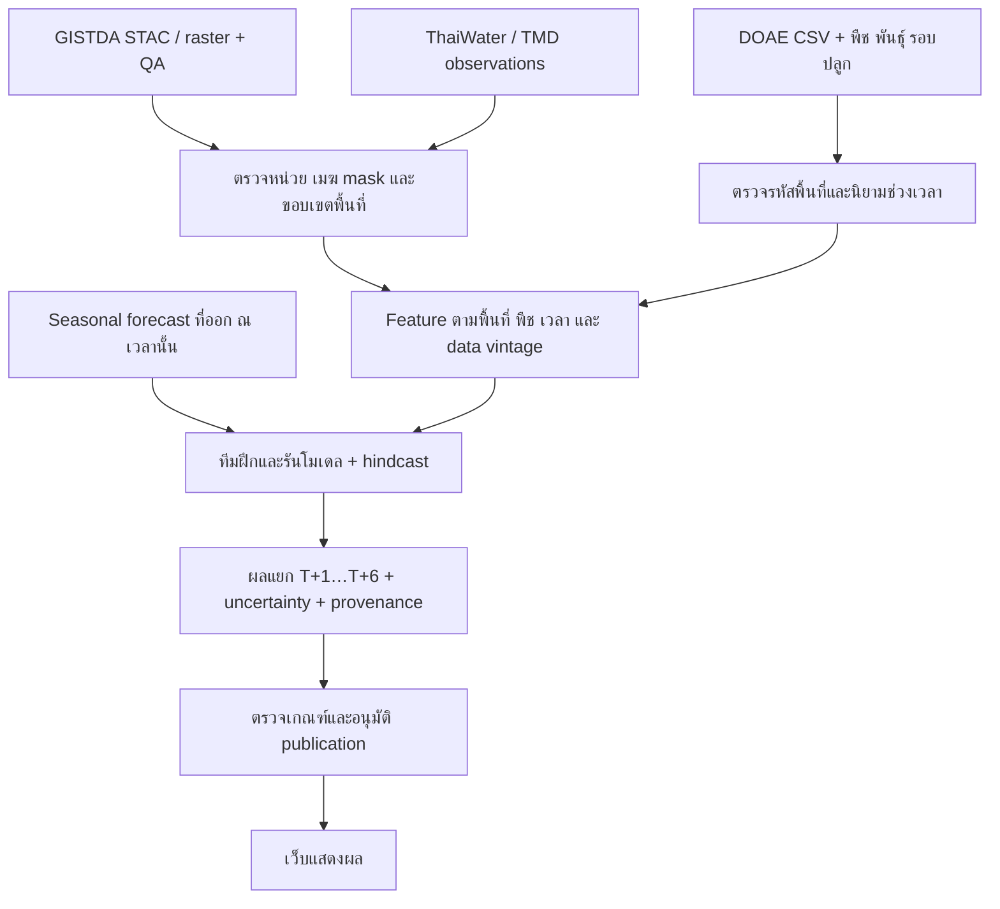

# ข้อมูลไทยสำหรับติดตามและพยากรณ์ภัยทางการเกษตร

ตรวจหลักฐานวันที่ 8 กันยายน 2026 สำหรับทีมพัฒนาและทีมโมเดลโคราชทันภัย

แบบระบบที่นำข้อค้นพบนี้ไปใช้: [MODEL_PIPELINE_DESIGN.md](MODEL_PIPELINE_DESIGN.md)
ครอบคลุม source adapters, schema, ทีมโมเดล, API และ T+ publication;
เป็นข้อเสนอ v2 ยังไม่ได้ติดตั้งหรือเผยแพร่ใช้งานจริง

## ข้อค้นพบที่ใช้ตัดสินใจได้

ควรเริ่มจาก GISTDA สำหรับข้อมูลดาวเทียม/ดัชนีภัยแล้ง, DOAE สำหรับข้อมูลพืช
และผลผลิต, ThaiWater/TMD สำหรับฝน น้ำ และสภาพอากาศ แล้วค่อยเลือกตัวแปร
ตามเป้าหมายของโมเดล การมีดาวเทียมและผลผลิตครบไม่ได้กำหนดระดับภัย 0/1/2
หรือรับรองความแม่นยำ T+6 ให้เอง

รอบนี้อ่านเอกสารทางการและ JavaScript ที่เว็บไทยส่งให้ browser จริง พร้อม
ทดสอบ read endpoints และอ่าน CSV สาธารณะ ไม่ได้เข้าถึง backend source
ที่ server ไม่ได้เผยแพร่ ไม่มีการรันโมเดลหรือเผยแพร่พยากรณ์ใหม่

## 1. GISTDA: มีบริการข้อมูลให้ต่อโดยตรง

ตรวจ [Disaster Platform](https://disaster.gistda.or.th/landing/services),
[แคตตาล็อกภัยแล้ง](https://opendata.gistda.or.th/dataset/disaster-platform-drought)
และ CKAN metadata ที่ตอบ HTTP 200 จริง พบทรัพยากร 13 รายการ:

- STAC catalog แยก `dri_plus`, `lst`, `ndwi`, `smap`
- DRI+, SMAP, NDWI มีบริการภาพแผนที่ WMS/WMTS/TMS ราย 7 วัน
- ชื่อทรัพยากร STAC ระบุการประมวลผลรายสัปดาห์

โค้ดหน้า [STAC](https://disaster.gistda.or.th/services/stac) โหลด catalog ผ่าน
`https://api-gateway.gistda.or.th/api/2.0/resources/stac/...` โดยใช้ access token
ของ session แล้วตาม STAC links เช่น `root`, `self`, `data`, `items`, `search`.
หน้าค้นหามี `bbox`, `datetime`, `collections`, `ids`, `limit` (ค่าเริ่มต้น 10)
เป็นหลักฐานว่าควรต่อแคตตาล็อกข้อมูล แทนการตีความสีบนภาพหน้าจอ

หลักฐานโค้ด ณ วันที่ตรวจ:

- [ค่าตั้งต้นของ API](https://disaster.gistda.or.th/_next/static/chunks/1nj_8jfddthag.js)
- [STAC catalog/search client](https://disaster.gistda.or.th/_next/static/chunks/41nxj005ge4hq.js)
- [รายการชั้นข้อมูลและ legend](https://disaster.gistda.or.th/_next/static/chunks/25i-nvhli0tay.js)

การเรียก gateway โดยไม่มี session ในรอบนี้ไม่สำเร็จ จึงยังไม่ยืนยัน schema
ค่าพิกเซลและไฟล์ asset จริง ส่วน `/app-api/layer-config` ที่เรียกโดยไม่มี
query ตอบ 400 `Missing key`; ยังไม่ควรตีความว่า key นี้เป็นรหัสสิทธิ์
โดยไม่มี caller contract การอ่าน public metadata สำเร็จไม่เท่ากับตรวจ raw
data access ครบแล้ว

สำหรับโมเดล ควรหา STAC assets ที่มีค่าจริงและ metadata การประมวลผล
WMS/WMTS/TMS ที่พบเหมาะกับแสดงแผนที่ แต่การเห็นภาพแผนที่ไม่ได้ยืนยันว่า
ได้ raw values ที่เหมาะกับฝึกโมเดลแล้ว ต้องตรวจ asset type, scale, nodata,
QA, projection, spatial support และช่วง composite

GISTDA ใช้ชื่อ NDWI; draft collector รองรับ NDMI แยกต่างหาก จึง **ยังไม่มี
การแปลงชื่อ NDWI เป็น NDMI อัตโนมัติ** ต้องยืนยันสูตรและช่วงคลื่นของผลิตภัณฑ์
ก่อน เช่นเดียวกับ DRI+ ที่ไม่ใช่ NDVI และไม่ใช่ risk code ของเว็บเรา

GISTDA ระบุว่าระบบ “เช็คแล้ง” รวมข้อมูลดาวเทียม ภูมิสารสนเทศ และสถานี
ตรวจวัด และร่วมงานกับ DOAE, RID, TMD และหน่วยงานอื่น เป็นหลักฐานไทยว่า
การใช้หลายแหล่งข้อมูลร่วมกันตรงกับการใช้งานจริง
[ข่าวโครงการเช็คแล้ง](https://www.gistda.or.th/ewtadmin/ewt/gistda_web/news_view.php?lang=EN&n_id=6812)

## 2. DOAE: อ่าน CSV จริงแล้ว พบ grain ละเอียดกว่าคำว่า “รายปี”

[แคตตาล็อกภาวะการผลิตพืชระดับตำบล](https://data.go.th/th/dataset/production_doae)
ระบุการเผยแพร่/ปรับปรุงรายปีและไฟล์พืชอายุสั้น/ยาว แต่ไฟล์พืชอายุสั้นปี 2566
ที่ดาวน์โหลดสำเร็จจริงมี **50,103 แถว รวมนครราชสีมา 1,695 แถว**
ขนาด 10,330,769 bytes จำนวนนี้เป็นผลนับไฟล์ที่อ่านในรอบนี้ ไม่ใช่จำนวน
ตำบลหรือแปลงเกษตร

[ไฟล์ CSV ต้นทางที่ตรวจ](http://catalog.doae.go.th/dataset/6cc09797-a60e-43ce-a646-65364a1333c3/resource/f9ab6055-6364-4f78-812e-15989e300979/download/1.-01-open01-2023-new.csv)

คอลัมน์จริงมี:

| กลุ่ม | คอลัมน์ที่พบ |
| --- | --- |
| เวลา | ปี พ.ศ., เดือน, รอบการปลูก |
| พื้นที่ | ชื่อจังหวัด, อำเภอ, ตำบล; ไม่มีรหัสตำบลในไฟล์นี้ |
| พืช | กลุ่มพืช, ชนิดพืช, พันธุ์พืช |
| พื้นที่เกษตร | เนื้อที่ปลูก, เสียหาย, เก็บเกี่ยว หน่วยไร่ |
| ผลผลิต | ปริมาณเก็บเกี่ยวเป็นกิโลกรัม, ค่าเฉลี่ยกิโลกรัม/ไร่ |
| ราคา | ราคาเฉลี่ยบาท/กิโลกรัม |

ข้อมูลจริงมีตัวเลขที่ใส่ comma เช่น `54,000.00` และค่าว่างทั้ง empty และ
เครื่องหมาย `-` ที่มีช่องว่างล้อมรอบ ต้องกำหนดการแปลงอย่างชัดเจน ไม่เติม 0
เมื่อไม่มีรายงาน ไม่มีเหตุผลให้แปลงพื้นที่เสียหายทั้งหมดเป็นความเสียหายจาก
ภัยแล้ง เพราะคอลัมน์นี้ไม่ระบุสาเหตุ

**สิ่งที่ยังต้องยืนยัน:** เดือนเป็นเดือนรายงาน/ปลูก/เก็บเกี่ยวหรือความหมายอื่น,
นิยามรอบปลูกและผลผลิตเฉลี่ย, เวลาเผยแพร่แต่ละ revision และคู่มือการบันทึก
แคตตาล็อกอัปเดตรายปีไม่ได้แปลว่าทุกแถวเป็นยอดทั้งปี และการพบเดือนก็ยังไม่ใช่
หลักฐานว่าปริมาณผลผลิตเป็น monthly total ที่บวกข้ามเดือนได้

ตัวเชื่อม production จึงต้องรักษา source year/month/round/variety ไว้ก่อน
ตรวจ crosswalk ชื่อจังหวัด+อำเภอ+ตำบลกับรหัสมาตรฐาน และตรวจนิยามการรวมยอด
ก่อนแปลงเป็น feature หรือ label ไม่ควร join ด้วยชื่อตำบลอย่างเดียว

ตัวอย่าง crop ใน `examples/model-inputs/` เป็น **processed annual example
ที่สมมติไว้เพื่อทดสอบ API** ไม่ใช่ mapping ของ CSV จริงข้างต้น ข้อมูลจริงยัง
ไม่ถูกส่งเข้า staging/โมเดลหรือแทนที่ข้อมูลของเว็บ

## 3. ThaiWater: API ฝนอ่านได้จริง แต่ endpoint ภาพดาวเทียมไม่ใช่ NDVI ตัวเลข

ตรวจ [เว็บ ThaiWater](https://www.thaiwater.net/) และ
[client bundle](https://www.thaiwater.net/dist/js/app.chunk.js) พบ API host
`https://api-v3.thaiwater.net` และทดลอง public read 3 รายการแบบไม่มี credentials

`GET /api/v1/thaiwater30/public/rain_24h?province_code=30` ตอบ HTTP 200,
`result: "OK"`, แถวใน `data` และมี 104 station IDs ของจังหวัด 30 ใน snapshot
ที่ตรวจ โดย 59 สถานีรายงาน rain_24h เป็น 0 จริง สถิตินี้เปลี่ยนได้ตามเวลา
จึงใช้เป็นหลักฐานตรวจ parser ไม่ใช่รายงานสถานการณ์ปัจจุบัน

| ฟิลด์จริง | ความหมายที่อ่านได้ |
| --- | --- |
| `station.id` / `station.tele_station_oldcode` | รหัสสถานี |
| `station.tele_station_lat` / `tele_station_long` | พิกัดสถานี |
| `rainfall_datetime` | วันเวลาต้นทางแบบไม่มี offset และวินาที |
| `rain_24h` / `rain_1h` | ปริมาณฝนสองช่วงสะสมที่ UI ใช้แยกกัน |
| `geocode.province_code` | รหัสจังหวัด |

Response ไม่มี QA flag, window start หรือ timezone explicit จึงยังไม่ตั้ง
production preset ที่เดาค่าเหล่านี้ สถานีไม่ใช่ค่าตรวจวัดทุกตำบลโดยตรง
API ภาพ MODIS NDVI USDA ที่พบตอบ 200 แต่ snapshot นี้มี TERRA/AQUA สอง
รายการที่ path/time ของภาพว่าง และไม่มี NDVI array หรือ pixel values จึงใช้
เป็นตัวดึง NDVI เข้าโมเดลไม่ได้โดยอาศัย response นี้

ไฟล์รายงาน drought DRI ของ HII ที่ตรวจมี 11 แถวและไม่มี province code 30
ใน snapshot นั้น การไม่มีแถวโคราชไม่ใช่การยืนยันว่าโคราชไม่มีความเสี่ยง

**พบไฟล์ raster จากโค้ดโดยตรงและตรวจเพิ่มแล้ว:**

- [PERSIANN สะสม 30 วัน](https://fews2.hii.or.th/model-output/data_portal/drought/obs_30days.tif)
  GET 200 จริง, GeoTIFF 85,031 bytes, 208×371 pixels, float32 หนึ่ง band,
  GeoKey EPSG:4326, pixel step 0.04 องศา, nodata ประมาณ −3.4e38
- [WRF-ROMS พยากรณ์ 5 วัน](https://fews2.hii.or.th/model-output/data_portal/drought/fore_5days.tif)
  HEAD 200, image/tiff, 945,805 bytes
- [DRI ล่าสุด](https://fews2.hii.or.th/model-output/data_portal/drought/DRI_latest.tif)
  HEAD 200, image/tiff, 5,868,648 bytes

code ยังอ้าง `obs_7days`, `obs_10days`, `obs_15days`, `obs_60days` และ
`fore_7days` แต่ไม่ได้เรียกไฟล์เหล่านั้นเพิ่ม ชื่อ/ชนิด PERSIANN และ WRF-ROMS
มาจาก label ใน client; ตรวจ TIFF metadata ของ obs_30days แล้วแต่ยังไม่ได้
ตรวจค่าพิกเซล หน่วย รุ่นการประมวลผล หรือ archive depth

ฝนย้อนหลัง 30 วันแบบเลื่อนหน้าต่างไม่เท่ากับผลรวมเดือนปฏิทิน และช่วง
7/10/15/30/60 วันซ้อนกัน จึงห้ามบวกกัน การใช้ชื่อไฟล์ latest ต้องสร้าง
snapshot/hash/เวลารับไว้ทุกครั้ง; HTTP Last-Modified ไม่ยืนยัน observation
window หรือวันที่ข้อมูลมีให้ใช้ครั้งแรกในการ backtest

## 4. TMD: ต้องแยกข้อมูลสังเกตจาก seasonal forecast

กรมอุตุนิยมวิทยามี [บริการข้อมูลและ API](https://www.tmd.go.th/service/serviceData),
[พยากรณ์เกษตรราย 3 เดือน](https://www.tmd.go.th/forecast/agromet/quater) และ
[ระบบ seasonal WRF](https://weather.tmd.go.th/seasonal/index.html)
หน้าระบบ WRF ระบุฝน อุณหภูมิ ความกดอากาศ ความละเอียด 18 กม. และพยากรณ์
ระยะยาว แต่ระบุเองด้วยว่าเป็น experimental และยังไม่ได้ validate accuracy
จึงไม่ควรเท่ากับการรับรอง T+6 ระดับตำบล

การเพิ่ม seasonal forcing เป็นทางเลือกที่สมควรประเมินสำหรับ T+1…T+6
ต้องเก็บ model/forecast issue time, target window, lead, สมาชิก ensemble,
หน่วย และรุ่นข้อมูล ห้ามเอาฝนจริงในอนาคตมาแทนฝนพยากรณ์ระหว่าง backtest
รอบนี้ยังไม่ได้ต่อ ingestion สำหรับ seasonal forcing

## 5. สิ่งที่เรียนรู้จากระบบที่ใช้งานนอกไทย

ใช้เป็นต้นแบบวิธีทำ ไม่ใช่หลักฐานความแม่นยำในโคราช:

- [FAO ASIS](https://www.fao.org/giews/earthobservation/asis/index_1.jsp?lang=en)
  ติดตาม crop water stress โดยใช้ vegetation health/temperature พร้อมพื้นที่ปลูก
  และระยะพัฒนาการพืช; [country-level ASIS](https://www.fao.org/giews/earthobservation/asistool.jsp?lang=en)
  ปรับ land cover, sowing dates, crop cycle และ crop coefficients ให้เข้าท้องถิ่น
- [JRC MARS](https://joint-research-centre.ec.europa.eu/monitoring-agricultural-resources-mars/jrc-mars-bulletin_en)
  พยากรณ์ผลผลิตโดยใช้ weather-driven crop models, Earth observation และการ
  วิเคราะห์ของผู้เชี่ยวชาญ ผลผลิตเป็นเป้าหมายคนละอย่างกับ drought risk index
- [GIDMaPS](https://www.nature.com/articles/sdata20141.pdf) แยก monitoring
  จาก probabilistic forecast โดยใช้ฝนและความชื้นดิน พยากรณ์ 1–6 เดือนได้
  ใน framework งานวิจัย แต่ไม่ได้รับรองทุก lead ทุกพื้นที่
- [การประเมิน soil moisture forecast ปี 2025](https://hess.copernicus.org/articles/29/925/2025/)
  แสดงความต่างของ skill ตาม lead, ความลึกดินและพื้นที่; หลักฐานใน Mediterranean
  ไม่ใช่ calibration ของไทย

แหล่งสากลที่ใช้เสริมเมื่อข้อมูลไทยขาด:
[MODIS NDVI/EVI](https://developers.google.com/earth-engine/datasets/catalog/MODIS_061_MOD13Q1)
16 วัน 250 ม., [MODIS LST](https://developers.google.com/earth-engine/datasets/catalog/MODIS_061_MOD11A2)
8 วัน 1 กม., [SMAP](https://nsidc.org/data/spl3smp_e/versions/6),
[CHIRPS v3](https://chc.ucsb.edu/data/chirps3) ฝนผสมดาวเทียมและสถานี
CHIRPS มี preliminary กับ final ที่ออกต่างเวลา จึงต้องรักษา data vintage
แยกไว้ การเลือกใช้ต้องตรวจ QA และประกาศคุณภาพของ product version นั้น

การดึงดาวเทียมจริงมักมีขั้นประมวลผลพื้นที่/เวลา:
[NASA AppEEARS API](https://appeears.earthdatacloud.nasa.gov/api/) ใช้ POST สร้าง
งานสกัดแล้ว GET สถานะ/ผลลัพธ์ และ
[Earth Engine](https://developers.google.com/earth-engine/guides/best_practices)
มีการลดค่าพิกเซลตามพื้นที่และ export งานใหญ่เป็น batch ดังนั้น upstream
collector ไม่จำเป็นต้องเป็น GET JSON สำเร็จรูปเพียงรูปแบบเดียว

## แนวทางข้อมูลและโมเดลที่เสนอจากหลักฐาน

ตัวแปรผู้สมัคร: ฝนสะสม/ความผิดปกติ, NDVI/EVI, ความชื้นพืชตามสูตรผลิตภัณฑ์,
อุณหภูมิพื้นผิว, ความชื้นดิน, crop mask/calendar, ชนิดพืช/พันธุ์/รอบปลูก,
ชลประทาน, คุณสมบัติดิน และผลผลิตย้อนหลังที่ประกาศแล้ว ไม่จำเป็นต้องใส่
ทุกตัว; เลือกจากการทดสอบเพิ่ม/ถอด feature และความพร้อมของประวัติข้อมูล

เป้าหมายต้องเลือกชัด: สภาพแห้งปัจจุบัน, ความน่าจะเป็นที่ดัชนีข้าม threshold
ใน T+h หรือผลผลิต/ผลผลิตผิดปกติรายฤดู ข้อมูล DOAE ใช้ช่วยวิเคราะห์ผลกระทบ
แต่ผลผลิตลดอาจมาจากหลายสาเหตุ ไม่ใช่ drought label โดยตัวมันเอง

ก่อนนำผลขึ้นเว็บ ให้กำหนด target definition, climatology/reference period,
threshold version, model/transform version และ validation reference.
ทดสอบย้อนหลังตามเวลาและข้อมูลที่ทราบจริงในแต่ละวันออกพยากรณ์ แยก lead,
ฤดู พืชและชลประทาน เทียบ baseline เช่น climatology/persistence และรายงาน
ทั้งความคลาดเคลื่อนกับการสอบเทียบความน่าจะเป็น

## สถานะโค้ดใน repository

มี collector JSON/CSV, immutable input API, schema สำหรับ prepared satellite
monthly features และ declared-period crop data, ตัวจัด model request และ
ตัวตรวจรูปแบบผล T+1…T+6 แล้ว ดู [API.md](API.md#model-inputs-local-system-bridge)

ยังไม่ได้ทำ GISTDA raster extraction, mapping DOAE จริง, การรัน/ฝึกโมเดล,
seasonal forcing, model skill validation หรือ forecast publication.
36 เดือน, valid pixels 50% และตัวแปรเริ่มต้นใน demo เป็น draft assumptions
ไม่ใช่ข้อสรุปว่าพอฝึกโมเดลได้ ตัวตรวจ result ตรวจโครงสร้าง ไม่รับรองความหมาย
ทางวิทยาศาสตร์หรือว่ารายการ hash ที่โมเดลกล่าวอ้างถูกใช้คำนวณจริง

`informationCutoff` ต้องเทียบกับเวลาออกพยากรณ์จริง หากใช้ origin เก่าและ
ข้อมูลที่ประกาศภายหลัง ต้องเรียกว่า retrospective reconstruction ไม่ใช่
as-issued hindcast; T+h ที่เป็น calendar offset ไม่เท่ากับ lead จากเวลาที่
ออกรายงานเสมอ โดยเฉพาะเดือนแรกที่อาจเริ่มไปแล้ว

หลักฐานตอบกลับ/ตัวอย่างจริงเก็บแยกใน `artifacts/thai-source-research/`
ซึ่ง gitignored; คีย์และ token ที่อาจปรากฏใน public client/catalog ไม่ได้
นำมาใช้เป็น credentials ของระบบนี้
